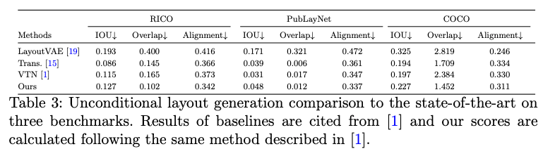

BLT: Bidirectional Layout Transformer for Controllable Layout Generation
===
ECCV 2022 / arxiv 21.12 / 46 Citations (24.04.12)
####
## Introduction
기존 Layout Transformer 논문은 primitive의 순서에 제한이 있기 때문에 conditional한 생성이 어렵다.  
그림1.a과 같이 알고있는 속성으로 누락된 속성을 예측하고 싶은 시나리오를 말하는 것이다.  
그림1.b에서 설명하는 것처럼 단방향으로 순서대로 생성하기 때문이다.  
이를 해결하기 위해서 이 논문은 양방향으로 마스킹된 속성을 예측하도록 학습한다.  
  
###

## Problem Formulation  
  
모든 좌표는 8-bit uniform quantization한다.  
####

최종적으로 5*N+2(=K+2)개의 값으로 한 데이터의 layout이 표현된다.  
####
근데 기존 연구에서는 x->y->w->h 생성 순서를 고정하여 x,w,h로 y를 예측하는 등의 task는 불가능하고, 병렬화할 수 없기 때문에 비효율적인 문제가 있다.  
###

## Approach
### Model and Training   
  
기본적인 아이디어는 BERT처럼 랜덤하게 마스킹해서 예측하는 bidirectional Transformer 컨셉이다.  
대신 완전 랜덤 샘플링은 효과가 좋지 않아 샘플링 정책을 제안한다.  
1. 그룹을 하나 선택 (category, size, position)
2. 해당 그룹 내에서 랜덤하게 마스킹  

이렇게 해서 학습시에 매번 동일한 의미의 속성들만 예측하게 한다.  
이걸 hierarchical sampling이라고 부른다.  
####
### Parallel Decoding by Iterative Refinement  
  
####
병렬적으로 하기 위해서 제안하는 방법이다.  
1. 학습때와 동일하게 그룹별로 진행한다.
2. confidence를 기준으로 하위 n개는 다시 마스킹한다.
3. n은 진행할수록 감소한다.
###

## Experimental Results  
### metrics
* IOU 
* Overlap : 예측된 bbox들이 겹치는 영역, 최대한 겹치지 않게 예측해야한다.  
* Alignment : bbox들 사이에 정렬이 얼마나 잘 되었는지를 확인, 각 왼쪽/중앙/오른쪽 좌표의 거리를 비교
* FID : 2-layer transfermer로 binary layout classifier를 학습해서 GT와의 비교
* Sim(DocSim) : 문서의 구조를 GT와 비교하는 것으로 객체간의 거리, bbox크기를 비교한다.
####
  
####
  
####

####

Non-autoregressive하게 하려면 제안하는 hierarchical sampling이 같이 사용되어야 한다.
####
  
ablation study  
> 읽으면서 궁금했던 부분인데 다행히 실험이 있다.  
> 아무래도 "뭔지 알아야 크기를 정하고, 크기를 알아야 배치하지"와 같은 마인드로 생각하면 맞는 것 같다.
