Rein: Harnessing Visionss Foundation Models
===
cvpr 2024 / arxiv 23.12  
#
* DGSS에 VFM을 활용하는 연구
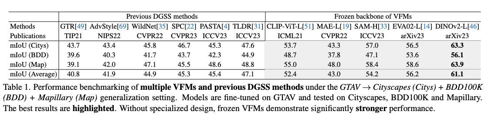  
* Stronger : 백본을 VFM으로 변경한 연구들이 성능이 더 좋다.
* Fewer : 적은 학습 파라미터만으로 VFM을 fine-tuning하는 방법을 제안한다.
* Superior : Rein을 사용하여 더 적은 파라미터만 학습하여 우수한 일반화 성능을 달성한다. 
#
***
## Methods  
* 기본적인 접근은 VFM의 각 레이어 사이에 새로운 메커니즘을 추가하는 것이다.
  * 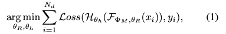  
#
* 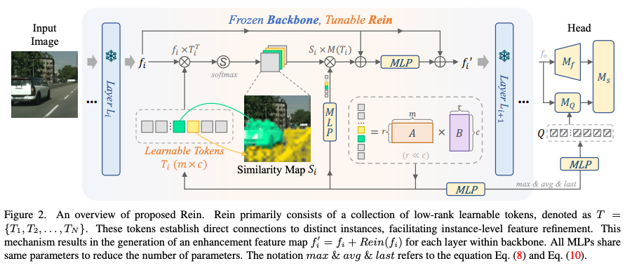
* 레이어에서 출력된 feature를 강화하여 다음 레이어로 넘겨주는 것이 목적이다.
  * 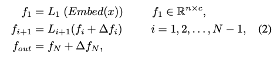
  * 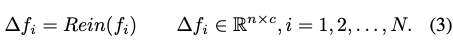
* 이 ∆f는 2가지 목적을 갖는다.
  * 훈련데이터(이미지넷)와 target scene(urban-scene)의 도메인 갭을 줄인다.  
  * task 차이 갭을 줄인다.  
#
* learnable token T와 레이어 출력 f의 attention으로 similarity map S를 만든다.  
  *   
 * 우선 MLP를 태운 T와 S를 곱해준다.  
   *   
   * 이 때, 첫번쨰 열과 첫번째 토큰을 제외한다.  
        해당되는 토큰이 없는 어려운 샘플이 있을 수 있기 때문이라고 되어있다.
        > 첫번째 토큰은 제외함으로 challenging sample을 첫번째 토큰으로 집중시키게 학습시키는 것 같다.  
 * 이후 원본 feature와 합하여 MLP를 한번 더 태운다.  
   * 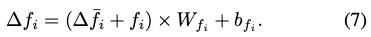
#
### Linking tokens to instances  
* 토큰으로 쿼리를 만들어서 head에서 사용한다.  
  * 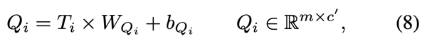  
* 하지만 모든 레이어에 대한 쿼리를 다 사용하면 너무 많기 때문에 max, average, 마지막 layer만 사용한다.  
  * 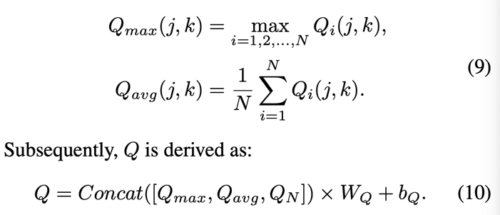  
#
### Layer-shared MLP weights  
* 그러면 3개의 MLP가 레이어마다 있나? > 결국엔 weight를 공유한다.  
  * 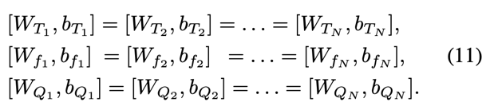  
#
### Low-rank token sequence  
* 자동차 전조등과 자전거 라이트처럼 같은 특성이 다른 토큰에 중복되어서 학습되는 것을 막기 위해 Low-rank를 사용한다.  
  * 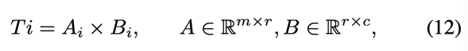
  * r << c 이기 때문에 파라미터의 갯수를 많이 줄인다.  
# 
***
## Experiments  
* backbone별로 비교
  * 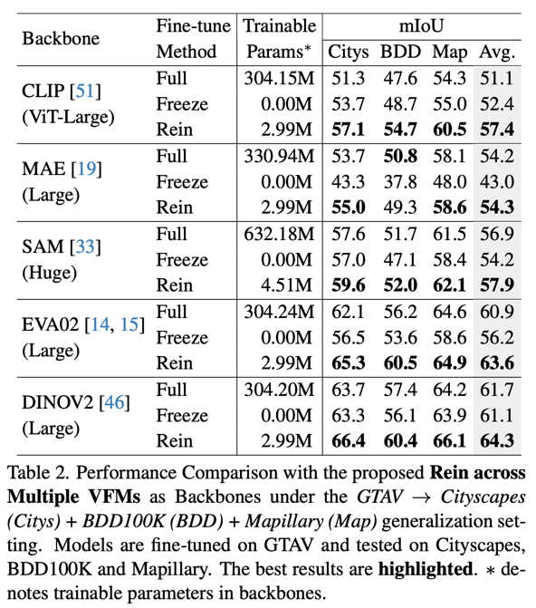  
* SOTA PEFT 방식들과 비교
  * 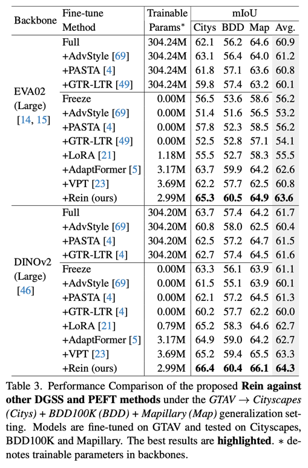  
* ACDC 데이터셋
  * 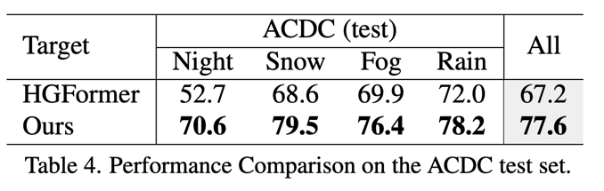  
* 다른 urban-scene Domain Generalization과 비교
  * 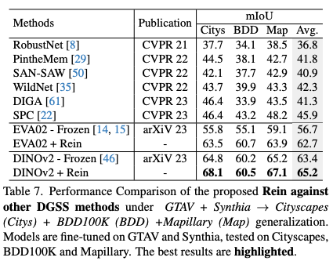  
* Ablation study 
  * 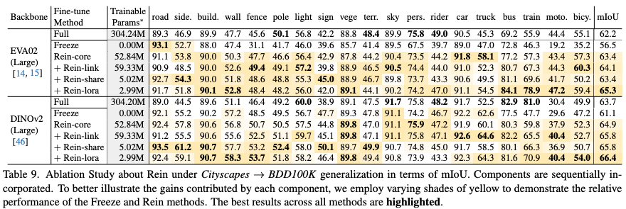  
* 토큰 길이 m에 대한 ablation study
  * 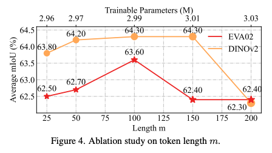  
* RoLA 차원에 따른 ablation study
  * 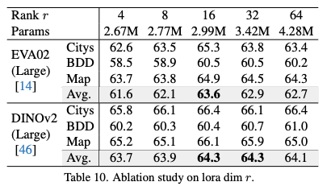
* 자원을 아낄 수 있다.
  * 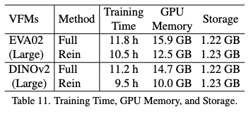

