ADD-IT: Training-Free Object Insertion in Images with Pretrained Diffusion Models
===
arxiv 24.11 / NVIDIA

# Introduction

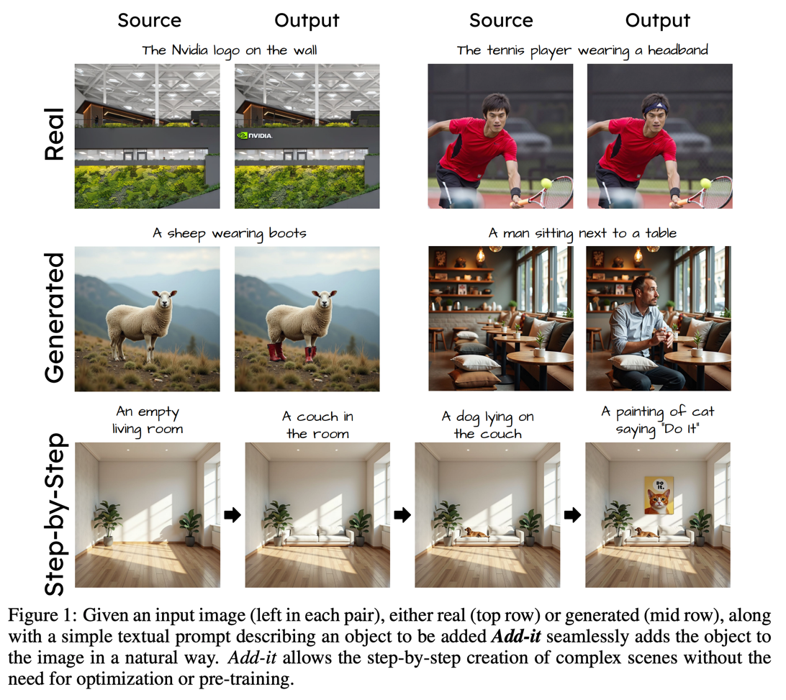 

위치를 지정해주지 않고 텍스트만으로 reasonalble location에 생성해야 한다.  
이 task를 "Image Additing"이라고 부르자  
* align 성능을 높이려고 instruction을 사용하는데, 이건 일반화 성능이 떨어진다.
  * 즉 학습한 클래스만 잘 생성한다.
* 최근에는 텍스트와 이미지 토큰에 각각 별도의 가중치를 주는 접근도 나오고 있다.  

기존의 neglect와 appearance는 CLIP이 잘 평가하지만 affordance는 잘 평가하지 못한다.
그렇기 때문에 Additing Affordance Benchmark를 제안한다.
* neglect: 세부 사항이 누락됨 (손가락, 문자)
* appearance: 생성된 외관이 비현실적이거나 부자연스러움

# Method

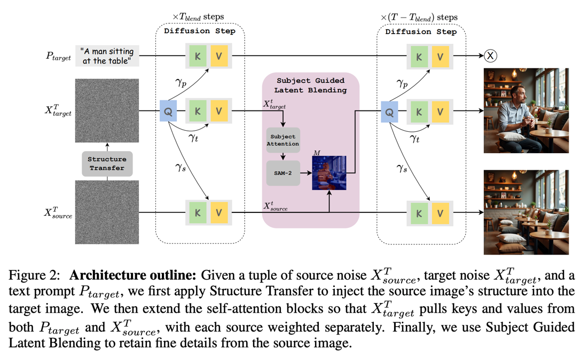

## weighted extended self-attention
기본적으로 이 연구에서 모델은 MM-DiT를 기준으로 한다.  
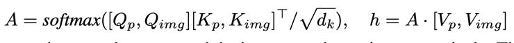

affordance를 높이기 위해서 전체적인 맥락을 더 잘봐야 하니까 소스 이미지를 self-attention하도록 추가한다.
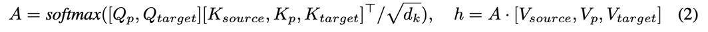

하지만 단순히 copy&paste하는 결과가 나타기 때문에 가중치가 추가되어야 한다.  
반대로 weight를 너무 많이 주면 쓸데없는 곳에 attention되기 때문에 밸런스를 잘 잡아야 한다.  
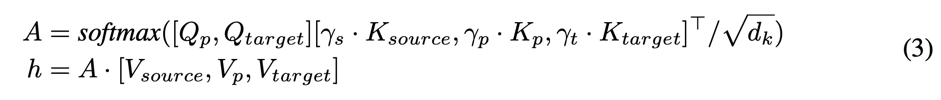

실험적으로 root-solver algorithm을 사용해서 정한다.
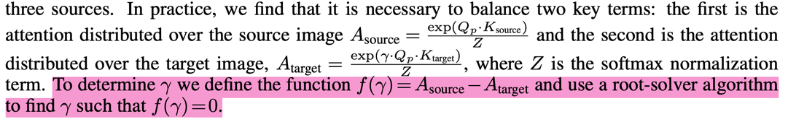

## structure transfer
소스의 노이즈를 그대로 사용하면 inversion하는 거라 객체가 거의 유사하게 생성된다.  
(강아지가 의자에 비해 비정상적으로 큼)  
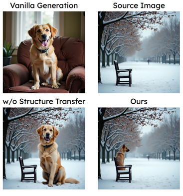  
그래서 inversion되지 않도록 노이즈를 중간에 랜덤하게 바꿔준다. (t는 실험적으로 933)   

## subject guided latent blending
배경의 작은 객체들은 변경되지 않고 유지되어야 한다.  
이를 위해서 sam2로 마스크를 얻은 다음에 블렌딩해주는 Latent Bledning을 제안한다.  

* attention map에서 가장 값이 큰 픽셀을 포인트로 sam2에 가이드해서 나온 마스크를 사용한다.
* blending 방법은 blended diffusion의 방법을 사용한다.

이때 attention map에서 attention값이 가장 큰 픽셀을 포인트로 sam에 가이드로 마스크 예측
blended diffusion 처럼 매 스텝마다 in-mask영역만 생성된 것 적용하는 방식

# Experiments
# Additing Benchmark
ChatGPT랑 FLUX로 100개의 세트 데이터셋을 만들었다.  
# Additing Affordance Benchmark
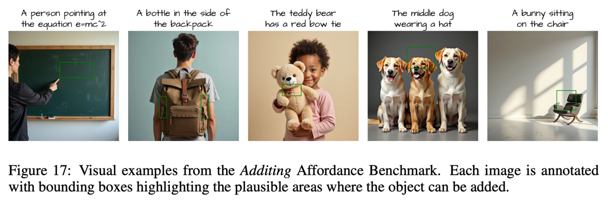  
200장에 이미지에 대해서 해당 객체가 생성될만한 위치에 대한 GT box를 같이 포함한다.  
평가할 때는 Grounding-DINO로 검출했을 때 IoU 0.5 이상인지 확인한다.  
> 개인적으로 완벽한 벤치마크는 아닌 것 같지만 접근 방법은 고려해볼만 하다.

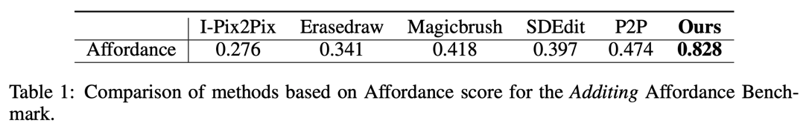

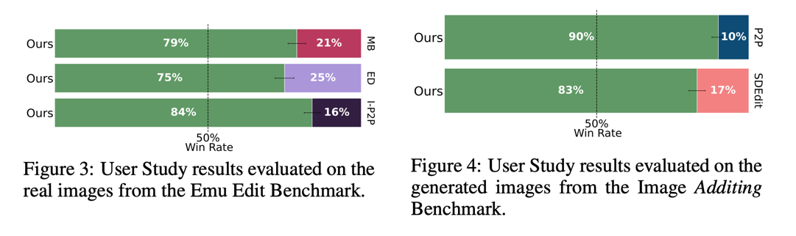

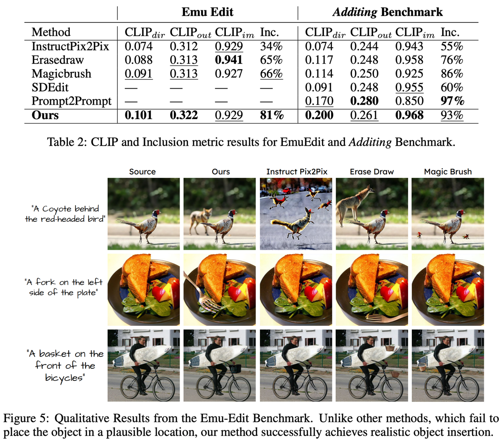

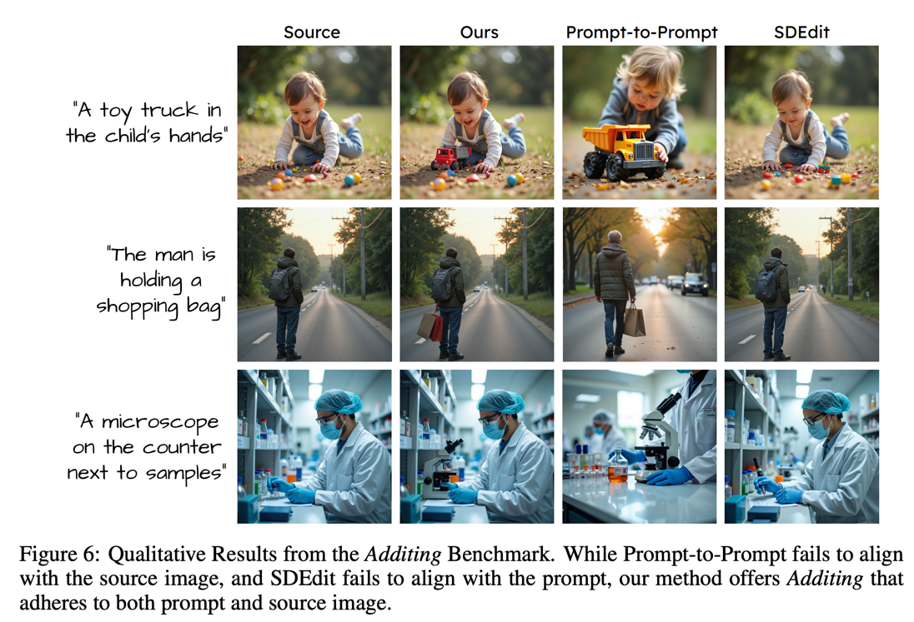
