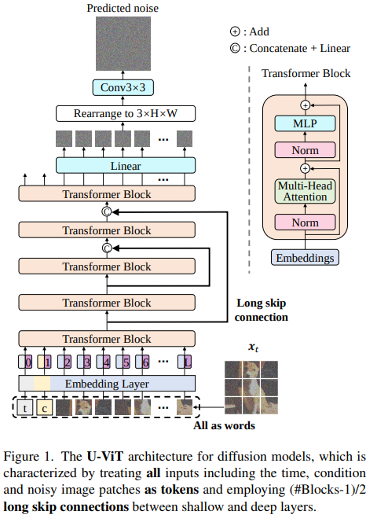
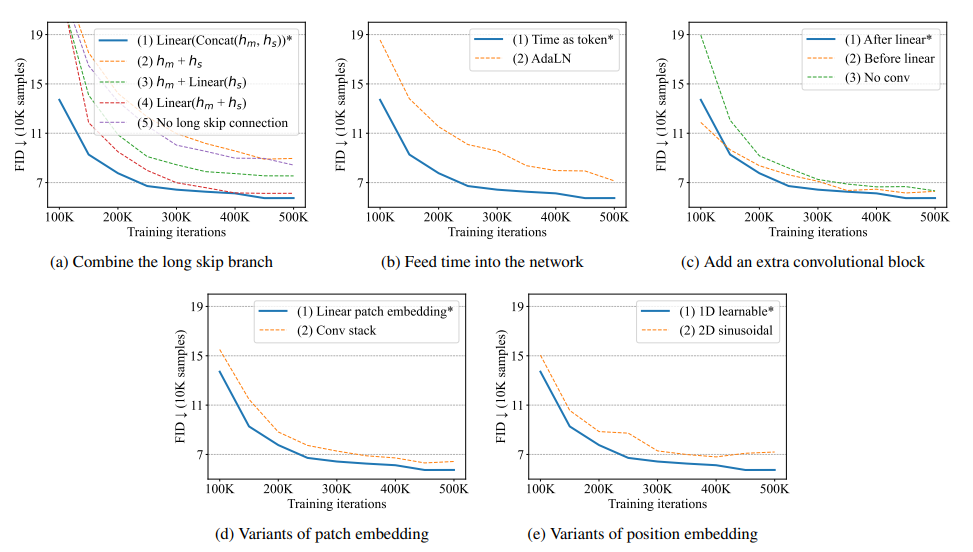
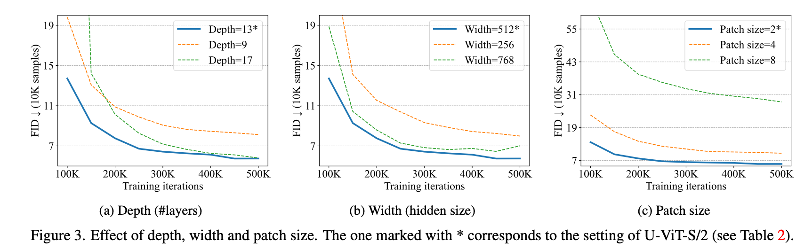
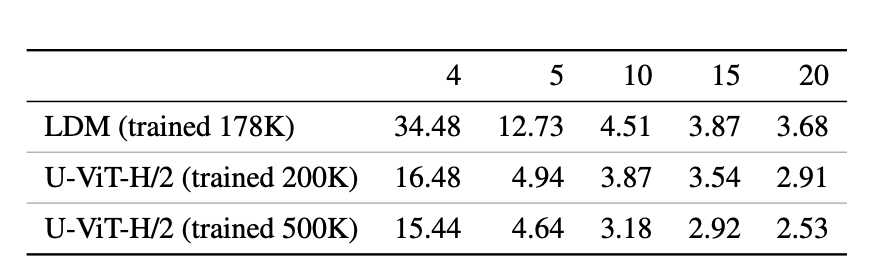

All are Worth Words: A ViT Backbone for Diffusion Models
===
Diffusion의 백본으로 CNN이 아니라 Transfrormer를 사용할 수 있다고 제안하는 논문

기존 Diffusion에서 사용한 ViT 백본들은 레이어마다 embedding된 condition과 time(diffusion step)을 key value로 입력해줘서 cross-attention한 것에 비해, 이 논문은 아예 하나의 패치로 취급해서 입력으로 넣어줌

아래 5가지에 대해서 비교실험 진행함
* long skip branch (yang song이 19년도에 제안함) low-level feature를 연결해주기 때문에 노이즈 예측에 유리하다.
* feed the time
* add extra convolution block > (22년도에 다른 논문에서 제안됨) 아티팩트 제거에 도움됨
* variants patch embedding
* variants position embedding

* Effect of Depth, Width and Patch Size

CNN 보다 월등히 좋지는 않지만, 비슷한 모델 사이즈에서 성능도 비슷하다.
즉, CNN에 다운/업 샘플링을 굳이 쓸 필요가 없다.

