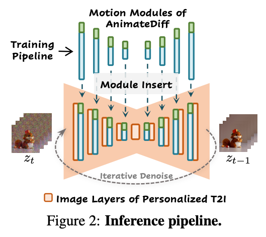
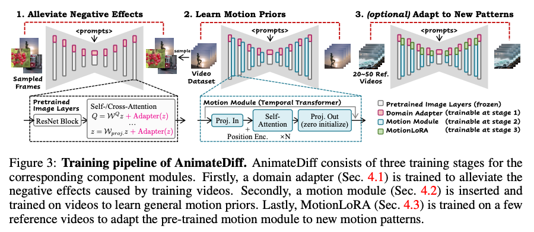
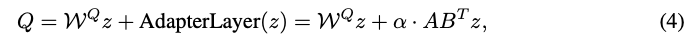

AnimateDiff: Animate Your Personalized Text-to-Image Diffusion Models without Specific Tuning
===
ICLR 2024 / arxiv 23.07  
  
## Introduction
* personalized text-to-image Diffusion을 fine-tuning하지 않고 애니메이션 생성이 가능하게 한다.  
* 제안하는 방법은 별도의 모듈만 학습하여 사용하는 것이다.  
* 새로운 동작 패턴에 대해서 간단하게 fine-tuning하는 MotionLoRA를 제안한다.  

***
## Methods
### AnimateDiff
  
* domain adapter : 학습에만 사용, 기존 T2I와 비디오의 격차를 줄이는 역할  
* motion module(파란색) : motion에 대한 prior 학습  
* MotionLoRA(초록색) : optional, 새로운 동작 패턴을 학습시키기 위한 역할  

  

### Alleviate Negative Effects from Training Data with Domain Adapter  
* 공개된 비디오 데이터셋 (WebVid)는 이미지 데이터셋 (LAION-Aesthetic)에 비해 품질이 많이 떨어진다.  
* 비디오 프레임을 개별 이미지로 사용할 때 motion blur, 압축 아티팩트, 워터마크가 포함될 수 있다.  
  * 그렇기 때문에 이러한 비디오 데이터를 그대로 사용하면 도메인 갭이 발생한다.
  * 때문에 T2I를 튜닝하지 않고 LoRA를 사용하여 어댑터 레이어를 만들고 T2I의 어텐션 레이어에 사용한다.  

  
어댑터 레이어의 파라미터만 업데이트 하도록 비디오 데이터의 스냅샷 이미지로 학습한다.  
인퍼런스할 때는 알파=0 으로 이 레이어를 사용하지 않는다.  

### Learn Motion Priors with Motion Module  
비디오를 처리하기 위해서는 2차원으로 모델링된 Diffusion의 차원을 확장시키고 시간 축에 따를 효율적인 정보교환이 가능해야 한다.  
* Network Inflation  
> Video Diffusion

