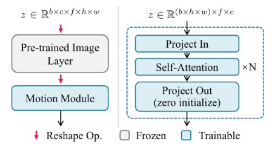
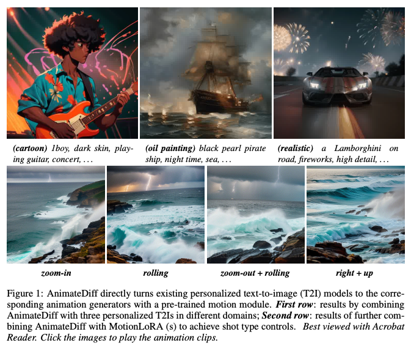
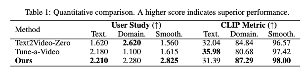
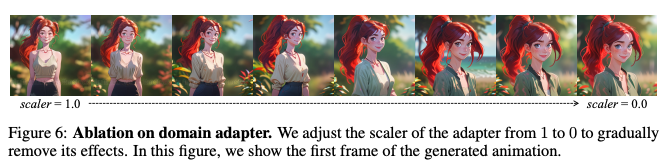

AnimateDiff: Animate Your Personalized Text-to-Image Diffusion Models without Specific Tuning
===
ICLR 2024 / arxiv 23.07  
  
## Introduction
* personalized text-to-image Diffusion을 fine-tuning하지 않고 애니메이션 생성이 가능하게 한다.  
* 제안하는 방법은 별도의 모듈만 학습하여 사용하는 것이다.  
* 새로운 동작 패턴에 대해서 간단하게 fine-tuning하는 MotionLoRA를 제안한다.  

***
## Methods
### AnimateDiff
  
* domain adapter : 학습에만 사용, 기존 T2I와 비디오의 격차를 줄이는 역할  
* motion module(파란색) : motion에 대한 prior 학습  
* MotionLoRA(초록색) : optional, 새로운 동작 패턴을 학습시키기 위한 역할  

  

### Alleviate Negative Effects from Training Data with Domain Adapter  
* 공개된 비디오 데이터셋 (WebVid)는 이미지 데이터셋 (LAION-Aesthetic)에 비해 품질이 많이 떨어진다.  
* 비디오 프레임을 개별 이미지로 사용할 때 motion blur, 압축 아티팩트, 워터마크가 포함될 수 있다.  
  * 그렇기 때문에 이러한 비디오 데이터를 그대로 사용하면 도메인 갭이 발생한다.
  * 때문에 T2I를 튜닝하지 않고 LoRA를 사용하여 어댑터 레이어를 만들고 T2I의 어텐션 레이어에 사용한다.
   
위와 같이 self, cross attention마다 LoRA를 붙여서 비디오 데이터에 대한 domain adaptation 용으로 사용한다.
어댑터 레이어의 파라미터만 업데이트 하도록 비디오 데이터의 스냅샷 이미지로 학습한다.  
이렇게 해서 원래 가지고 있던 고화질 생성 능력을 유지하면서 비디오 도메인 학습한다.  
학습할떄 알파=1, 인퍼런스할 때는 알파=0 으로 이 레이어를 사용하지 않는다.  

### Learn Motion Priors with Motion Module  
비디오를 처리하기 위해서는 2차원으로 모델링된 Diffusion의 차원을 확장시키고 시간 축에 따를 효율적인 정보교환이 가능해야 한다.
* Network Inflation  
  이미지 레이어를 통과할 때는 f축을 b축으로 reshape해서 시간 축 정보를 무시한다.  
  출력을 다시 5차원으로 바꾼 뒤 새로 추가된 모션 모듈에 입력되는데, 이 때는 h,w를 b로 reshape한다.  
* Module Design  
    
  이후 시간축 방향으로 self-attention을 거친다.  
  이때 project out 레이어을 처음에는 0으로 초기화하여 pre-traine layer의 초기 가중치를 잃지 않도록 유도한다. (LoRA에서 한 것과 같은 테크닉)  

### Adapt to New Motion Patterns with MotionLoRA  
위에서 말한 모듈에 LoRA를 붙여서 모션에 대한 fine-tuning에 사용한다.  
예를 들면 카메라 줌, 패닝, 롤링과 같은 패턴에 적응해야할 때이다.  
여기서는 예시로 크롭을 이용하여 줌을 묘사한 증강 데이터로 학습했다고 한다.  
#
***
## Experiments
* 
*   
* 

