Attend-and-Excite: Attention-Based Semantic Guidance for Text-to-Image Diffusion Models
===
ACM Transactions on Graphics 2023 / arxiv 23.01

## Introduction  
Stable Diffusion이 좋긴한데 text prompt를 그대로 표현하지 못하는 경우가 있다.  
* catastrophic neglect: 2개 이상의 다른 객체를 모두 표현하지 못하는 경우 발생  
* attribute binding: 색상과 같은 속성을 표현하지 못하는 경우 발생  

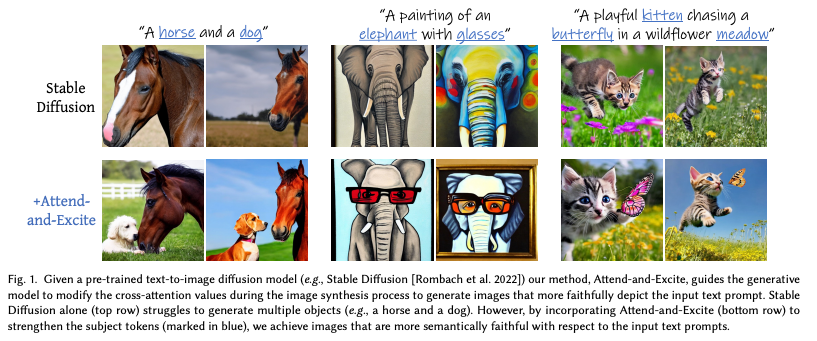                   
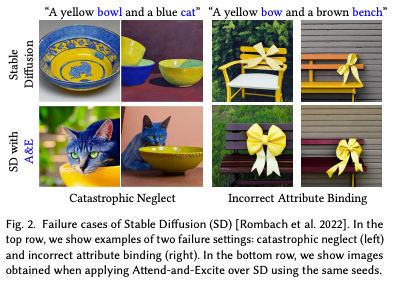  

이러한 의미론적 문제를 해결하기 위해 Generative Semantic Nursing (GSN)이라는 것을 제안한다.  
저자는 위와 같은 문제의 원인을 해당 토큰에 대한 attention 값이 작기 때문이라고 말한다.  
따라서 각 subject 토큰이 적어도 하나의 패치에 할당되는 것이 보장되어야 한다고 말한다.  

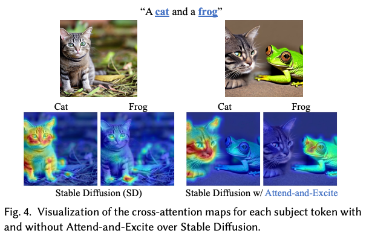  
  
## Method  
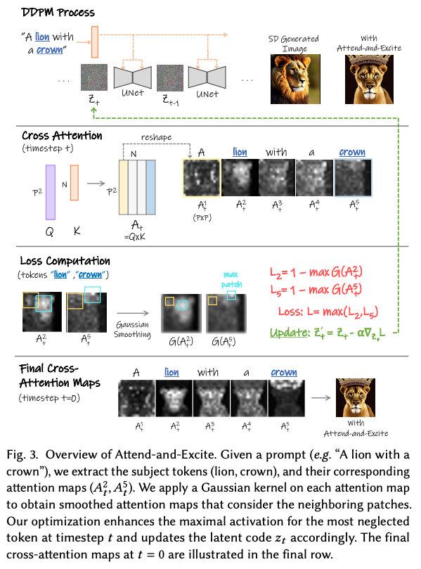  
위의 철학을 그대로 반영한 것이다.  
매 timestep마다 cross attention 맵을 뽑고 subject 토큰에 해당하는 attention이 이미지 내에 어딘가에는 무조건 할당되도록 loss를 주어 latent를 최적화한다.  
  
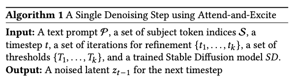        
1. **Extracting the Cross-Attention Maps**  
    현재 스텝에서 attention map을 추출한다. (16x16이라고 명시된 것을 보니 3번쨰 레이어에서 뽑은 것 같다.)  
    그리고 CLIP ecoder는 [sot]토큰에 높은 attention 값을 갖도록 학습이 되어있다. (문장을 요약한다고 의도적으로 그렇게 설계했다.)  
    때문에 [sot]토큰을 제거하고 나머지 토큰들에 대해 Softmax를 수행한다.  
    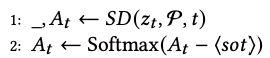  
          
2. **Obtaining Smoth Attention Maps**  
이 상태에서의 attention map의 값이 큰 패치에 subject의 전체 모습을 항상 생성하지 않는다.  
subject의 일부분에 대한 패치가 연결되어 값이 큰 것일 수 있다.  
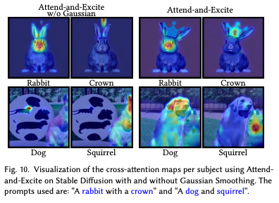  
때문에 가우시안 필터를 적용하여 이웃패치와의 선형조합인 값이 되도록 한다.  

3. **Performing On the Fly Optimization**   
각 subject 토큰이 적어도 하나의 패치에서 높은 attentino 값을 갖도록 최적화한다.        
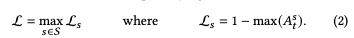  
즉, subject 토큰 중에서 가장 neglected 토큰을 강화해주는 것이다.  
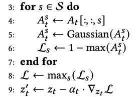  
이 과정을 t=[50:25] 범위에서 반복해서 수행해준다. (후반부는 구조에 영향을 안주기 때문에 전반부만 진행했다.)

4. **Iterative Latent Refinement**
    특정 타임스텝에서 이 loss가 최소한의 하이퍼파라미터를 넘도록 강제해준다.  
    t1=0, t2=10, t3=20  
    T1=0.05, T2=0.5, T3=0.8  
    최종적으로는 최소한 0.8이상의 attention 값을 보장하도록 하고 싶은 것이다.  
    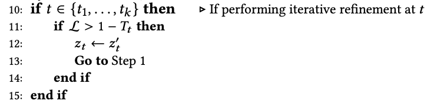  
    > 뭔가 이상한데 t1=50, t2=40, t3=30 을 의도한게 아닌가 싶다.  

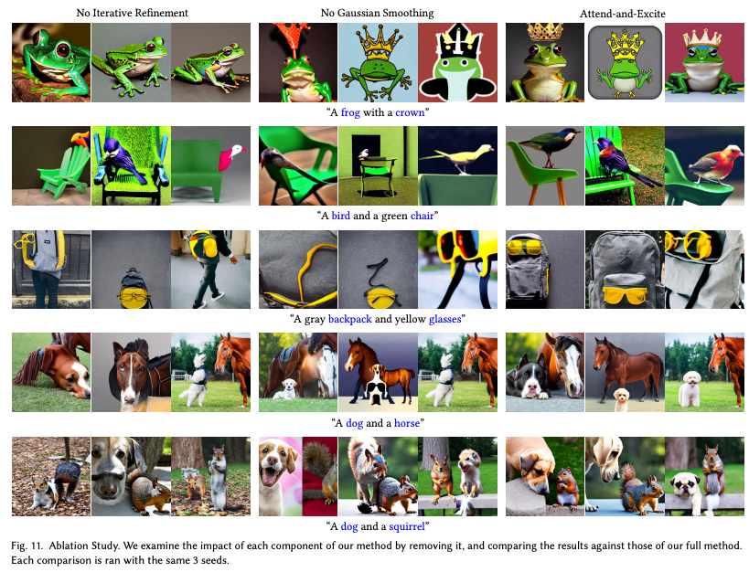  
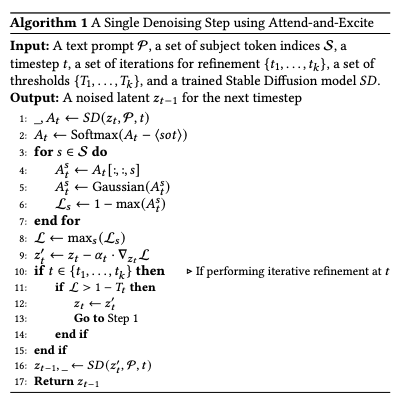  

## Results  
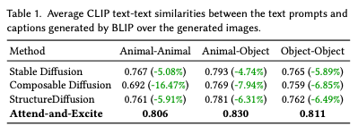  
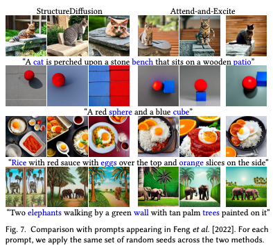  
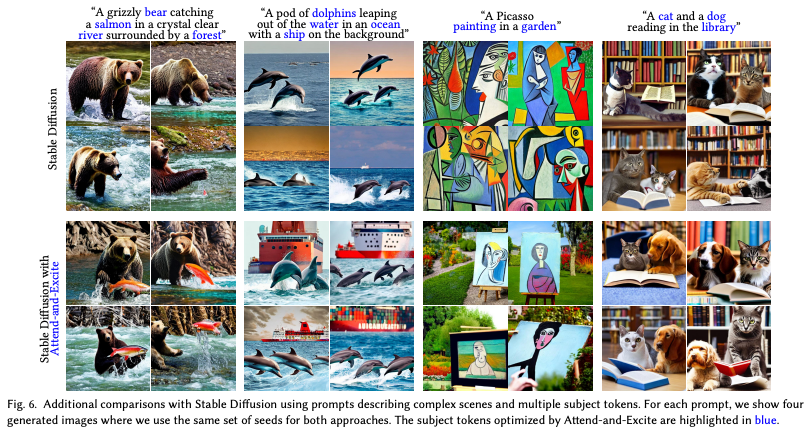  
