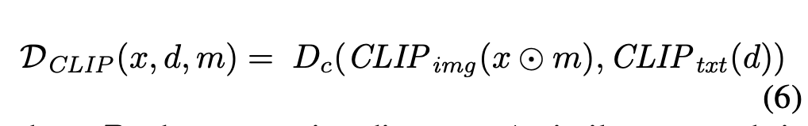
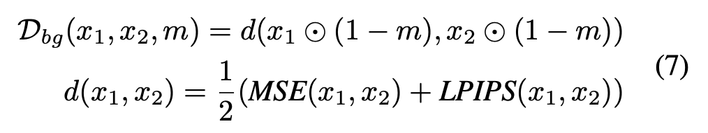
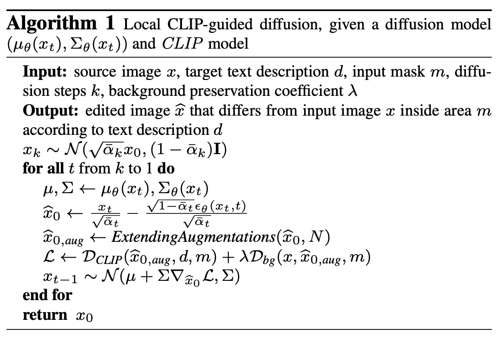
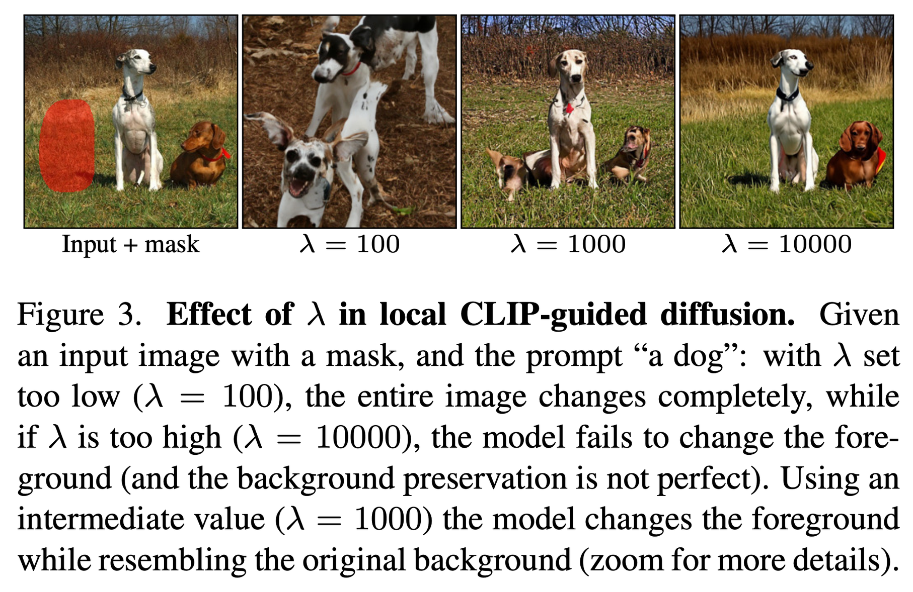
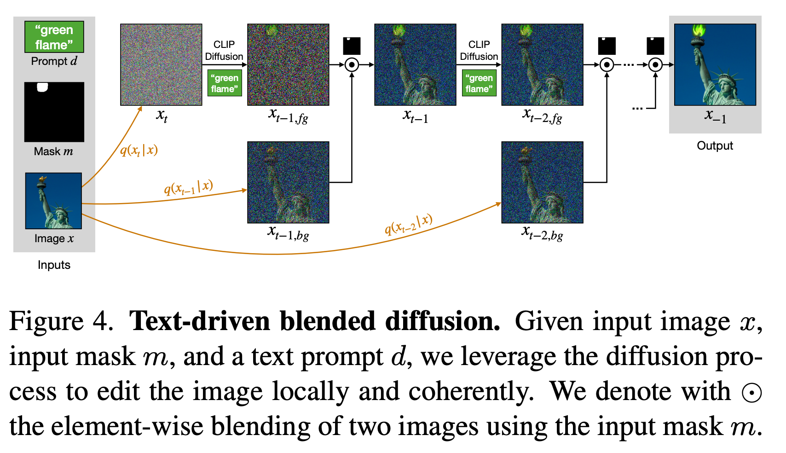
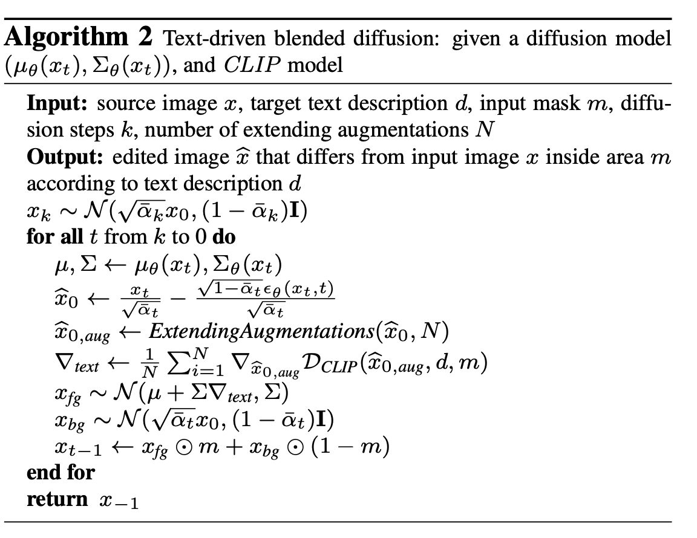
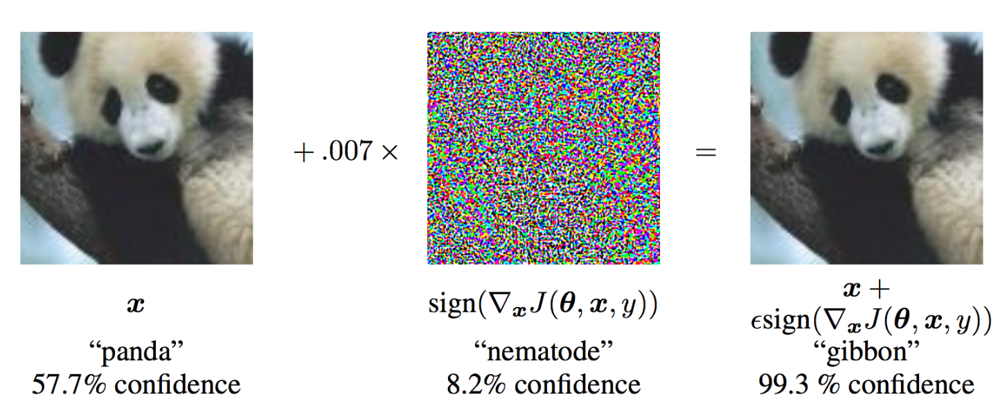
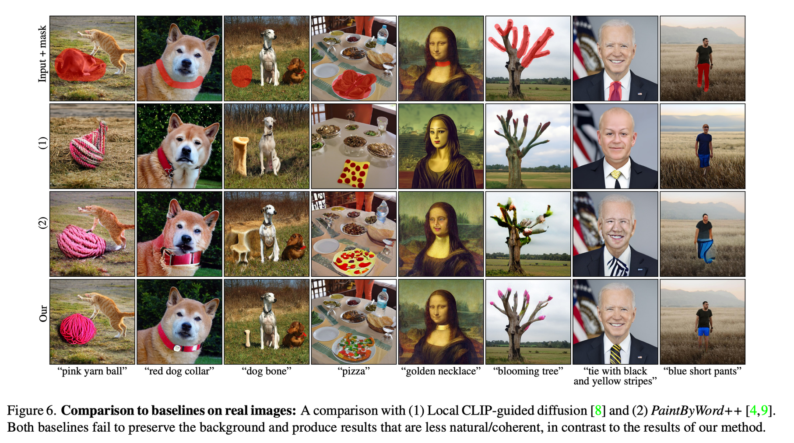

Blended Diffusion for Text-driven Editing of Natural Images
==

Diffusion으로 text guided image editing task를 제대로 연구한 최초(?) 논문
Diffusion + CLIP이다.

1. real 이미지에서 text guided image editing의 솔루션을 최초로 제안한다.
2. 배경 보존이 완벽하게 되는 것을 보장한다.
3. 간단한 augmentation이 adversarial 결과의 리스크를 크게 줄인다.

### Local CLIP-guided diffusion
* 마스크 안쪽의 생성되고 있는 이미지를 CLIP을 사용하여 코사인 거리를 계산, 이를 loss로 사용 한다. 
  * 이 때, x는 noised image이다.

  

* 하지만 배경 영역에도 영향을 주기때문에 background preservation loss를 추가하게 된다.
  * (LPIPS: ImageNet pretrained network의 중간의 몇개 레이어에서 activation map의 distance를 계산하는 평가지표)

  

### Text-driven blended diffusion

### Background preserving blending

이러한 blending을 할 때 중요한 점은 배경과 객체가 자연스러워야 한다는 것이다. 
이 논문에서는 The Laplacian pyramid as a compact image code라는 1983년도 논문에서 영감을 받았다고 한다. 
위 논문에서는 Laplacian pyramid의 각 레벨에서 이미지를 blending해야 자연스럽게 된다고 말한다. 
그렇기에 noised image에서 섞인 이미지가 다음 디노이징을 수행하면서 “비일관성을 개선”한다고 한다. 
> ### Laplacian pyramid
>   * Gaussian pyramid 
>     이미지를 업샘플링, 다운샘플링할 때 가우시안 필터를 사용하는 방법  
>     업샘플링에서는 추가되는 픽셀을 채우고, 다운샘플링에서는 aliasing을 방지하는 방법 
>   * Laplacian pyramid 
>     Gaussian pyramid의 blur함을 인해 화질저하를 개선하기 위해 엣지 이미지를 더해줘서 복구하는 방법

### Extending augmentations

(Adversarial exaples의 예시 - Explaining and harnessing adversarial examples, 2014) 
Adversarial exaples처럼 CLIP guide에서도 CLIP loss는 감소하지만 high-level sematic이 바뀌지 않는 현상이 있었다. 
이를 해결하기 위해서 CLIP loss를 계산할 때 이미지에 여러 증강을 하여 각각 loss를 계산하고 그라이디언트를 평균내어 사용하였다. 
이렇게 CLIP을 속이면 high-level sematic을 바꾸도록 유도할 수 있다고 한다.

### Limitations
* Inference 시간이 오래걸린다. (한장에 30초)
* 객체에 일부분만 생성되는 경우가 있다.
* CLIP에 의존적이기 때문에 CLIP의 단점인 typography attack이 발견된다.
* 종종 객체를 생성하지 않고 부자연스러운 그림자를 생성한다.
