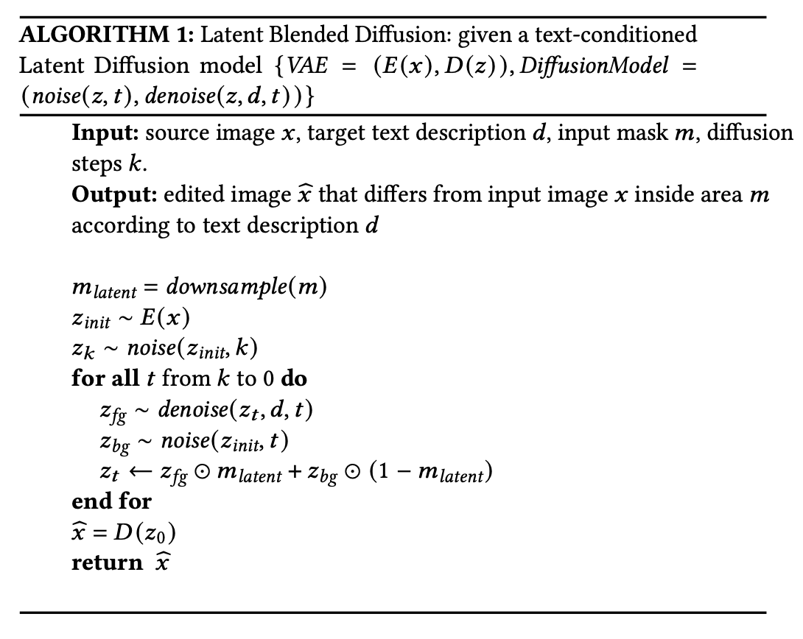
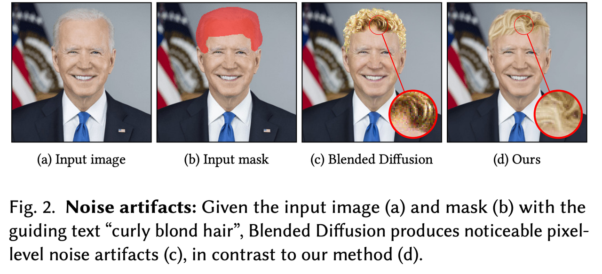
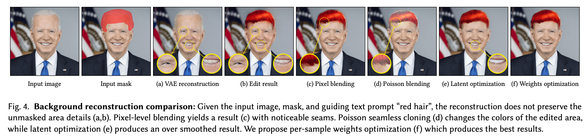
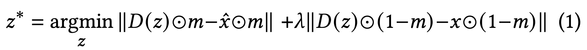
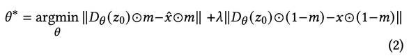
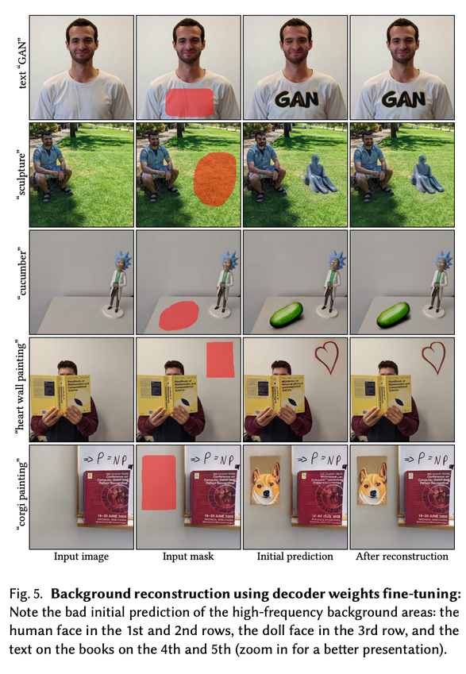
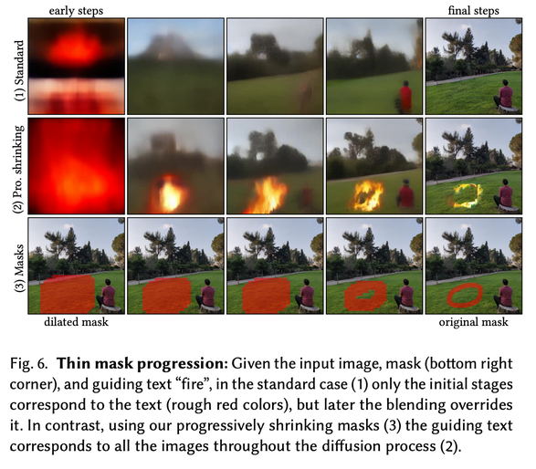
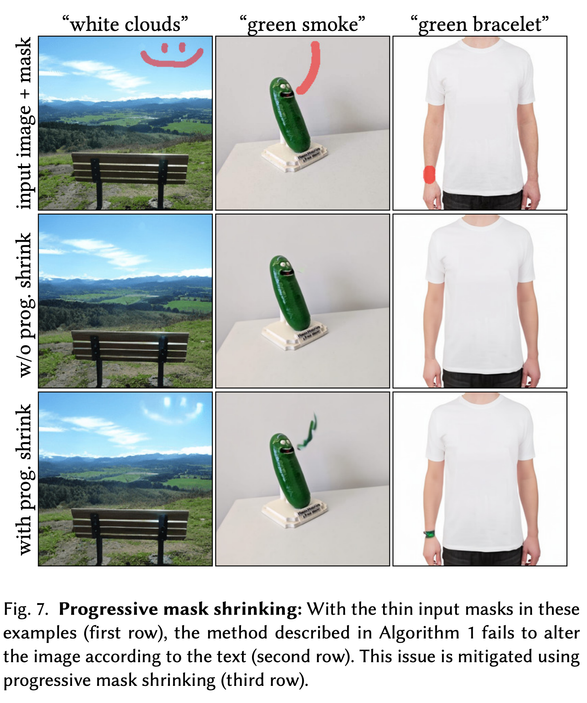
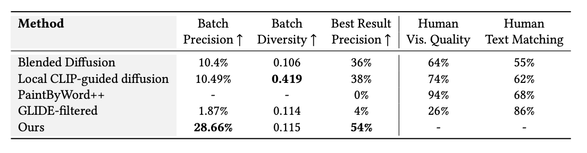
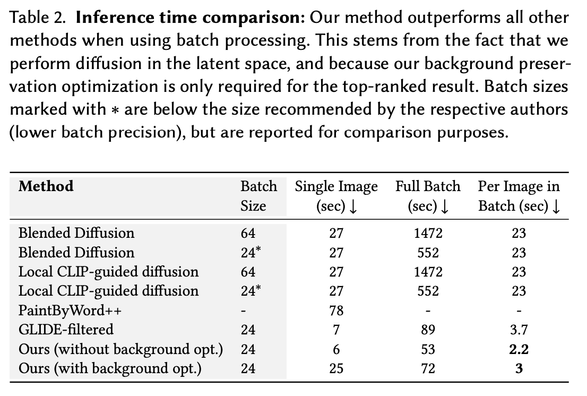

Blended Latent Diffusion
==
2022, ACM. 100 citations

Blended Diffusion + LDM

실제 이미지에 일부분만 수정하고 나머지는 유지하는 editing task에 대한 수요가 많은데 이 시나리오를 다루는 연구가 많지 않다. 
Blended Diffusion (2022 CVPR), GLIDE (2021 ICML), DALL-E 2 (2022 arxiv) 이렇게 3가지 밖에 없다. 
그나마도 이 시나리오를 메인으로 task로 연구한 논문은 Blended Diffusion 밖에 없다. 
이 논문은 이러한 image editing task과 latent diffusion을 연결하는 연구이다.

1. text guided image editing + LDM
2. thin mask의 경우에 대한 대응
3. 평가 지표 제안

### Method

* 장점
  * latent에서 진행하기 때문에 더 빠르다. 다른 방법처럼 CLIP loss를 사용하지 않기 때문에 그만큼 빠르다.
  * 픽셀에서 디퓨전할 때 발생하는 아티팩트를 피할 수 있다.

    
  * CLIP의 advesarial example이 발생하지 않는다.

* 단점
  * VAE의 성능으로 인해 제한적일 수 있다.
  * 마스크가 얇을 경우 다운샘플링과정에서 더 얇아지거나 사라질 수 있다.
                                  
### Background Reconstruction

a: 디노이징 하지 않고 바로 디코딩한 결과, 디테일에 변화가 생길 수 있다. 
b: 이런 점이 디노이징 후 디코딩한 결과에도 영향을 준다. 
c: 나이브하게 최종 이미지(픽셀)에서 붙이는 방법도 있지만, 마스크 안쪽은 어떻게 할 수가 없다. (+ 마스크 영역에 대한 아티팩트도 문제) 
d: 그래서 poisson blending을 했는데, blending자체가 잘 되지 않는다. 
e: GAN inversion에서는 latent에서의 벡터자체를 optimize한다. 하지만 결과에서 보이는 것처럼 over-smoothed해진다.

f: 그래서 디코더에 파라미터를 optimize한다. (각 이미지마다)  
하지만 이건 선택사항이니까 생성하려는 것이 얼굴이나 텍스트같은 경우에 사용하라고 한다.

> Semantic Photo Manipulation with a Generative Image Prior   
> Reconstruction문제를 해결하기 위해 GAN inversion쪽에서 모델자체를 최적화하는 방식을 제안한 논문   
> latent를 최적화하는 방식은 학습된 생성기를 사용하기 때문에 평균적(픽셀단위?)으로 좋은 성능을 내도록 최적화되고, 이로 인해 smooth한 이미지가 만들어지는 latent를 선택하게 된다.  
> 반면 모델 자체를 최적화하면 고주파 영역, 세부 사항을 더 잘 유지할 수 있는 여지가 있기 때문에 유리하다고 설명한다.  
> GPU당 30초만 사용하면된다고 하는데…. 한장당 30초면 짧은 시간은 아니라고 생각된다.  
> 물론 여기에 디코더는 더 작은 모델이긴 하겠지만 그래도 trade-off가 있는 것 같다.

### Progressive Mask Shrinking

얇은 마스크 문제를 해결하기 위해서는 초반 스텝에서는 마스크를 러프하게 만들어서 사용하고, 점차 축소하는 방법을 사용한다.  
처음에는 생성되지만 점차 마스크를 줄여가면서 배경으로 덮어버리는 방법이다.  
이 방법으로 아래와 같이 어느정도 해결을 보았지만 미세한 세부 사항까지는 한계가 있다고 말한다.

### Results

* Precision  
웹에서 랜덤하게 이미지 50장 준비  
[dim/5, dim/2] 범위에서 랜덤하게 마스크  
ImageNet class중에서 랜덤하게 생성            
ImageNet classifier로 분류 (비교군에 CLIP guidance쓰는 모델들이 있기에 CLIP은 사용하지 않음)  
top-5를 기준으로 함
* Batch Precision: 여기서 batch는 prediction ranking에서 선택하기 전에 여러장 이미지들을 다 평가 (총 50*batch 장)
* Best Result Precision: CLIP 유사도 가장 높았던 한 장만 평가 (총 50장)
* Batch Diversity: classifier가 올바르게 분류한 이미지들만 가져와서 LPIPS 거리를 계산   
(LPIPS쓴 것으로 봐서 classifier는 VGG거나 AlexNet일 것 같다.)

