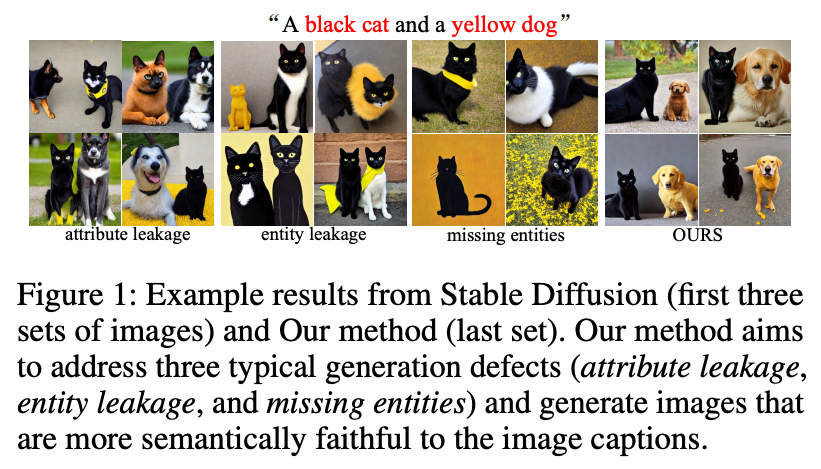
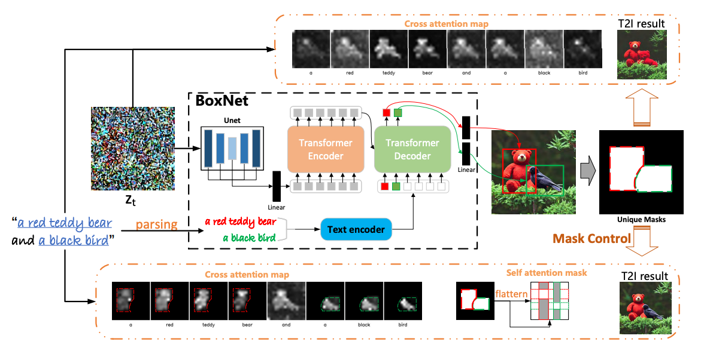
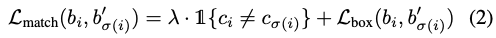
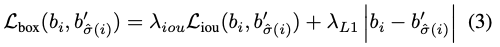
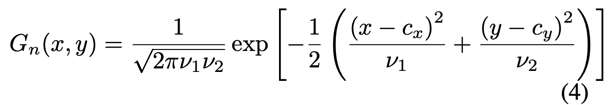
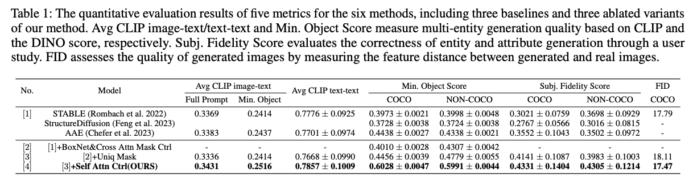
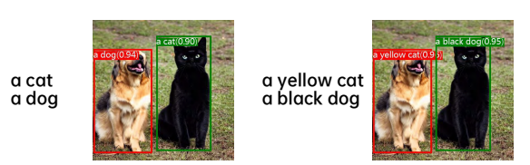
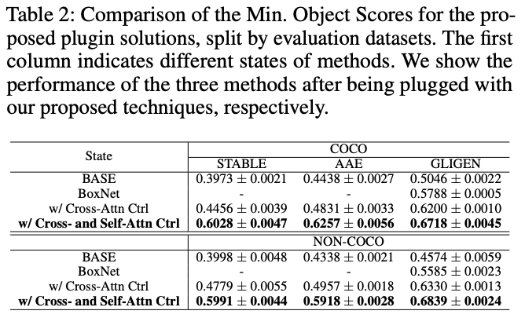

Compositional Text-to-Image Synthesis with Attention Map Control of Diffusion  Models
===
arxiv 23.05  
####
## Introduction

T2I의 고질적인 문제
* attribute leakage: 속성이 다른 객체에 표현됨
* entity leakage: 속성이 덮어씌워짐
* missing entities: 객체가 누락되어 생성되지 않음  
####
이를 해결하기 위해서 bbox를 예측하고 attention map에서 각 entity만 attention되도록 강제하는 방법으로 해결한다.  
> 이 논문에서 말하는 entity는 텍스트상에서 각 객체와 그 객체에 대해서 설명하는 속성을 한번에 말하는 것 같다. 
###
***
## Methods
### BoxNet Architecture  
  
Diffusion의 Unet에 Detr을 연결해놓은 형태이다.  
attention을 제어하는게 목적이니 recognition 성능은 고려하지 않는다.  
* 각 Unet 레이어에서 feature map을 추출해서 보간하여 concat한다.  
* 그다음 mlp를 통과해서 detr 인코더의 입력으로 사용된다.  
* 텍스트를 객체 기준으로 분리하고 (수동 or spaCy라는 라이브러리) 인코딩해서 object query로 사용한다.  
####
Loss function은 Detr과 동일하다.  
  

####
### Attetnion Mask Control
추론된 bbox를 기준으로 이진마스크를 만들어야 하는데 이 논문은 다수의 객체를 생성하는 것이 목적이기 때문에 객체가 겹치는 경우를 고려해야한다.  
  
이를 위해서 각 center point를 평균으로 하는 2차원 가우스 분포 확률을 가정한다.  
겹치는 좌표은 이 가우스 븐포에 값이 큰 객체에 할당 시킨다. 
####
***
## Experiments  

####
  
이 논문에서는 entity를 제대로 표현하는 것이 목적이기 때문에 이에 좀더 초점을 맞춰서 metric을 설정한다.  
* full prompt: 전체 이미지에 대해서 CLIP score    
* Min Object: 각 객체에 대해서 entity와 crop 이미지를 기준으로 CLIP score, 랜덤 시드로 100개 생성 후 가장 작은 score 선택  
> 직접적으로 crop한다는 말은 없는데 box를 기준으로 한다고는 되어있다.  
* CLIP text-text: Attend-and-Excite에서 제안한 GT text와 생성된 이미지의 BLIP caption을 비교
* Min. Object Score: Grounding DINO score  
  * 하지만 이 때, Grounding DINO가 색상에 민감한 부분이 있어서 색상에 대한 것은 빼고 했다고 한다.  
  *   
* Subj. Fidelity Score: User study  
* FID: 10k 장으로 비교  
####
  
BoxNet부분은 GLIGEN(layout 방식)에 입력으로 예측된 bbox를 사용한다는 것이다.

