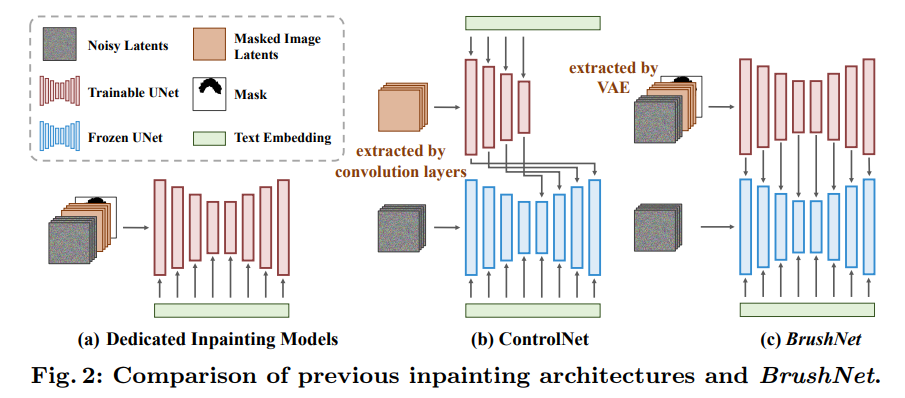
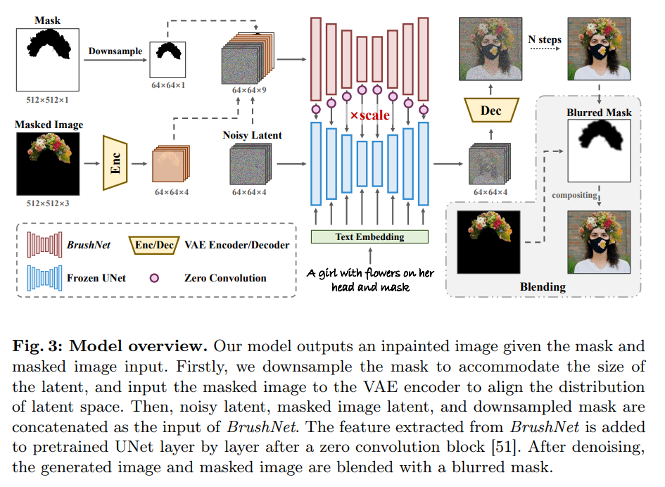
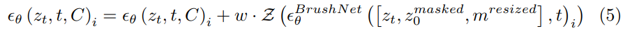
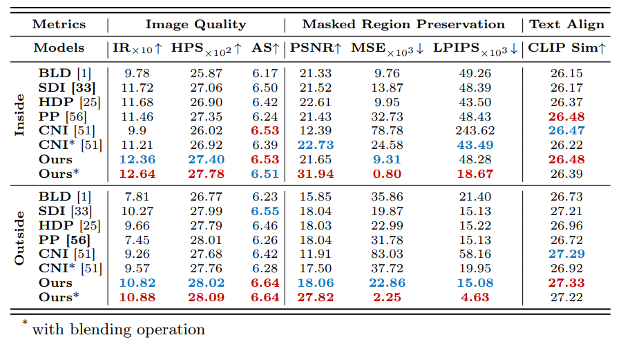
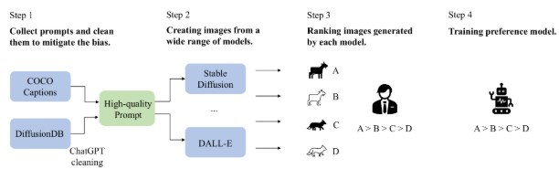
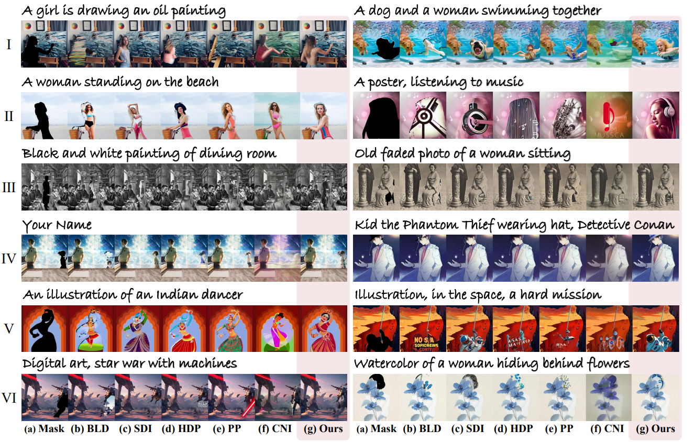
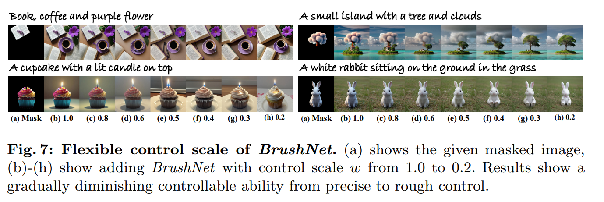

BrushNet: A Plug-and-Play Image Inpainting Model with Decomposed Dual-Branch Diffusion
===
ECCV 2024 / arxiv 24.03  

# Introduction
Inpainting : 배경은 유지하면서 지정한 영역만 복원하는 task  
- 기존 방법 1 : Sampling strategy modification   
    배경 영역을 copy&paste하는 방식 ([blended diffusion](../Blended_Diffusion/Bledned_Diffusion.md))
- 기존 방법 2 : Dedicated inpainting models
    입력할 떄 masked image를 같이 stacking해주는 방식 (SD-inpining이나 smart brush같은 대부분의 방법)

3가지의 문제점이 있다.
- masked image가 텍스트의 영향을 받는다.  
    배경을 생성하는데 text의 영향이 들어간다는 의미인 것 같다.
- UNet의 부담이 너무 크다.
- diffusion backbone 자체를 학습하는 것은 무리다.

그래서 brench를 따로 두는 것이 좋은데, ControlNet은 Inpainting task가 아니기 때문에 성능이 아쉽다.  
(ControlNet은 텍스트에 의존하여 control하고 있고, Inpainting은 픽셀정보도 함께 참고해야하기 때문에)  

  

그렇기 때문에 Inpainting + ControlNet 형태의 BrushNet을 제안한다.  
1. ControlNet에서 쓰던 랜덤초기화된 conv 대신에 VAE인코더를 사용
2. 두 브렌치의 모든 레이어를 다 연결
3. 배경생성에 text의 영향을 받지 않기 위해서 추가 브렌치에서 cross-attention 제거

# Method
  

## Masked Image Guidance
추가 브렌치의 역할은 보존해야할 영역의 feature를 추출하는 것이다.  
> architecture figure가 조금 헷갈리긴하지만, 추가 브렌치는 배경 유지를, 메인 브렌치는 객체 생성에 집중하도록 역할 분담을 한 것이라 생각하면 된다.

  

## Blending Operation
latent space에서 blending하면 mask위치가 정확하지 않을 수 있다.  
또한 VAE가 완벽하게 이미지를 재구성하지 못할 수 있다.  
그렇기 때문에 생성 완료된 후 최종적으로 blending을 해준다.  

## Flexible Control
1. ControlNet처럼 SD를 fine-tuning하지 않기 때문에 plug-and-play가 가능하다.  
2. 5번 식에 w를 통해서 보존되는 정도를 조절할 수 있다.
3. blending 여부를 선택할 수 있으니 이에 따라서도 조절가능하다.  

# Experiments
  

* IR : Image Reward > Human evaluation
      

* HPS : HPS v2 > Human evaluation  
    

* AS : Aesthetic Score

  

