Compositional Visual Generation with Composable Diffusion Models
===
ECCV 2022, 210 Citations, arxiv 22.06
  
텍스트는 복잡한데 고정된 크기의 latent vector로 인코딩하기 때문에 다 표현할 수가 없다.  
이 논문에서는 이러한 condition을 ㅁㅁㅇ시적으로 분해해서 복잡한 조합의 속성을 표현할 수 있게 한다.  
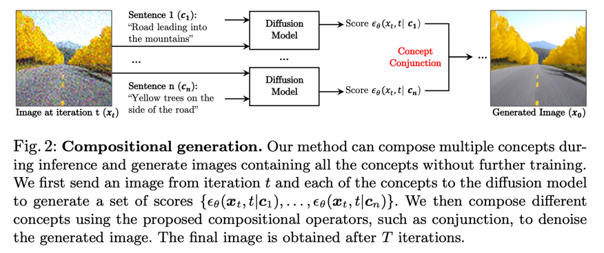  

## Diffusin models as Energy Based Models  
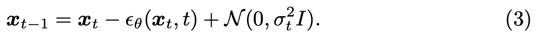  
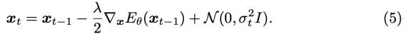  
Diffusion은 일종의 parameterize된 Energy Based model이다.

기존 EBM논문에서는 컨디션에의한 energy function을 합께 사용하는 것을 제안한다.  
(Compositional Visual Generation and Inference with Energy Based Models, arxiv 20.04, 14 citations)

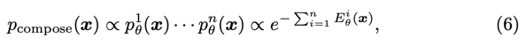  
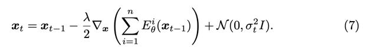  

그러면 이걸 Diffusion에서도 똑같이 쓸 수 있지 않을까?  
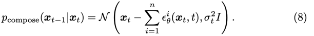  

## Compositional Generation through Diffusion Models  
그럼 Diffuions에 적용해보자  
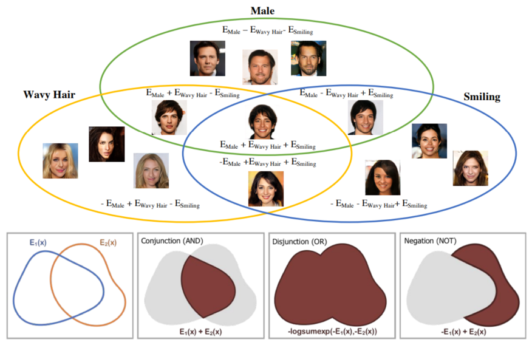   

### Concept Conjunction (AND)  
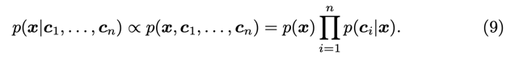  
여러 컨디션을 동시에 만족하는 x는 x에 대한 무조건 확률에서 x가 각 condition에 해당할 확률들의 joint로 표현할 수 있다.  
이는 implicit한 classifier 역할을 하는 것으로 볼 수 있다.  
여기에 베이즈룰을 적용하면 아래와 같이 된다.  
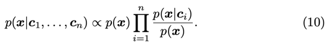  
이러면 어디서 많이 보던 것이다.  
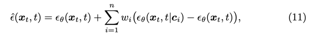  
그렇다 바로 CFG랑 같은 의미인 것이다.  
즉, 여러개 condition을 넣어줄 때, 이것처럼 conditional 입실론 결과를 각각 뽑아서 계산해주면 된다.  

### Concept Negation (NOT)
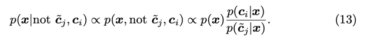  
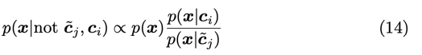  
> 어라...? 알고 한 것은 아닌데 지금 사용하는 background 개념이 이거다...  
> 다만 'background'라는 개념이 특정 단어로 표현되지 않기 때문에 learnable token을 쓴다라고 하면...  

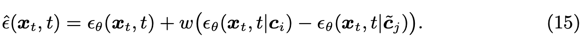  
마찬가지로 CFG 관점에서 빼주기만 하면 된다.  
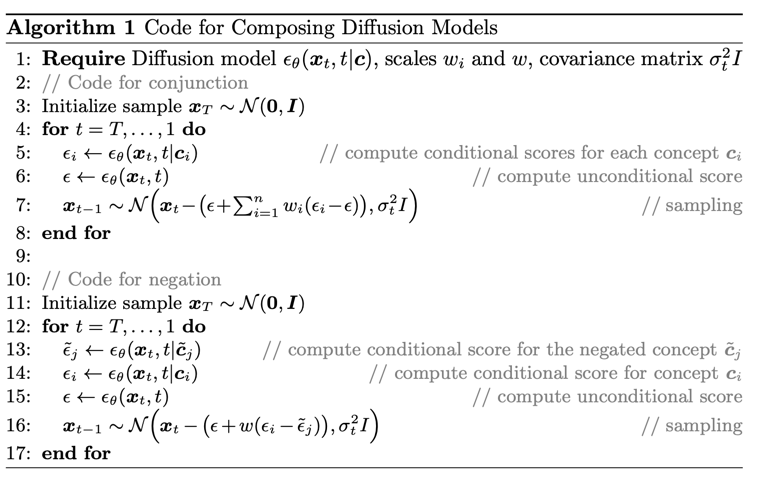  

## Result
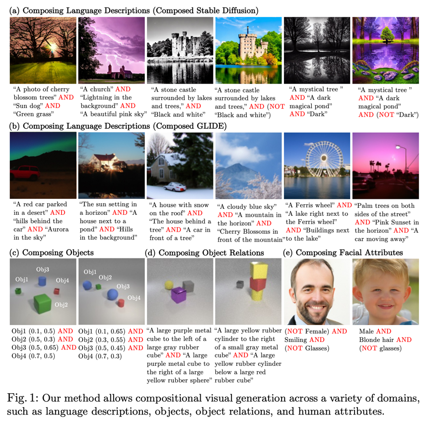  
Object 결과물이 흥미롭다.  
이렇다는 건 좌표를 이런식으로 넣어줘볼만 한 것 같다.

