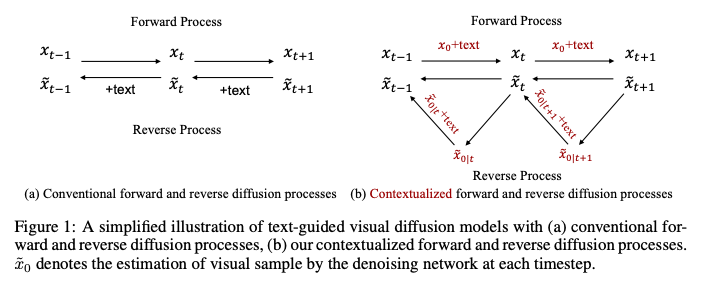
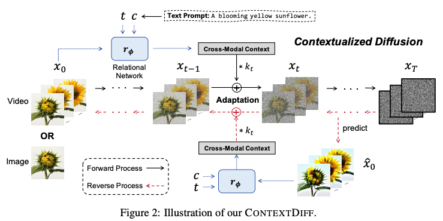
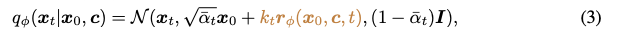
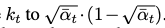
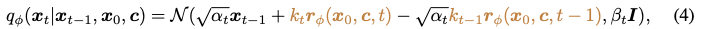
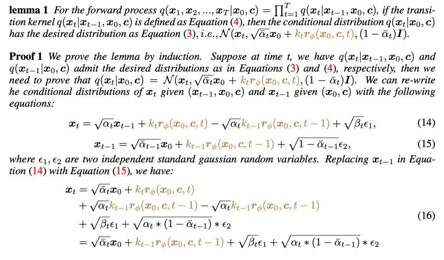
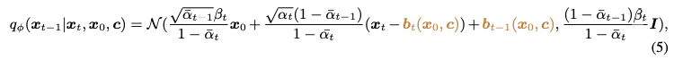

Cross-Modal Contextualized Diffusion Models for Text-Guided Visual Generation and Editing
===
ICLR 2024 / arxiv 24.02
###
  
Reverse Process (=Denoising process)에서는 text를 고려하고 있지만 Forward에서는 고려하지 않는다.  
이것은 Diffusion 모델의 잠재력을 제한하는 것이다.  
또한 기존의 모델들은 cross-modal context, 즉 텍스트-이미지의 맥락을 충분히 활용하지 못한다고 지적한다.  
이로 인해 텍스트가 의도하는 바를 시각적으로 완전하게 표현하는 것에 한계가 있다고 주장한다.  
###
## Method
### Cross-Modal Contextualized Diffusion  
  
####
Relational Network는 두 modal을 align하는 구조를 사용한다.(cross-attention)  
x0와 같은 크기의 bias항을 출력해서 condition에 cross-modal context를 더해준다.  
  
####
k는 알파에 의한 스케줄링된 값이다.  

####
  
forward를 이렇게 정의한다.  
  
####
이를 통해서 t>1에 대한 forward의 posterior를 아래와 같이 구할 수 있다.
  
b는 kr를 말하는 것이다.  
###
### Adapting Reverse Process  
