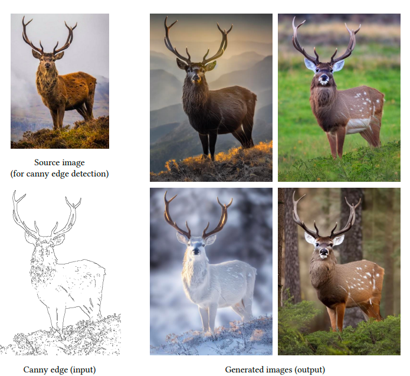
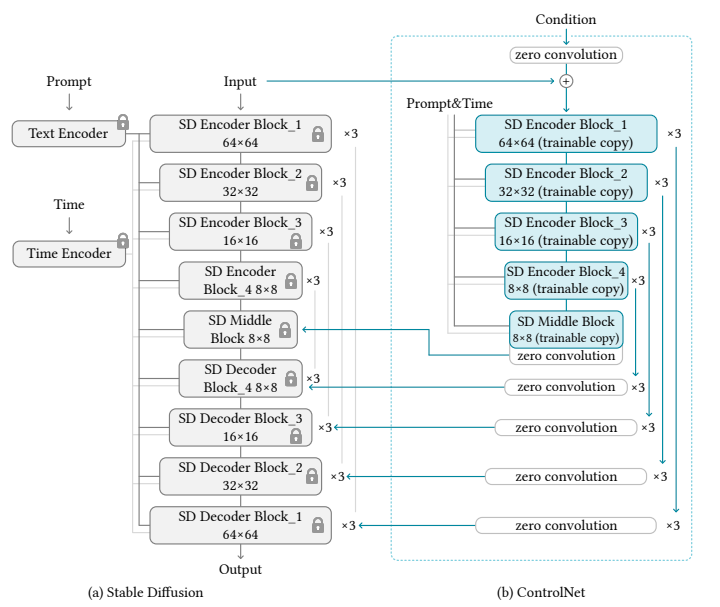
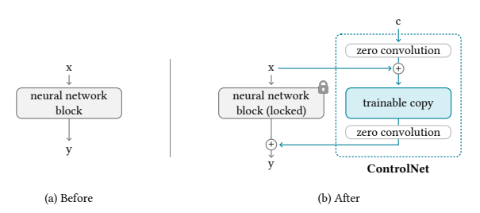
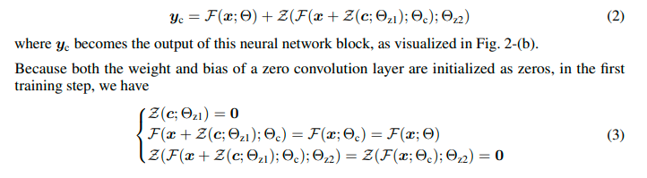
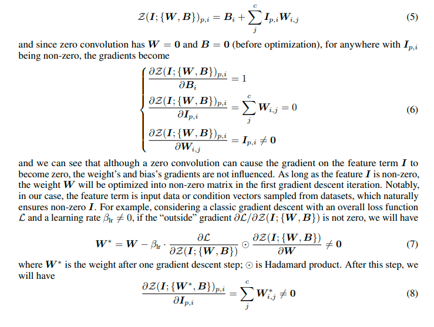

Adding Conditional Control to Text-to-Image Diffusion Models
===
ICCV 2023 / arxiv 23.02  

  

large diffusion model (Latent Diffusion)을 specific한 domain으로 fine-tuning할때,
specific한 domain에 small data에 overfitting되는 것을 예방하는 연구

(논문에서는 small data의 기준을 <50~100k 로 말하고 있다.)

즉, generalization ability를 유지하면서 transfer learning을 해야 한다.

  

“어? 그럼 원래 layer 유지하면서 specific domain만 학습하게 복사해서 학습시키면 되겠네?”

optimize되기 전에는 pre-trained weight와 동일하게 유지되도록 하기 위해서 zero convolution을 block별로 앞뒤에 추가해준다.  
zero convolution은 W=0, b=0으로 init된 1x1 convolution이다.

   

이렇게 해줬을 때 각 block의 최초 출력값은 동일하게 유지된다.

  

아래는 최초 이후에는 optimze하는데 문제없다는 정리이다.  

