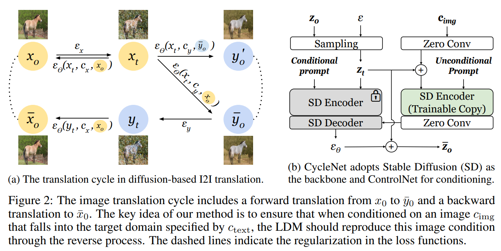
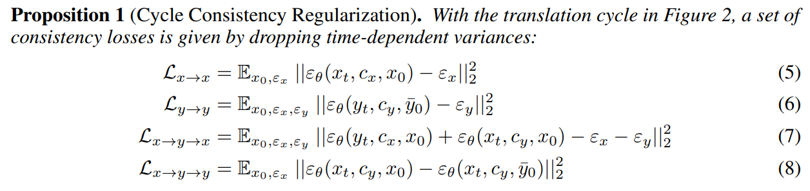
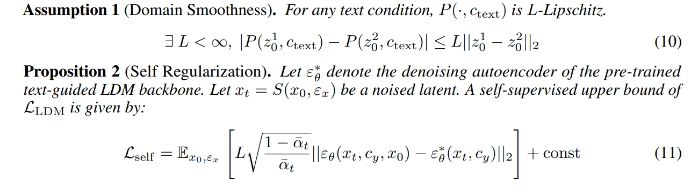
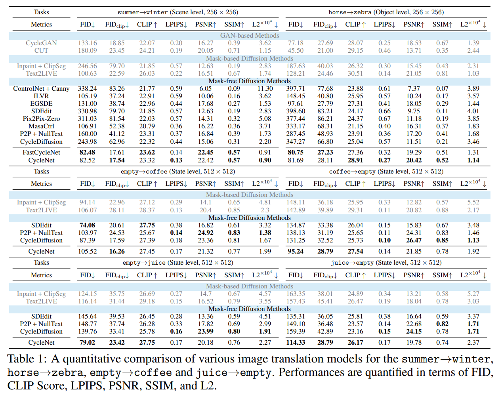

CycleNet: Rethinking Cycle Consistency in Text-guided Diffusion for Image Manipulation
===
NIPS 2023 / arxiv 23.10

## Introduction
Diffusion인데 unpaired I2I translation을 하겠다.  
> 기존 Cycle consistency loss는 a->b->a를 학습하기 때문에 완전한 이미지 b를 만드는 것이 필요하다.  
그래서 기존 방법들은 GAN을 기반으로 하거나, one step Diffusion을 사용한다.  
이 논문은 그러한 방법을 회피하고 upaired consisteny regularization을 시도한다.

## Method

이 논문에서 기본적인 전제는 "어떤 이미지든 A컨디션으로 생성하면 A가 되어야 한다."  
이를 이용하여 A->A를 loss로 사용한다는 컨셉이다.  

### Cycle Consistency Regularization
preserved structures and unrelated semantics  

5,6 : reconstruction loss  
7 : cycle consistency loss  
8 : invariance loss  
appendix에 증명 참고

### Self Regularization
match the distribution of generated images with the target domain
  

## Experiments
