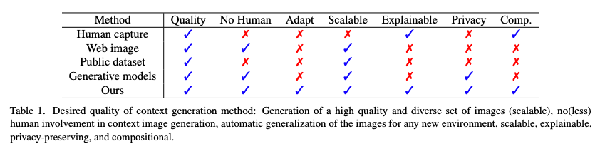
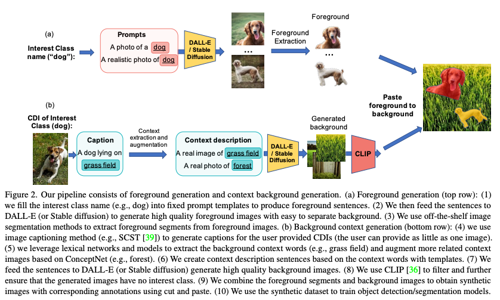
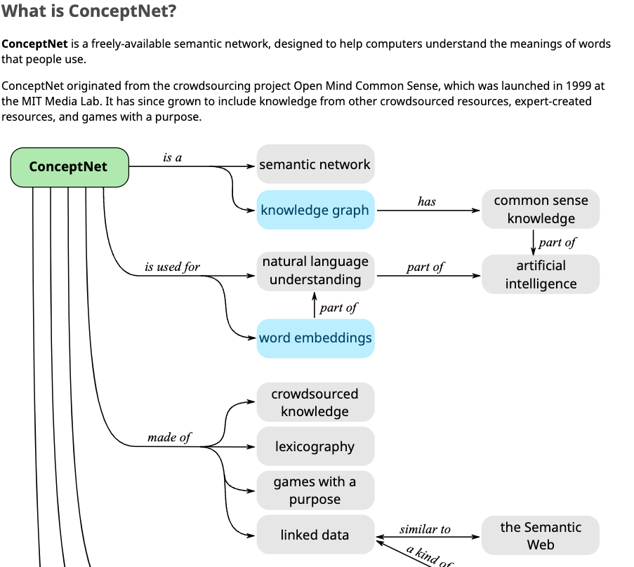
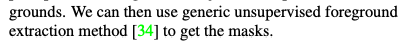
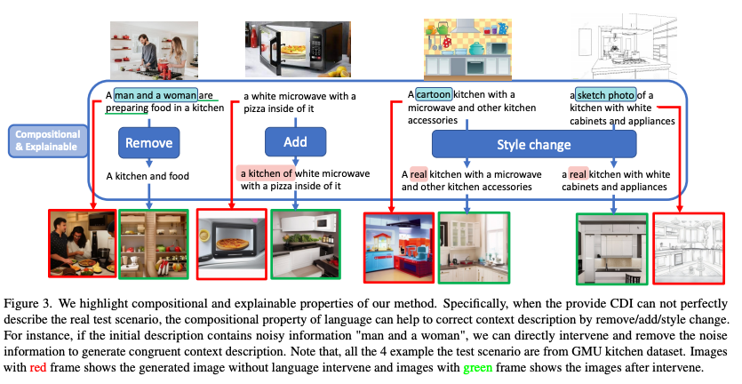
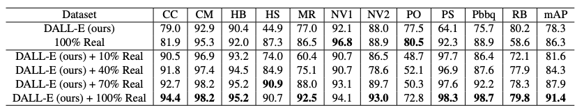

DALL-E for Detection: Language-driven Compositional Image Synthesis for Object Detection
===
arxiv 22.06       

> Diffusion으로 OD용 데이터생성을 하는 논문을 읽는 과정  
> 미리 말하자면 별거 없다...  
> 그래도 저자에 Microsoft Research가 있길래 뭔가 있나 싶었는데, 없다...

  
## Language-driven Context generation
실제 이미지를 캡셔닝한다음에 객체와 배경으로 나눠서 각각 생성한 뒤에 합친다.  
캡셔닝 모델로는 SCST(self-critique sequence training)이라는 16년도 모델을 사용하는데, 다른 모델을 써도 된다고 말한다.  
이미지 당 K개의 캡션을 만들고 ConceptNet을 사용하여 단어의 표현을 증가시킨다.
>   

이 후 DALL-E를 사용해서 이미지를 생성하고 CLIP으로 필터링한다.  

## Language-drive Foreground generation
'A photo of [object]', 'A realistic photo of [object]', 'A photo of [object] in pure background'  
를 사용해서 생성한다. 이렇게 생성하면 배경이 간단해서 분리하기 쉽다고 한다.  
segmentation model은 "open world entity segmentation"이라는 21년도 모델을 사용했는데, 특별히 사용한 이유는 없다.  
> 진짜로 없다. 이 한 문장이 전부이다.  
> 

## Compositional dataset generation  
생성된 객체를 랜덤하게 증강해서 경계에 가우시안블러 살짝 먹이고 배경에 랜덤한 위치에 붙인다.  
이것이 Table1에서 말한 Compositional의 정체이다.

  
뭔가 있어보이지만 단어를 안 쓰면 제거한거고, 단어를 추가하면 추가한것이란 말이다.  
이게 Table1에서 말한 Explainable의 정체이다.  
이런식으로 문장들을 섞어서 데이터의 variation을 넓혀주는 것은 괜찮은 접근법이긴 한 것같다.

  
