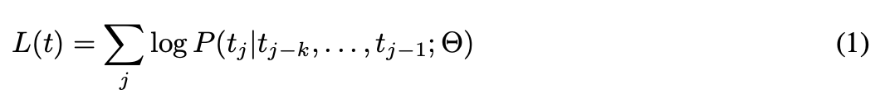
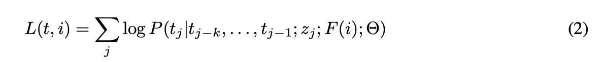
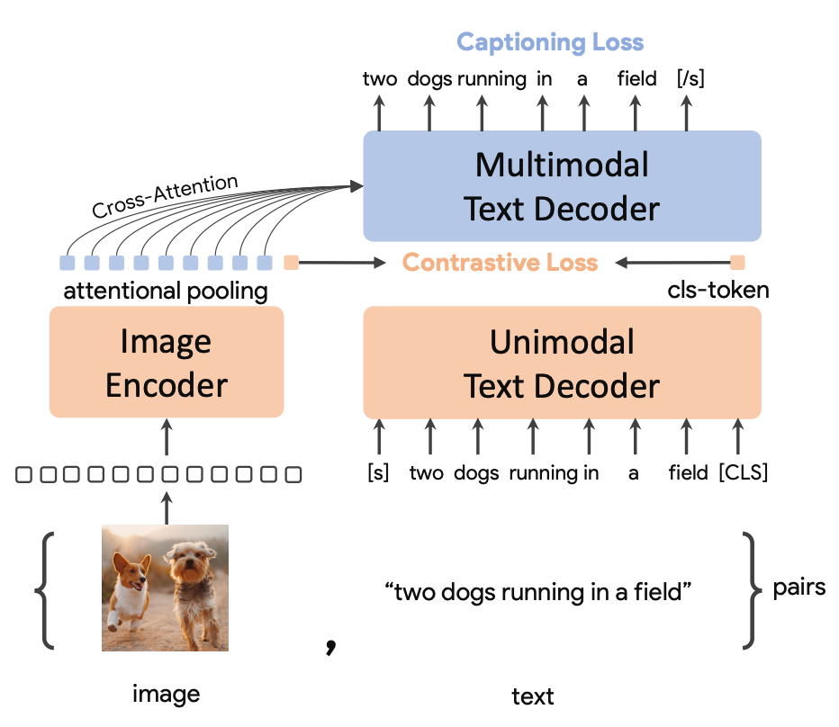
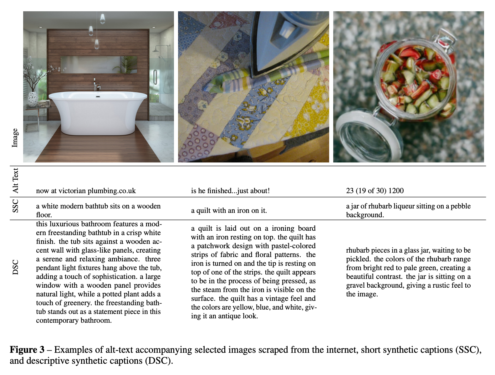
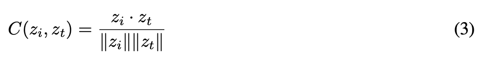
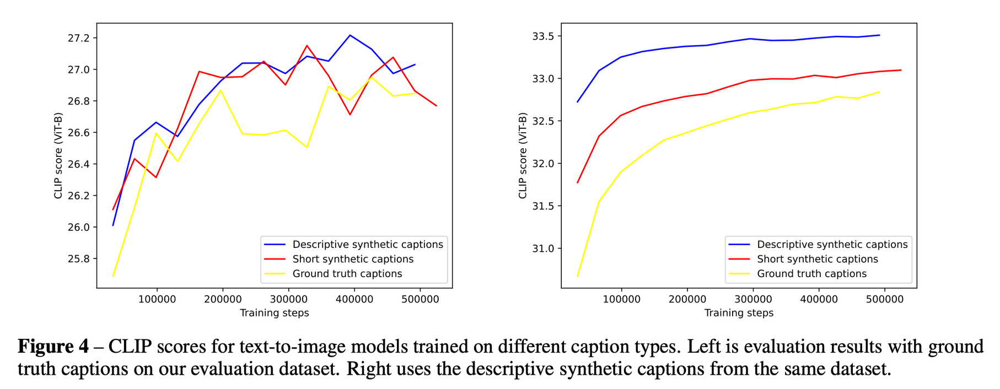
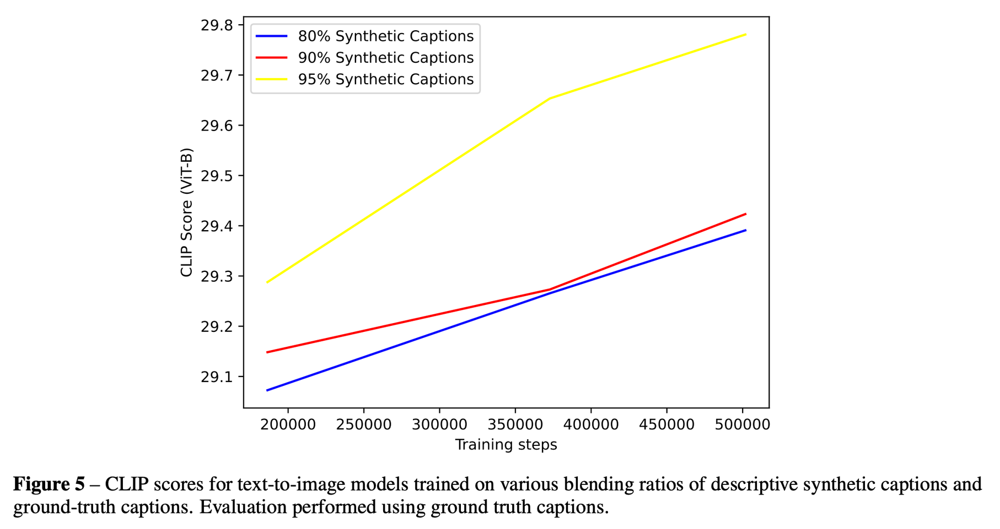

Hierarchical Text-Conditional Image Generation with CLIP Latents
==
### 23.09? [open-ai](https://cdn.openai.com/papers/dall-e-3.pdf) (DALL-E3)

### Prompt Following
트랜스포머를 사용하면서 text-to-image 생성에 많은 발전이 있었다.
text-to-image 생성할 때에 프롬프트의 의미를 혼동하거나 단어를 무시, 디테일한 프롬프트를 표현하지 못하는 경우가 많다.
캡션에서 단어의 순서, 의미를 놓치지 않고 생성할 수 있는 게 필요한데 이를 prompt following이라고 부르자
여기서 우리는 학습 데이터셋의 캡션을 개선함으로 이를 해결한다.

저자들은 이것이 학습용 이미지에 노이즈 프롬프트가 많다고 가설을 세웠고,
이를 위해 image captioner를 학습하고, 데이터셋을 재라벨링 후 생성모델을 학습하였다.

### Dataset Recaptioning
기존에 학습에 사용한 text-image 데이터셋의 가장 큰 문제는 대부분의 캡션이 이미지의 주제에 대한 간단한 설명이고, 세부적인 묘사는 생략되어있다는 것이다.
1. 부엌의 싱크대나 보도에 있는 정지 표지판과 같은 객체들의 존재와 설명
2. 장면에서 객체들의 위치와 그 객체들의 수
3. 장면에서 객체들의 색상과 크기와 같은 상식적인 디테일들
4. 이미지에 표시된 텍스트

더불어 인터넷에서 가져왔기 때문에 잘못된 캡션들도 존재한다.
(광고, 밈, alt-text)

#### Pre-training
이미지 캡셔너는 전통적인 텍스트 예측 언어모델과 매우 유사하다.

여기에 이미지만 조건으로 추가해주면 된다.
하지만 이미지는 수천 개의 픽셀값으로 되어이씩 때문에 CLIP을 사용한다.

그래서 captioner(Θ)와 CLIP(F)를 CoCa방식으로 같이 pre-train시켜준다.

하지만 아직 이 단계에서는 아직 세부 사항을 잘 설명하지 못한다.

### Fine-tuning
* short synthetic captions: 짧지만 이미지의 주요 주제만을 담은 캡션으로 fine-tune하여 편향시킨 모델로 생성한 캡션
* descriptive synthetic captions: 상세하게 기술된 캡션으로 학습된 모델로 생성한 캡션

### Evaluating the re-captioned datasets
10억장 이미지, 2048 배치, 500000 epoch

생성된 캡션들은 구두점, 캡션 길이, a나 an으로 시작하는 스타일같은 경향이 있다.
이러한 스타일에 편향되는 것을 막기 위해 실제 캡션을 랜덤하게 섞어서 학습에 regularize를 걸어준다.

3가지 text-to-image 생성 모델을 학습한다.

1. 실제 캡션만으로 학습
2. 95%의 짧은 생성된 캡션으로 학습
3. 95%의 상세하게 생성된 캡션으로 학습

* 좌측
  * 실제 캡션으로 평가한 것이다.
  생성된 캡션으로 text-to-image 모델을 학습하는 것이 단점이 없음을 나타낸다.
* 우측
  * 상세한 생성된 캡션으로 평가한 것이다.
  전체적으로 변동성이 낮다. 즉, 생성된 캡션이 평균화된다는 저자의 가정을 뒷받침해준다.
  (편향된 거니까 안좋다고 할 수도 있고, 의도에 따라 fine-tuning하는 느낌으로 적용할 수도 있을 것 같다.)

혼합 비율을 바꿔서 실험하였다. 65%도 했는데 너무 안좋아서 빼버렸다고 한다.

캡션을 길게 사용했기 때문에 길고 매우 자세한 캡션의 분포에 적응하게 된다.
(캡션이 길어져도 세부적인 내용을 놓치지 않고 잘 묘사한다는 의미인 것 같다.)

또 한가지 제안하는 것은 이미지를 생성할 때 GPT-4를 사용하여 텍스트를 “업샘플링”하는 것이다.
이렇게 하였을 때에 누락되어 잘못 렌더링했을 이미지들을 올바르게 렌더링한다고 한다.
