DatasetDM: Synthesizing Data with Perception Annotations Using Diffusion Models  
===
NIPS 2023, arxiv 23.08  
####
## Introduction
Diffusion으로 segmentation data를 만들곘다.  
Diffusion의 성능은 유지한 상태로 P-Decoder라 부르는 다운스트림 모델만 학습한다.  
* 다른 모델에 1%정도 (약 100장)의 데이터만으로도 가능하다.  
* semantic, instance segmentation뿐 아니라 domain generalization, long-tail data에서도 유용하다.  
####
## Methods  
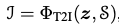  
{noise, text} > synthetic image
####
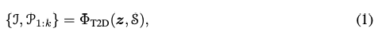  
{noise, text} > {synthetic image, annotations}  
text-to-data process를 만들곘다.  
####
## Train  
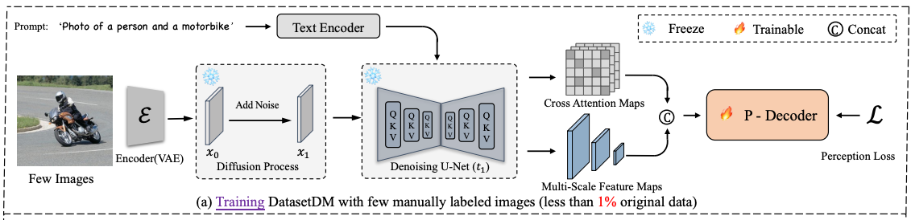  
####
### Hypercolumn Representation Extraction
1. 100장의 few images를 inversion > 1 step denoising하는 과정에서 attention map과 feature map을 뽑는다.
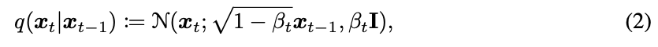
####
2. text prompt는 간단하게 class에 대해서만 "a photo of a [cls1], [cls2]..."로 사용
3. feature map은 8, 16, 32, 64 레이어에서 총 4개를 뽑는다.  
4. attention map은 16개 cross attention뽑는다. (16개면 decoder에서도 뽑는 것이다.)  
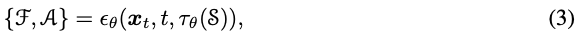
####
5. 그리고 각 해상도마다 concat > 1x1 Conv를 통해서 hyper-column representation를 만든다.  
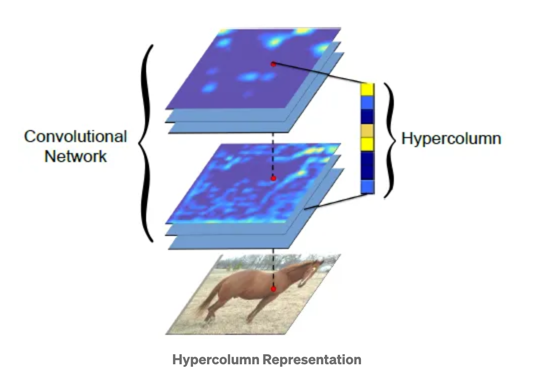
####
### Perception Dicoder
이후에는 각 task에 속하는 일반적인 모델을 사용한다.  
> 멀티 스케일 피쳐를 고려하는 모델이면 아무거나 붙여도 되는 늬앙스이다.  

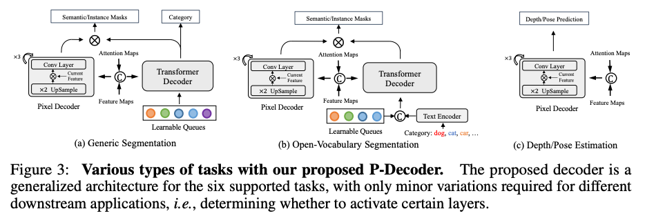
####
## Inference
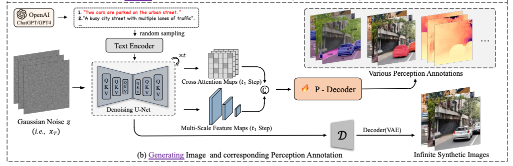  
* 프롬프트를 LLM을 사용해서 augmentation한다.  
  * ‘Please provide 100 language descriptions of urban driving scenes for the Cityscapes benchmark, containing a minimum of 15 words each. These descriptions will serve as a guide for Stable Diffusion in generating images.’
* Denoising단계를 T에서부터 한다.
  * 이미지를 생성해야하기 때문에 T부터한다.
> 논문에 언급은 없지만 P-Decoder에는 당연히 1 => 0으로 가는 step에서 뽑은 feature를 사용할 것 같다.  
###
## Experiments  
* V100, 512x512, 20시간 학습
####
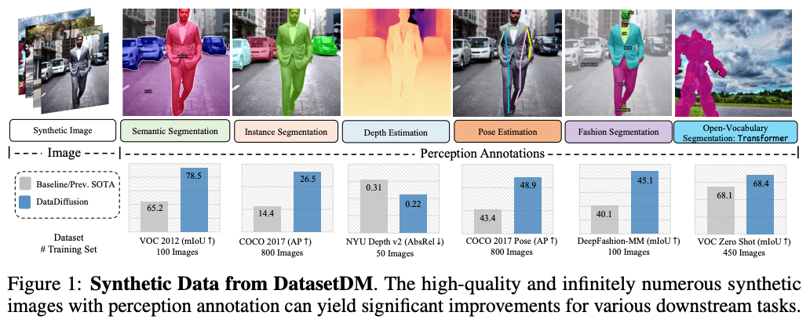
####
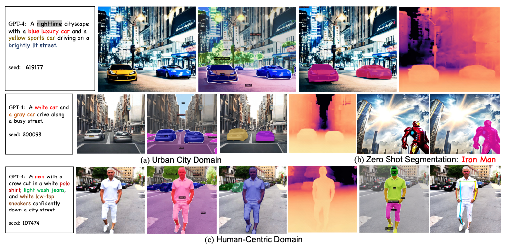
####
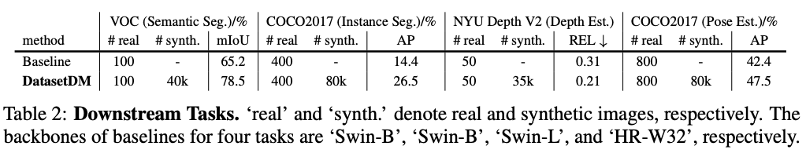
####
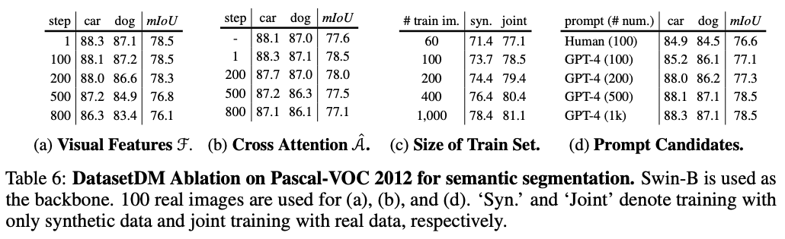
####

