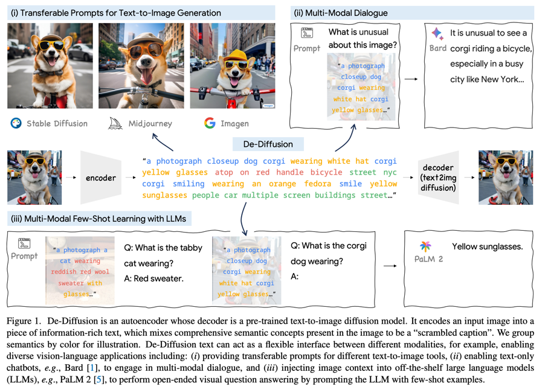
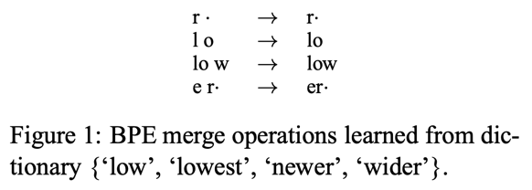
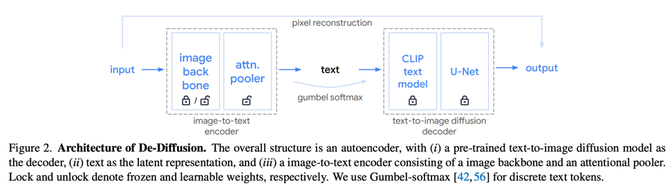
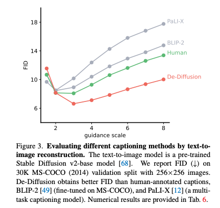
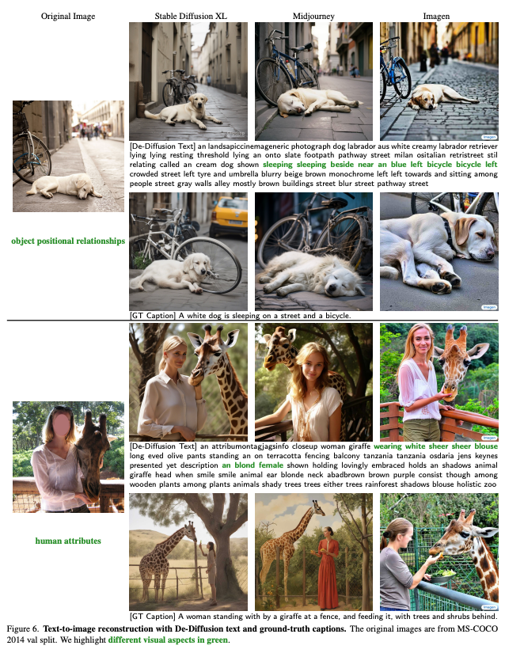
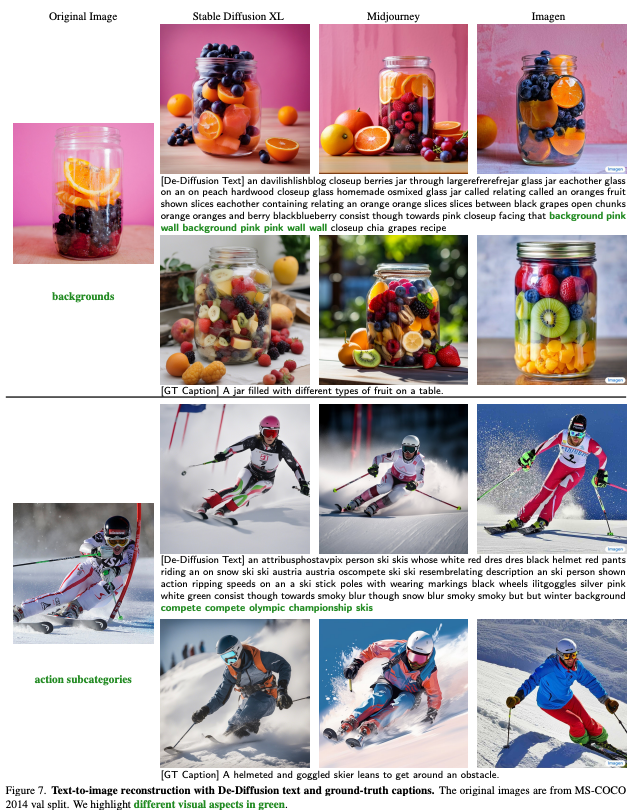
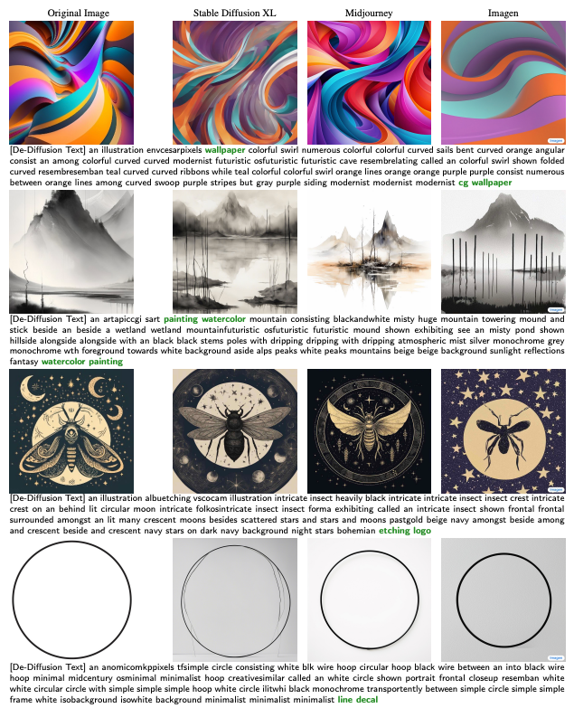
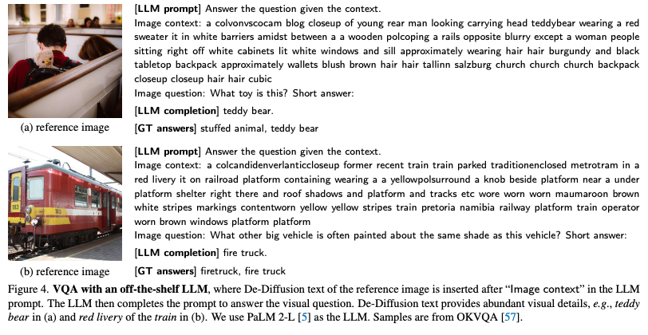

De-Diffusion Makes Text a Strong Cross-Modal Interface
===
CVPR 2024 / 23.11  
###
## Introduction
  
입력이미지를 설명하는 텍스트를 뽑아내고, 이를 활용해서 여러 task의 성능을 향상시키는 논문  
* Cross-modal interface를 사용해야한다!
  * content preserving: 원래 modal로의 재구성이 잘 되어야 한다.
  * semantically meaningful: raw signal이 이해와 추론에 도움을 준다.  

AE는 content preserving에 강하고, CLIP은 semantically meaningful이 강하다.  
이 논문에서는 텍스트가 훌륭한 cross-modal interface가 될 수 있다는 아이디어이다.  
예를 들면 음성 오디오를 텍스트로 변환 후 다시 오디오로 바꾸는 것은 위의 두가지 조건을 모두 만족한다.  
###
이 논문에서는 기존의 image captioning보다 더 정밀한 텍스트를 얻고 싶어한다.  
이를 위해서 text-to-image Diffusoin 모델을 decoder로 사용하여 reconstruction loss를 계산하는 방향으로 접근한다.  
전통적인 AE를 생각하면 된다.
##
***
## Methods
###
### De-Diffusion for Text Representation  
* Image-to-Text Encoder
  * BPE-encoded text token을 사용하여 기존 image captioning보다 의미론적으로 더 정밀한 표현을 얻을 수 있다
> BPE-encoding: JPEG 압축처럼 단어의 패턴을 byte로 표현하는 방법
> 

* Text-to-Image Diffusion for Decoder
  * 당연하게도 encoder의 출력이 인간의 언어가 아니라 decoder에 overfitting될 수 있다.  
    * 때문에 Diffusion의 U-Net과 CLIP text encoder를 freeze 시킨다.
  * 그리고 I2T encoder의 출력을 text로 변환하여 condition으로, 랜덤 노이즈로부터 생성을 한다.
    * 단, 한 배치안에서는 모두 같은 노이즈로부터 시작한다. 아무래도 텍스트를 잘 뽑게하는 것이 목적이기 때문에 변수를 고정하는 것으로 보인다.

  
* backbone은 당연히 pre-trained가 더 좋다.  
* pooler는 transformer기반으로 출력되는 N개의 쿼리가 각 단어를 의미한다.  
  * 즉 [SOS]+N개토큰+[EOS]로 Diffuion condition으로 들어간다.
* 학습 데이터셋에서 이미지만 사용하고 text는 사용하지 않는다.  
* CLIP text encoder에서 전체 어휘중 6%에 해당하는 구두점을 제거했더니 성능이 증가했다.  
###  
### Implementation Details  
* Imagen 베이스  
* WebLI 데이터셋, 구글리서치에서 웹크롤링하여 만든 text-image 데이터셋  
  * 학습에는 물론 이미지만 사용  
* 288*288 입력받는 CoCa 백본 사용, freeze  
###
## Experiments and Applications  
* 이 논문에서는 디코더로 Imagen사용했지만 SD나 Midjourney와 같은 모델들을 사용할 수도 있다. 즉 디코더에 overfitting되지 않는다.   
* 정량적인 평가 : 이미지 -> 인코더 (De-Diffusion or 기존 captioner) -> text, caption -> 생성모델 (디코더와 다른 모델) -> FID  
  *   
* supervise로 학습한게 아니다보니 GT보다 더 풍부한 표현력을 보여주고 있고 이로 인해 더 구체적으로 생성되는 결과를 확인할 수 있다.  
  *   
  *   
* 심지어 사람이 text를 만들기도 어려운 이미지에 대해서도 잘 표현이 가능하다.
  *   
* VQA로 사용할 수도 있다.  
  * 
