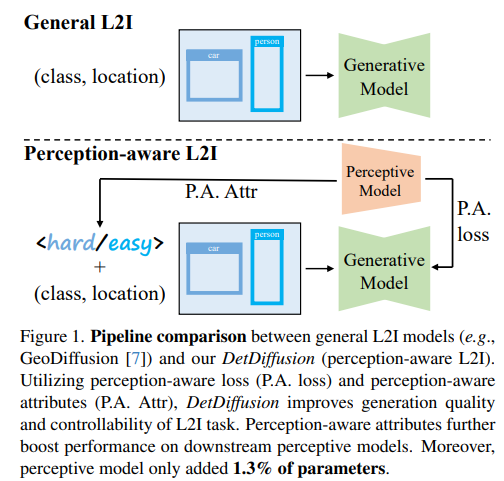
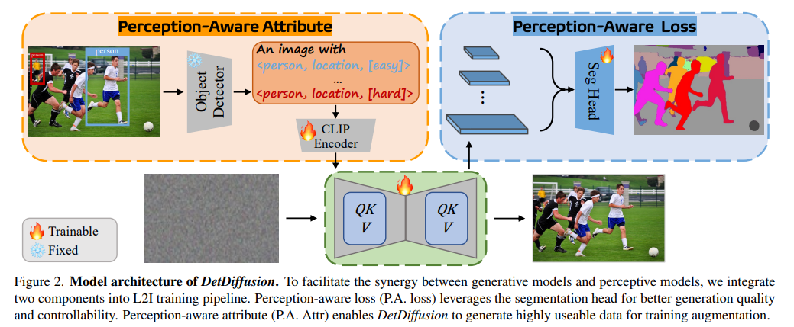
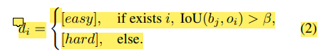
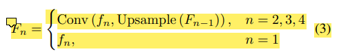
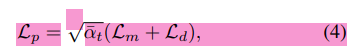
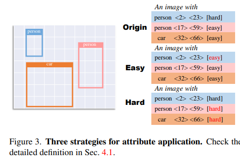
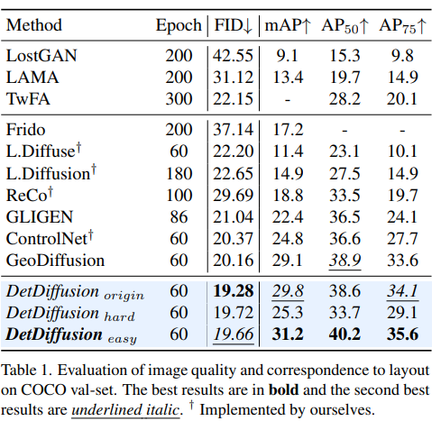
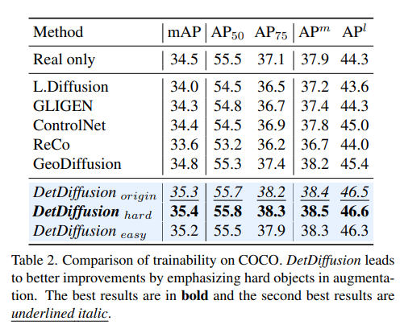

DetDiffusion: Synergizing Generative and Perceptive Models for Enhanced Data Generation and Perception
===
CVPR 2024, arxiv 24.03

# Introduction

Diffusion에서 생성된 이미지를 Detection 학습에 사용하기 위해서는 bbox label이 필요하다.  
이 논문에서는 perception-aware loss라는 것을 제안해서 Detection의 검출 결과를 자연스럽게 모델에 반영할 수 있도록 학습을 유도한다.

# Method

## Perception-Aware Attribute
기본적으로 위치좌표를 condition으로 넣는 방식은 [GeoDiffusion](../GeoDiffusion/main.md)의 방식을 따른다.  
* "An image with {objects}", where objects are [(c1, l1, d1), ...,(cm, lm, dm)]  
    * c:category / l:location / d:difficulty attribute(아래 3번)
1. 일단 pre-trained OD(Faster R-CNN, YOLO ...)로 real 이미지에서 검출을 한다.  
2. confidence score threshold로 확실한 객체만 골라낸다.  
3. 그리고 GT와 IOU threshold를 주어서 "검출 난이도"를 hard/easy로 구분한다.
  

## Perception-Aware Loss as Supervision
Diffusion에서 주로 L1, L2 loss만 사용하는데, 이는 고해상도에서 디테일이나 image attribute를 잘 표현하지 못한다.  
그렇기 때문에 visual feature에 perception attribute를 반영할 수 있는 loss를 제안한다.  
visual feature는 attention map을 활용하는 논문들([P2P](../Prompt-to-Prompt/main.md), [DatasetDM](../DatasetDM/main.md), [Controlnet](../ControlNet/main.md))처럼 FPN과 같은 방식을 채용한다.  

L_m: BCE / L_d: dice loss  
결국 loss 구성은 [DatasetDM](../DatasetDM/main.md)과 동일하다.  
대신 alpha텀이 추가되어있는데, 알고 있는 그 DDPM에 alpha가 맞다.  
적은 노이즈(작은 timestep)에서 피쳐맵의 영향력을 높이는 것을 의도한 것이다.  
당연하게도 노이즈가 많은 스텝에서는 객체의 피쳐가 약할 것이기 때문에 강도를 줄여준다.

  
최종적으로 LDM loss와 같이 사용한다.  

## Experiments
  
Difficulty attribute에 효과를 확인하기 위해서 다 통일시켜서도 비교한다.   

  
생성된 이미지를 OD에서 inference한 결과이다.  
easy의 검출 결과가 hard의 검출 결과보다 좋다.  
이를 통해 의도한 대로 hard로 생성하면 "OD가 검출하기 어려운" 형태의 객체를 생성해준다.  

  
이를 사용하면 hard case를 생성해주기 때문에 OD를 학습할 때 더 효과가 좋다.  

> 충분히 reasonable한 것 같다.
> 하지만 hard case에 대해서 misalign이 없는지는 확인해봐야 할 것 같다.  
> hard case라지만 class가 다른 객체가 생성되었으면 오답 데이터일 뿐이다.  
> 이 부분에 대해서 CLIP score같은 것으로 실험 결과가 있었으면 더 좋았을 것 같다.