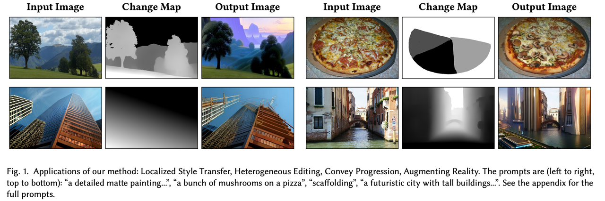
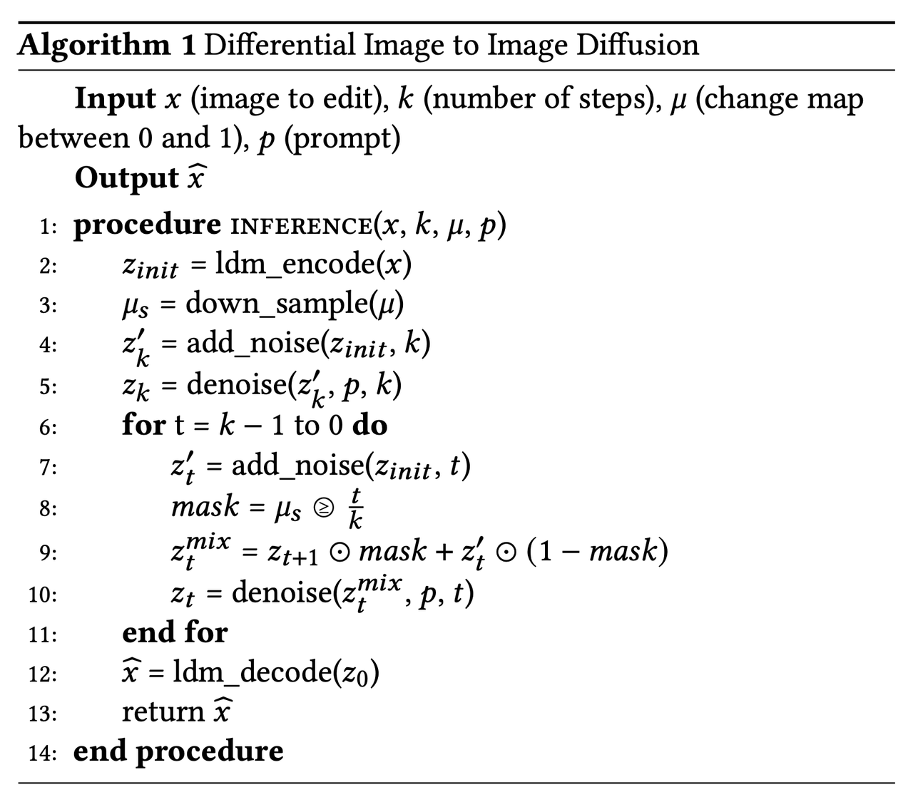
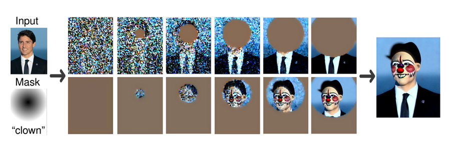
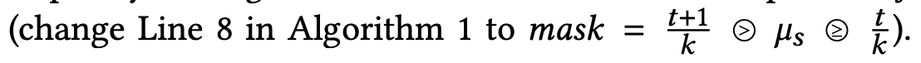
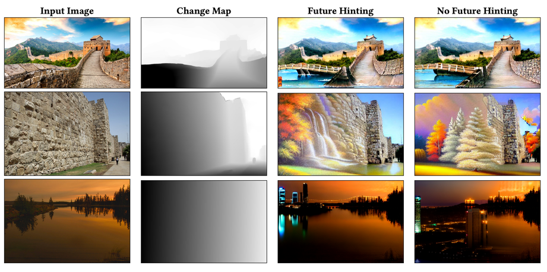
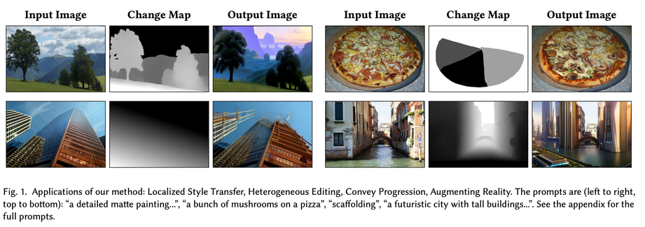
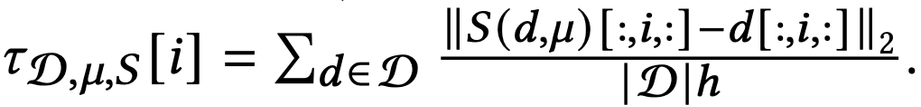
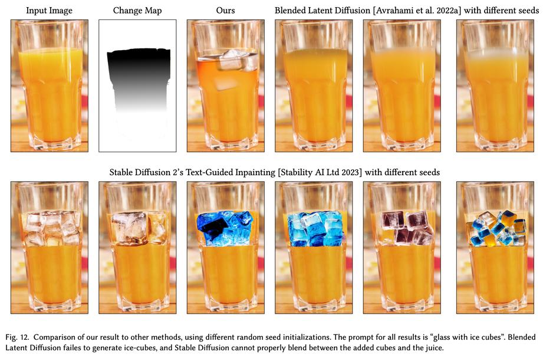

Differential Diffusion: Giving Each Pixel Its Strength
===

* 변화량에 strength를 주기 위한 새로운 Diffusion inference process를 제안한다.inference만 수정한다. (추가 학습 없다)
* change map을 사용한다.
* 새로운 metric을 제안한다.

### Method

전체적으로 동일하고 8번이 메인이다.
t/k의 비율에 따라서 매 스텝 마스크가 변경된다.

### Injection

1. Gradual Injection

강도가 큰 영역일수록 많은 횟수에 디노이징을 겪기 때문에 입력과 유사도가 멀어진다.
즉 적용되는 step에 비례하여 노이즈의 양이 증가한다는 점이 일반적인 diffusion의 inference와 다른 점이다.
(제안하는 것처럼 말하지만 collage diffusion에서 사용했던 방법이다… collage diffusion은 23.03이다.)

2. Future Hinting

큰 타임스템에서 디노이징되었던 영역은 더 작은 스텝에서도 반복해서 디노이징된다.
이를 통해 모델에 입력으로 미래 타임스텝에 해당하는 정보를 입력해주기 때문에 future hinting이라고 한다.

pre-trained 모델은 mask를 채우는 것을 학습하지 않아서 강인하지 않기 떄문에 이러한 방법으로 정보를 넣어주는 것이 구멍 채우기 (fill holes)에 더 자연스럽다고 주장한다.

(SD v1.5 이후에 제공되는 inpainting task checkpoint는 배경이미지를 concat해서 입력하는 방식이다. 즉 이 논문에서는 이 방식의 inpainting을 사용하지 않은 것이다.)

아래는 Future Hinting을 사용하지 않은 결과와 비교한 것이다.

### Experiments

Trend Reconstruction for single images

change map을 얼마나 잘 적용하였나를 평가하려고 한다.
논문에서 말하기 경험적으로 높이에 따라서 생성되는 콘텐츠가 달라진다고 말한다.
나무의 뿌리가 위에 있으면 부자연스럽다는 예시를 들기도 한다.

1. 수평방향으로 gradient map을 만든다.
2. 열 별로 평균이 선형적으로 변하는지 확인한다.

#### Reliability score

다음과 같은 속성을 발견하였고 정량화하려고 한다.
* diffusion이기 때문에 결과 이미지에는 노이즈가 섞여있다.
* 이미지의 가장자리에 더 많은 변화를 주는 경향이 있다.
* 전체 영역을 전체 스텝에서 변경하더라도 확률적으로 입력이미지와 유사하게 나오는 경우가 있다.
* 추세는 유사하지만 정량적인 평가는 달라야 한다.

d: 원본 이미지
μ: change map
S: 전체 편집 과정

생성된 이미지와 원본 이미지의 열 별로 L2 norm을 해준다.

기준 trend (전체 범위를 전체 스텝에서 생성한 결과)를 빼준다.
이렇게 normalized trend를 정의한다.

“meaning G is a horizontal gradient change map”
(이 문장으로 보아 여기서 제안하는 평가방식은 위와 같은 change map으로 수평방향의 그라디언트 맵만을 사용하는 것이 제한사항인 것 같다.”
이를 생성된 이미지에 각 열의 인덱스 벡터와 피어슨 상관계수를 계산한다.

두 방법은 바이너리 마스크니까 0.5를 threshold로 사용했다고 한다. (…?)

