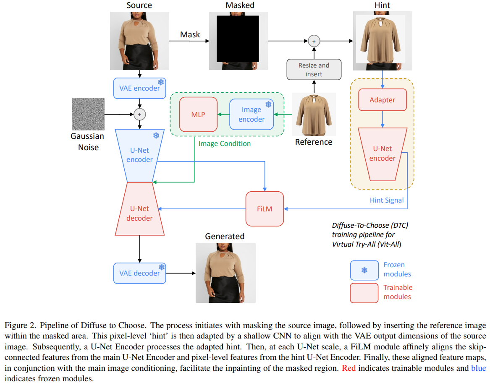
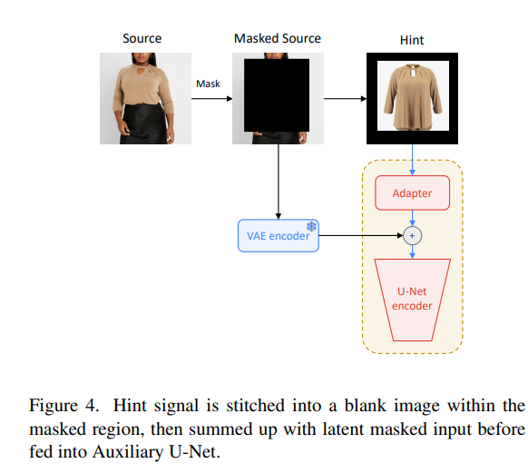
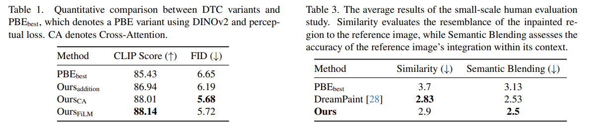
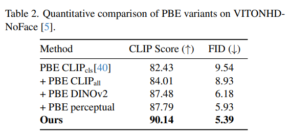
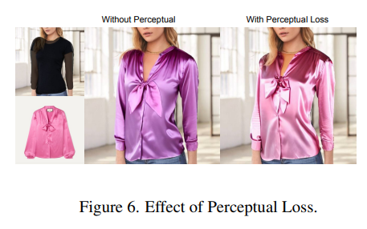
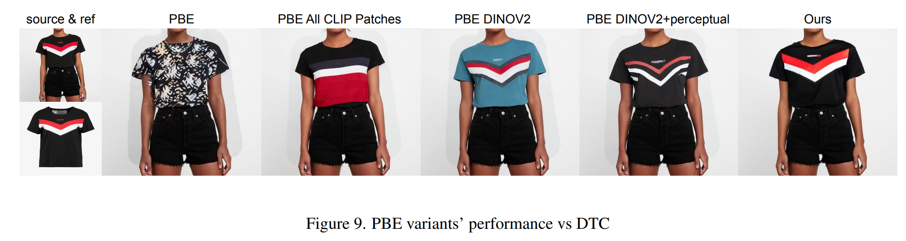

Diffuse to Choose: Enriching Image Conditioned Inpainting in Latent Diffusion Models for Virtual Try-All
===
arxiv 24.01 / Amazon

## Introduction
Virtual Try-on task : image-conditioned inpainting  
Vitual Try-All : 특정 제품군에 제한되지 않고 다 하겠다는 의미  
* 고객들이 항상 스튜디오에서 깔끔하게 찍은 사진만 사용하지 않기 때문에 in-the-wild 에서도 가능해야한다.
* 객체의 identity는 유지하면서 배경과 자연스럽게 생성되어야 한다.
* 온라인 서비를 위해서 fast inference가 필요하다.  

기존의 방법들은 fine-grained detail이 부족하다.  
* 3D기반 렌더링 방법 (non deep learning)  
    당연한 이야기겠지만 촬영 각도와 같은 물리적인 환경을 알아야하기 때문에 dl기반 보다 부족하다.
* DreamPaint  
    DreamBooth + Inpainting task인 논문이다.  
    DreamBooth 방식에 의한 few-shot fine-tuning이 필요하기 때문에 fast inference가 불가능하다.
* Paint by Example  
    pair한 데이터를 사용하지 않고 [CLS]토큰에 의존하는 방식이다 보니, 세부적인 디테일까지 표현하지 못한다.  
    그렇기 때문에 pixel-level guidance가 필요하다.  

## Method
  
### Diffusion Inpainting Models
PbE와 유사한 형태이다.  
단, 다른 점은 객체의 소스 이미지가 있는 데이터셋이기 때문에 CLIP 패치를 전부 사용하고,  
이미지 인코더로 DINOv2를 사용한다.  
### Design of Diffuse to Choose

#### Creating the Hing Signal
* ControlNet 처럼 보조 U-Net 사용  
* hint signal은 소스와 같은 크기의 0이미지에 소스를 paste한 것을 사용한다.  
#### Combining Hint Signal with Main U-Net
* FiLM(Feature-wise Linear Modulation)이라는 구조를 사용해서 U-Net에 입력한다.
* 세부사항 유지에 특히 도움이 된다.
#### Hinting Strategies, Refinement Loss and Image Encoder
* Edge를 입력하는 것보다 이미지를 직접 입력하는 것이 세부 사항 유지에 더 좋았다.  
* DINOv2를 이미지 인코더로 사용, VGGnet으로 perceptual loss 사용

## Experiments
  
  
  
 
> Inpainting 연구 해봤으면 아는 mask에 대한 artifact가 쏙 사라졌다.  
> 근데, 사용한 방법들은 condition을 잘하는 거지, 이것에 효과가 있을 만한 것이 없다.  
> 심증이긴 하나 혹시나 학습을 더 많이 했거나 cherrypick했을 가능성도 염두해두자.