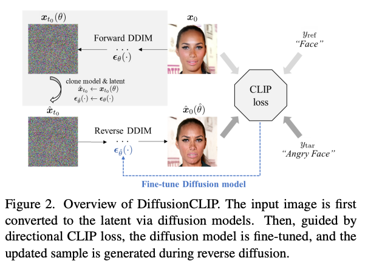
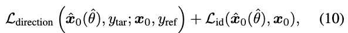
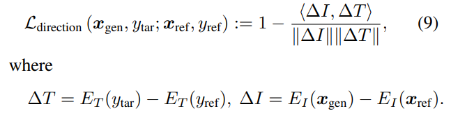
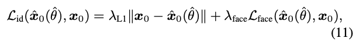
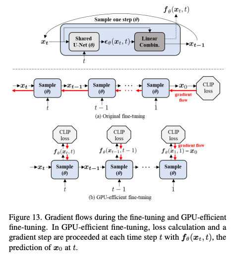
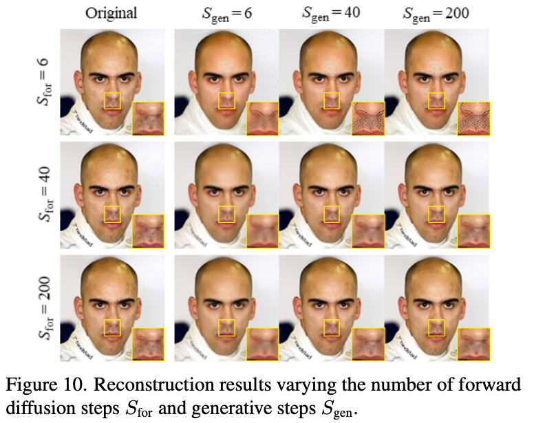
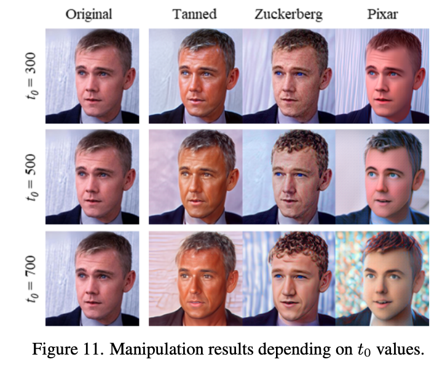
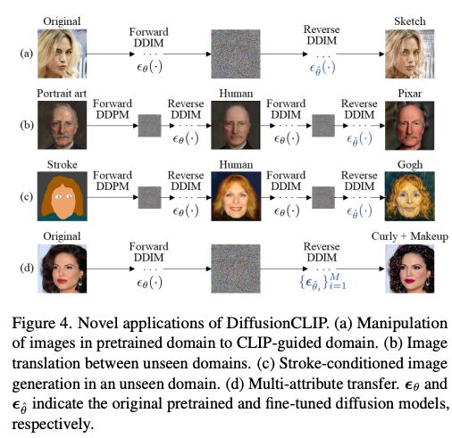
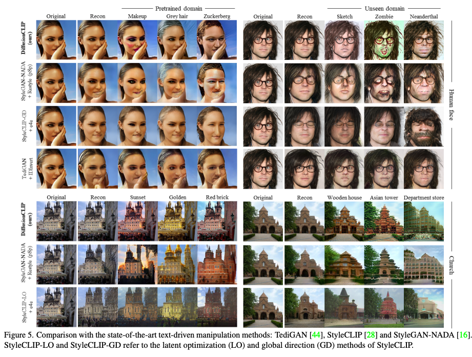

DiffusionCLIP: Text-Guided Diffusion Models for Robust Image Manipulation
---

CVPR 2022, arXiv 2021.10

SOTA인 GAN inversion은 실패하는 경우가 많이 발생한다.

* fig1, (a)를 보면 턱을 받치고 있는 손이 복원되지 않는 모습을 볼 수 있다. (얼굴 데이터로만 학습한 것 같다.)그 이유는 학습 데이터에서 손과 얼굴이 같이 있는 데이터가 적기 때문이라고 설명한다.마찬가지로 오른쪽과 같이 LSUN이나 ImageNet처럼 편차가 큰 데이터셋에 경우 더 심하다.

> 즉 GAN Inversion이 학습 데이터셋에 의존적이다.그래서 편차가 적은 데이터셋을 사용하면 위 예시처럼 본적 없는 상황에 대한 대처가 약하고반대로 다양한 분포의 큰 데이터셋을 사용하면 reconstruction이나 editing 자체의 성능이 약해진다.

* DIffusion은 forward process와 reverse process가 일치하도록 학습되었기 때문에 Inversion에서는 더 좋다고 설명하고 있다.

> GAN은 latent와 image간의 관계를 Discriminator를 사용해서 간접적으로 학습하는 반면Diffusion은 프로세스가 더 긴 대신 직접적으로 학습하기 때문에 좋다는 의미인 것 같다.

DiffusionCLIP

    
L_direction은 CLIP loss

Identity loss는 텍스트를 통해서 변경되는 부분을 제외한 다른 요소들은 유지시키는 역할이다. (전체적인 형태, 색상…)
L_face는 ArcFace에서 제안하는 loss이고 얼굴을 생성하는 경우에만 추가한다.

a와 같이 전체 스텝에 대해서 역전파해주는데, GPU가 부족할 경우 b처럼 한 스텝에 대해서만 하라고 한다.
대신 b는 시간이 2배정도 걸린다고 말한다.

효율을 위해서 t_0 < T인 값을 사용, 이 논문에서는 T=1000일 경우 t_0를 [300,600]에서 사용하였다고 함
(이미지가 unseen domain이거나 domain을 바꾸는 editing일 경우 크게 잡는 것 같다.)
이 때, (S_for, S_gen) = (40,6)으로 두어 스텝을 확 줄였다고 한다.
(t_0=400이고 S_for가 40이면 forward할 때 한 스텝당 timestep이 10씩 증가하도록 몇개의 구간으로 나눌지 정하는 하이퍼파라미터이다.)
이 하이퍼파라미터들은 실험적으로 정했다.

 > 정성적으로 S_for=200, S_gen=40 일때가 가장 좋다고 말한다.
 다만 figure 10은 inference할때의 파라미터 값이다.

최종적으로 (S_for, S_gen)을 학습할때는 (40,6)으로, Inference할때는 (200,40)으로 사용했다고 한다.

        
4(d)의 경우는 다수의 변화를 동시에 주는 것이다.

M개의 모델들을 각각 fine-tuning하고 이 노이즈들을 섞어서 여러가지 변화를 동시에 적용한다.
당연히 감마의 합은 1이다.

