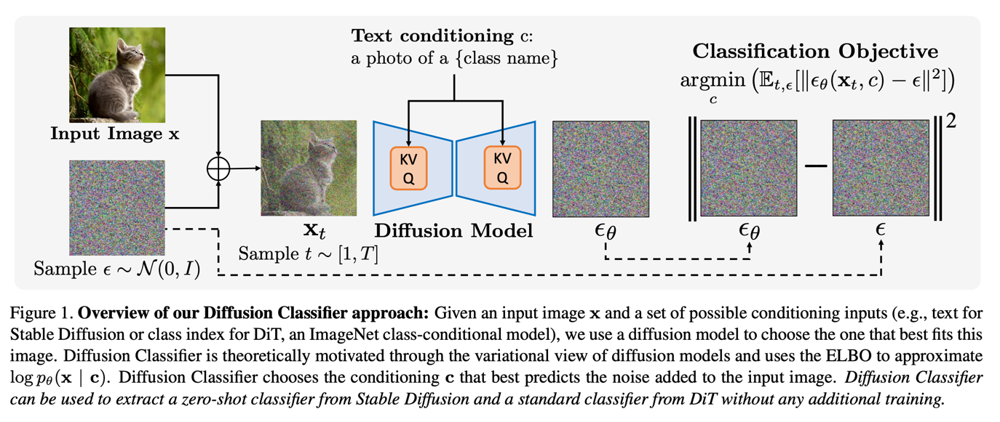
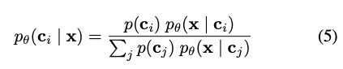
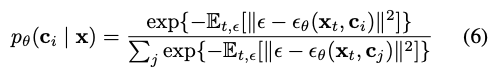
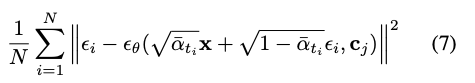
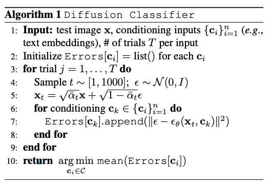
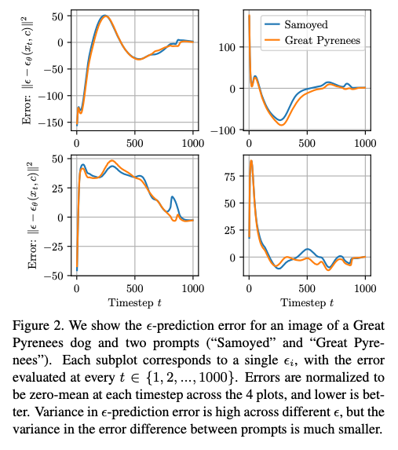
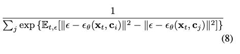
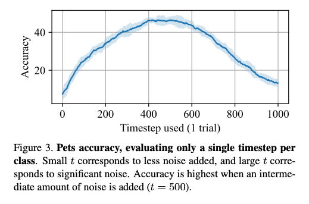
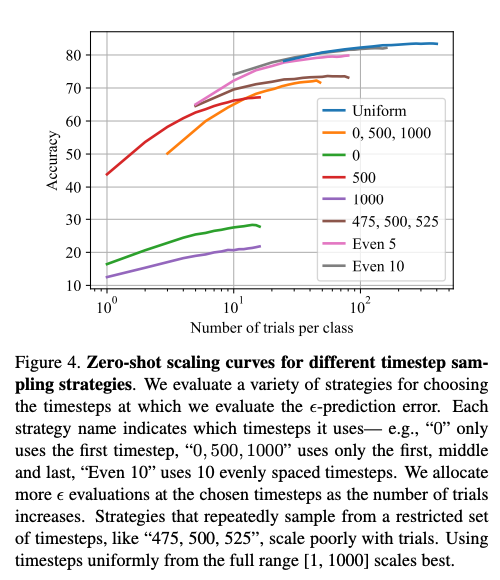
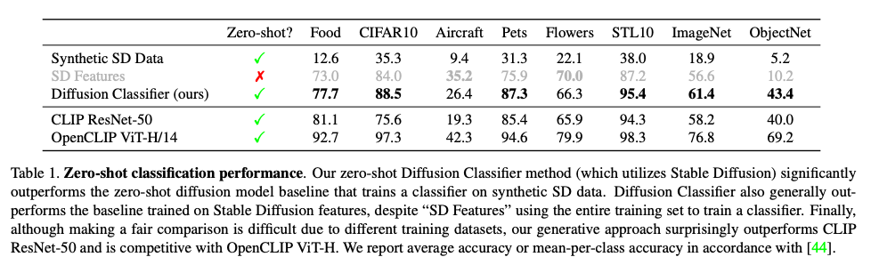

Your Diffusion Model is Secretly a Zero-Shot Classifier
===  
arxiv 23.03

> "To Recognize Shapes, First Learn to Genertae Images"
> 제프리 힌튼이 2007년에 쓴 논문에서 이렇게 말했다고 한다.

Diffusion 모델은 다양한 프롬프트에 대해서 사실적인 이미지를 생성할 수 있다.  
생성모델은 데이터의 분포를 정확하게 모델링하는 과제를 다루기 때문에   
Downstream task에서 더 완전한 표현을 생성할 수 있다.

본 논문은 이 점을 이용해서 pre-trained Diffusion을 zero-shot classification으로 사용하는 것을 제안한다.  

## Classification with diffusion mdoels
  

Diffusion-TTA랑 그림이 비슷하게 생겼다.  
motivation도 동일하다.  
조건부 생성 pθ(x|c)가 있을 때 베이즈 룰을 사용해서 아래와 같이 바꿀수 있다.  
  
이걸 DDPM에서 하는 것처럼 ELBO로 approximate하면 아래와 같이 된다.  
  
이제 이 식의 출력을 일종의 confidence로 사용하는 것이 이 논문의 핵심이다.  
  
결과적으로는 각 클래스에 대해서 스텝별로 다 계산한다음에 평균낸다.  
> 엄청 오래 걸리겠는데...  

  

## Variance Reduction via Difference Testing  
그림2를 보면 서로 다른 입실론으로 고정하고 똑같은 데이터와 프롬프트에 대해서 에러를 계산한 결과이다.  
실제로 매번 다른 값이 나오기 그대로 confidence로 사용하기에는 정확도가 낮다.  
  
대신 동일한 설정에서 프롬프트 차이에 의한 결과는 일관성있게 나온다.  
  
그래서 최종적으로 8번식으로 바꿔서 클래스별 에러의 차이를 사용하게 된다.   
> 그러면 binary classification은 안된다는 말인 것 같다.  

## Practical Considerations  
저자도 예측 시간이 오래걸리는 것은 인지하고 있다.  
때문에 몇가지 방법을 제시하고 있다.  
* Effect of timestep  
      
    샘플별로 고정된 입실론과 하나의 타임스텝만으로 계산한 결과이다.
      
    타임스텝을 여러가지 조합으로 실험해본 결과이다.
    물론 타임스텝을 다양하게 가져가는 것이 정확도는 더 좋다.
* Efficient Classification  
    클래스별로 250번씩 한다고 할 때에 클래스별로 25씩 시도한다음에 에러가 작은 클래스 5개만 선택한다.  
    이 선택된 5개에 클래스에 대해서만 남은 225번씩 시도해서 최종 샘플링을 한다.  

이렇게 해도 아직은 이미지 한장 분류하는데 RTX 3090기준 18초가 걸린다. (pets 데이터셋, 37클래스)  
심지어 이미지넷같은 1000개 클래스는 약 1000초가 걸린다고 한다.  
디퓨전을 활용하는 것에 대한 가능성을 제시하는 정도로 봐야한다.  

  
