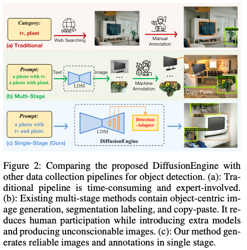
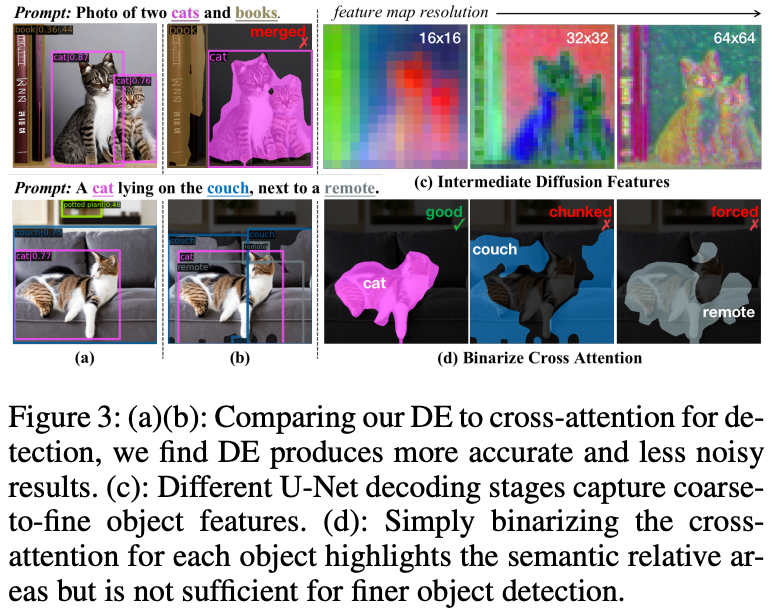
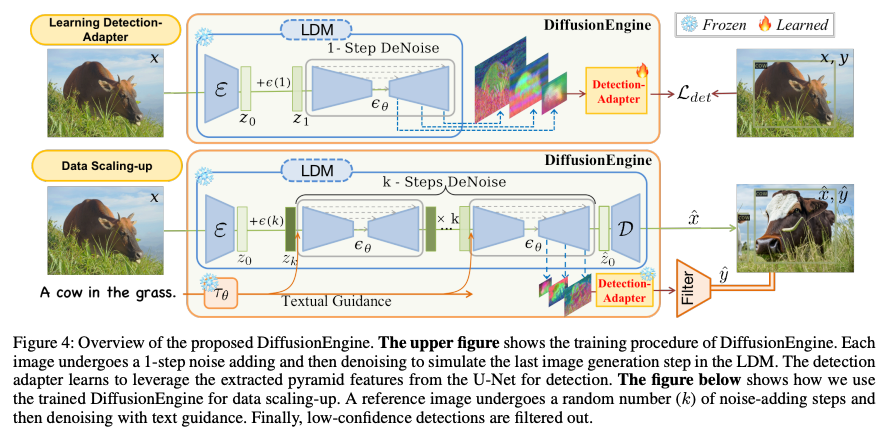
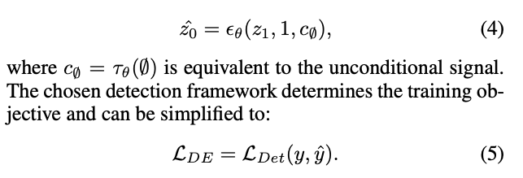
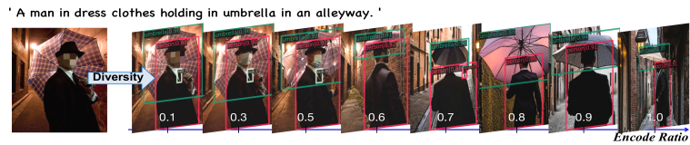
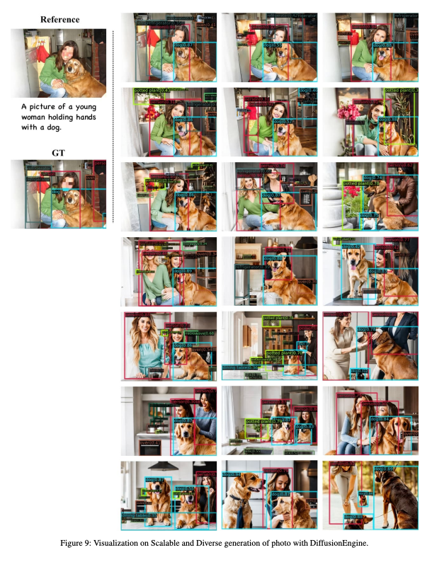
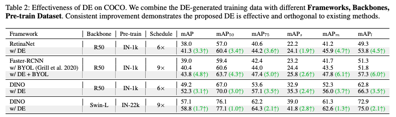
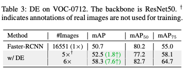
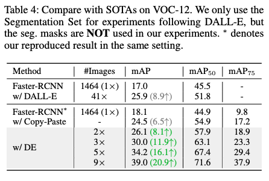

DiffusionEngine: Diffusion Model is Scalable Data Engine for Object Detection
===
arxiv 23.09  

기존의 방법들은 웹 크롤링 후 추가적인 수동 라벨링이 필요헀다.  
DALL-e for detection이나 X-Paste같은 논문들은 이를 해결하기 위해 연구를 하였지만 3가지 문제가 있다.  
1. 라벨링을하는 모델이 필요하다.  
2. 단순 paste를 하기 때문에 다양성이 제한되고 비합리적인 이미지를 생성한다.  
3. 이미지와 주석 생성이 분리되어있어, Diffusion의 학습된 semantics와 location에 대한 detection-aware한 정보를 충분히 활용하지 못한다.  

  
 
이 논문의 contribution은 아래와 같다.  
1. 기존의 다단계 과정을 제거하고 Detection-Adaptor를 설계하여 플러그 앤 플레이로 사용 가능하다.  
2. Diffusion이 가지고 있는 implicit한 정보를 task에 의한 신호와 align해서 우수한 라벨링 능력을 부여한다. 물론 무한한 데이터 생성이 가능하다.  
3. COCO-DE, VOC-DE 데이터셋을 기여한다.  
4. Grounding Diffusion보다 좋다.  

## Methods  
### LDM is Effective Backbone for Detection  
기본적으로 Diffusion의 Cross-attention을 보면 이미 위치 정보와 해당 위치에 의미론적으로 맞게 생성하는 능력이 있다.  
  
하지만 그림3에 보여주는 실패 케이스와 같이 BCA를 그대로 label로 사용하기에는 무리가 있다.  
1. 객체가 겹쳐있는 경우 두마리 고양이처럼 따로 분리하기가 어렵다.  
2. 반대로 하나의 객체가 여러개로 나눠지는 경우도 있다.  
3. 또한 리모콘처럼 특정 객체가 생성되지 않았는데 억지로 위치를 할당하고 있는 경우가 있다.  
4. 반대로 프롬프트에 없는 객체가 생성될 수도 있다.  

이를 해결하기 위해 Detection-Adapter를 사용하는 것을 제안한다.  

### Learning Detetion-Adapter  
  
그림4의 윗부분이다.  
CA의 attention map을 feature pyramid로 사용해서 Detection-Adapter를 학습시킨다.  
여기서는 DINO를 사용했지만, 어떤 Detection을 사용해도 상관없다고 설명한다.  
  
단순하게 생각하면 생성하면서 학습시키는 것이 좋겠지만, 그러면 라벨링 작업이 필요하다.  
그래서 실제 데이터셋을 사용하여 학습시킨다.  
  
t=1인 한 스텝에 대해서만 진행을 하였다.  
특이한 점은 unconditional로 진행하였는데, 어차피 1->0으로 가는 스텝이라 실험적로 큰 영향이 없었다고 말한다.  
이렇게 함으로 프롬프트가 없는 데이터셋을 사용할 수 있다.  

### Scaling Up Data with DiffusionEngine  
* Image: LDM을 학습하지 않기 때문에 이미지에 변화는 없다.  
* Label: threshold는 0.3으로 잡았다.  
* Diversity: seed, encode ratio, guidance scale, text prompt를 바꿈으로서 다양성을 늘릴 수 있다.  
  >   
  > encode ratio가 뭔지 설명이 없고 처음들어보는 용어이다...  
  > 근데 늬앙스 상으로는 LDM에서 인코딩한 latent를 비율만큼 랜덤 노이즈랑 섞어서 쓰는 것 같다.    
  > "When the encoding ratio is set to 1.0,the image is converted to Gaussian noise" 라는 표현이 있다.  
  > 
* Prompts: 텍스트 프롬프트가 있는 데이터는 그대로 쓰고, 없으면 "A [domain], with [cls-a], [cls-b], ... in the [domain]"을 사용했다고 한다. 

## DiffusionEngine Detection Dataset  
  
* 512 x 1024로 리사이즈
* encoding ratio 0.3~1.0

## Experiments  
  
  
  
segmentation mask를 사용하여 inpaiting한 것보다 성능이 좋았다.  
