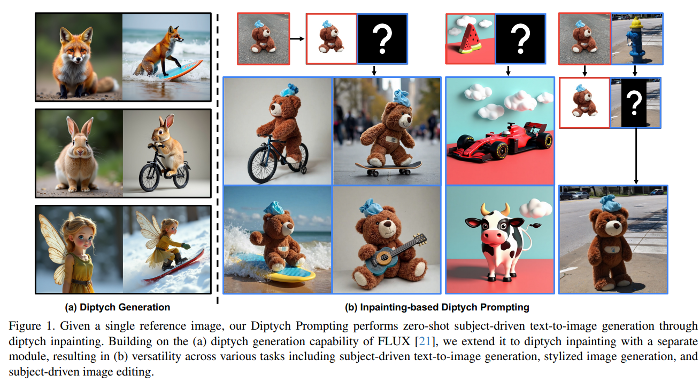
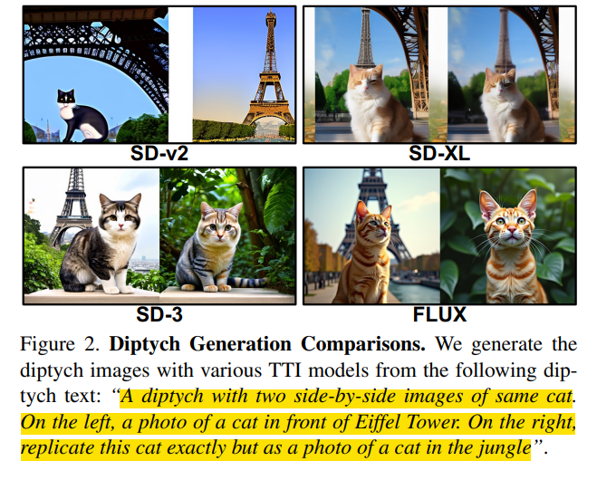
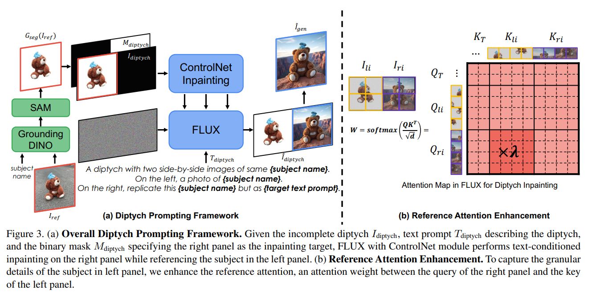
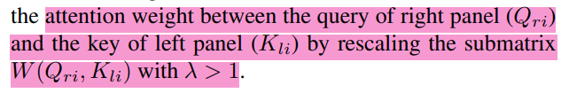
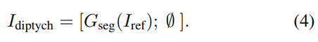
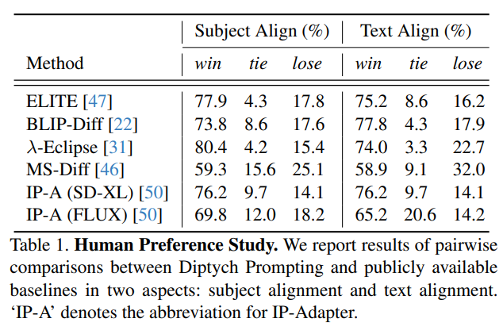
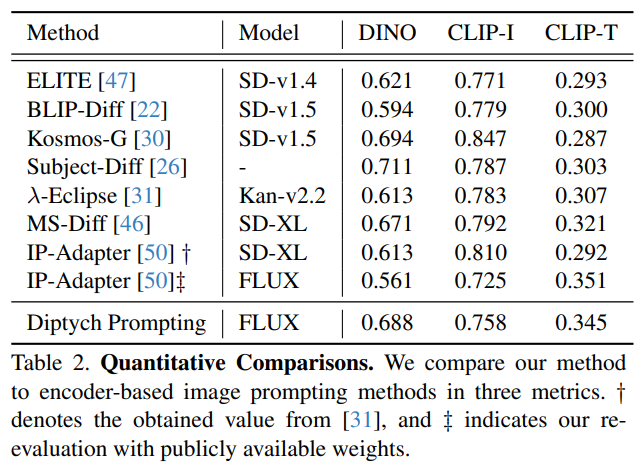
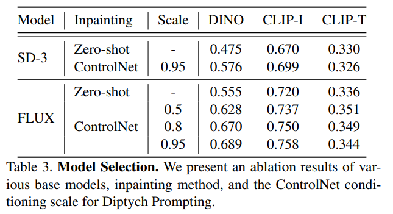
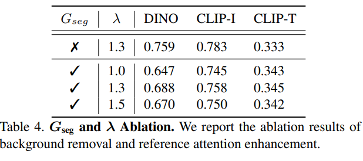
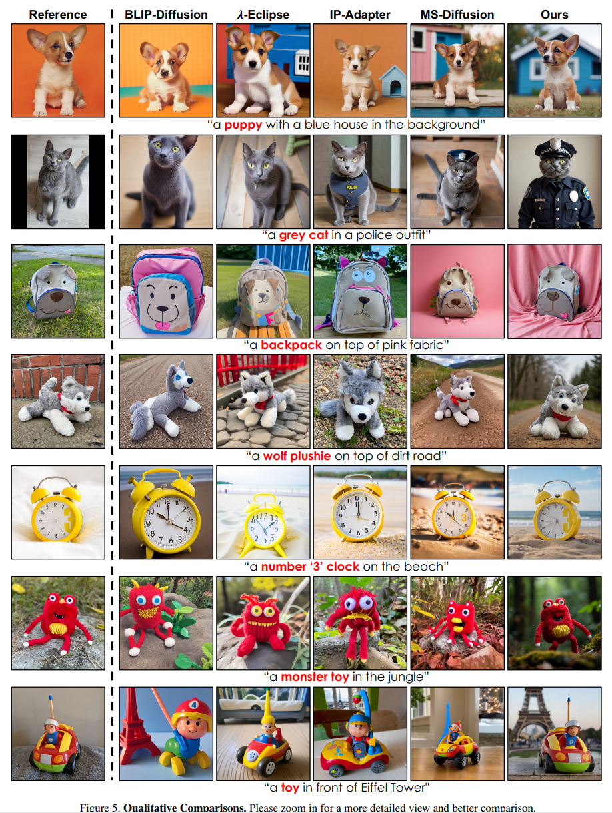

Large-Scale Text-to-Image Model with Inpainting is a Zero-Shot Subject-Driven Image Generator
===
arxiv 24.11

# Introduction
  

[Diptych](https://en.wikipedia.org/wiki/Diptych) : 양쪽이 pair하게 연출된 그림, 예술품등을 말한다.  
저자는 최근 유행하는 Flux의 Diptych 생성 성능에 영감을 얻어 이를 subject driven text-to-image task의 방법으로 사용한다.  
  

* 최초의 Zero-shot subject-driven + Inpainting task

# Method
  
* Diptych 성능이 좋은 Flux 사용
* Flux 원래 성능은 유지하기 위해 ControlNet 사용
* Attention map에 가중치를 주어 왼쪽 이미지를 더 참고하도록 함
    subject 이미지가 메인 이미지의 key로 들어갈 때 weight를 추가해준다.  
    
* subject으로 사용되는 왼쪽이미지는 SAM을 사용해서 배경을 지우고 객체만 남겼다.
      
      
    
Text Prompt의 포맷은 다음과 같다.  
"A diptych with two side-by-side images of the same {subject name}. On the left, a photo of {subject name}. On the right, replicate this {subject name} but as {target text prompt}”  

# Experiments

