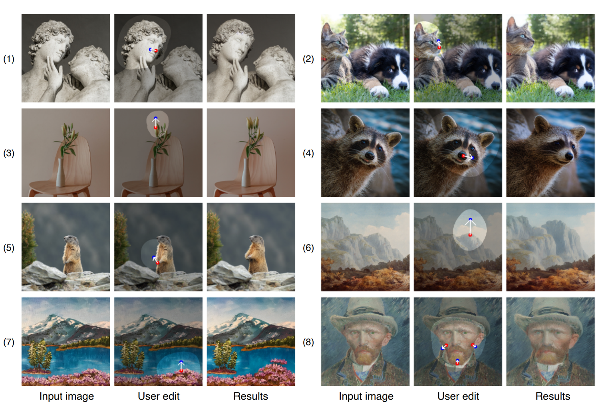
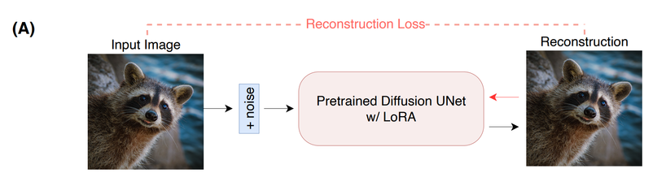
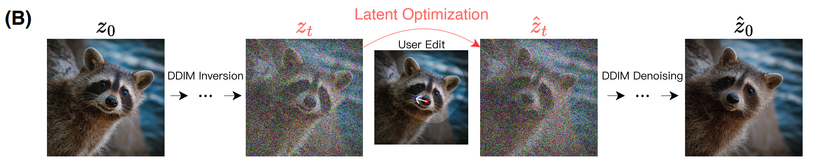
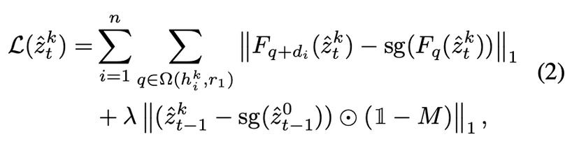
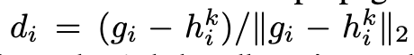
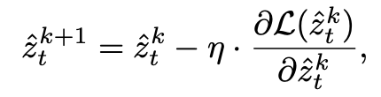
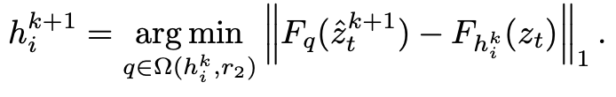
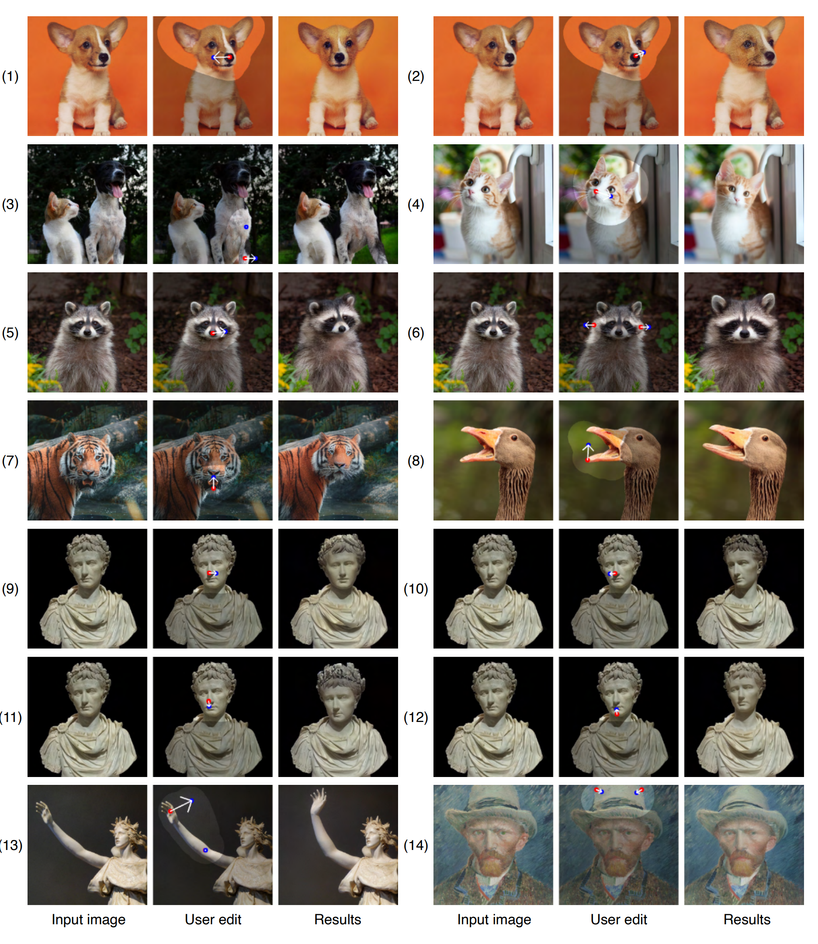
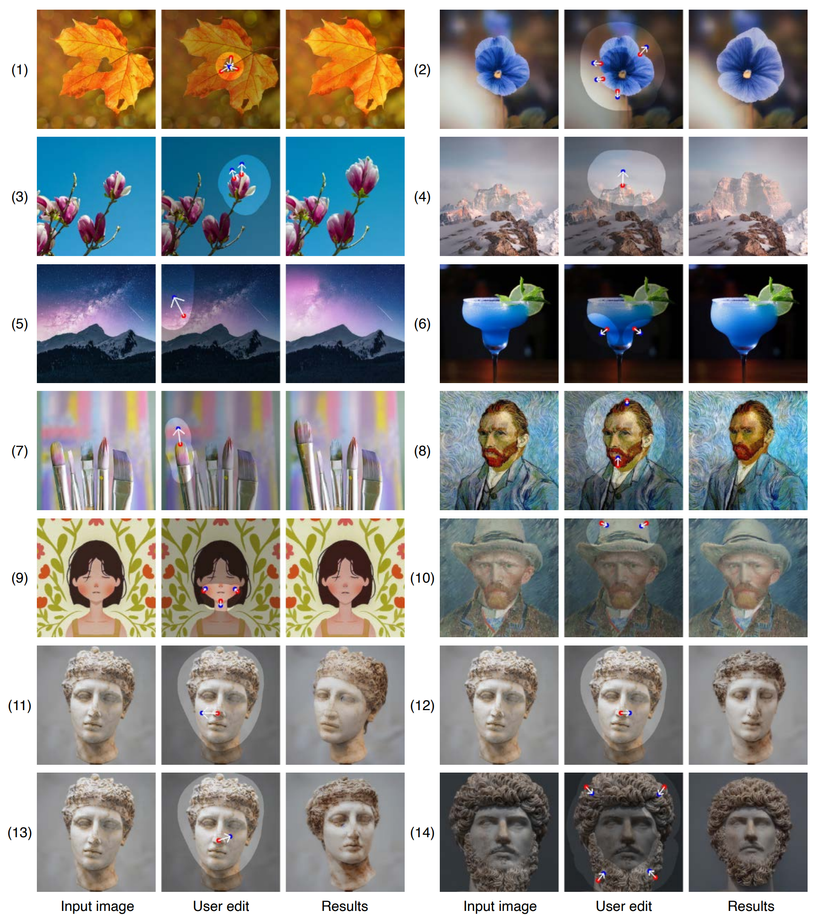

Drag your GAN의 Diffusion 버전 논문, 진짜로 method가 거의 똑같다.
본문이 3.5페이지 밖에 안되고 (그림빼면 2.5페이지정도) Experiments는 코드 공개할 때 Drag GAN과 비교하곘다고 하면서 결과 이미지만 조금 보여준다.

한가지 확인해봐야 할 부분은 fine-tuning할 때에 LoRA를 사용했다고 한다.
잠깐 찾아보니 LLM을 fine-tuning할 때 메모리는 3배, 파라미터는 10,000배 정도 줄일 수 있다고 하는 논문이다.
추후에 꼭 읽어봐야겠다.

이 논문은 input 이미지를 기준으로 한다. “생성된” 이미지가 아니다.

A. 일단 입력 이미지에 대해서 reconstruction loss를 1회 해준다.
이 때는 인터렉션이 들어가는 것이 아니고 LoRA로 학습되는 것이다.
한번 학습시켜줘서 editing할 때에 object의 identity를 더 잘 유지하고, style도 더 잘 유지할 수 있다고 한다.

이후 input 이미지를 Inversion해서 노이즈를 만들고 Drag GAN과 똑같이 중간단계의 노이즈+이미지에서 loss를 준다.
Implementation Detail에 의하면 총 50스텝 중에 40번째 스텝에서 optimize 해줬다고 한다.

## Motion Supervision

Drag GAN과 똑같은 방법을 사용한다.
40번째 step에서 UNet의 penultimate 블록의 feature map을 사용한다고 한다.
penultimate : 어미에서 두번째, 언어학에서 쓰이는 용어라고 한다.
맨 끝에서 두번째가 출력 = 맨 마지막 레이어에 들어가는 feature를 말하는 것 같다.

n은 전체 포인트의 갯수입니다. (죄송합니다. Drag GAN에서 잘못 설명했습니다….)
sg는 stop gradient, k는 Motion Supervision의 이터레이션, t는 diffusion의 time step이다.
notation이 달라진 것 같지만 Drag GAN과 완벽하게 똑같다.

단위 벡터 계산도 동일하다. (g: target, h: handle)

이것도 Drag GAN에서 잘못 설명했습니다. 모델이 아니라 latent를 optimize해준다.

## Point Tracking

이 부분도 Drag GAN과 동일하다.
   

