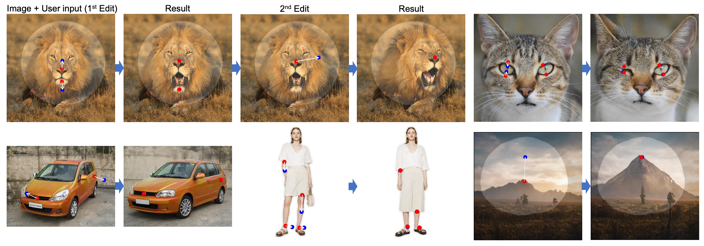
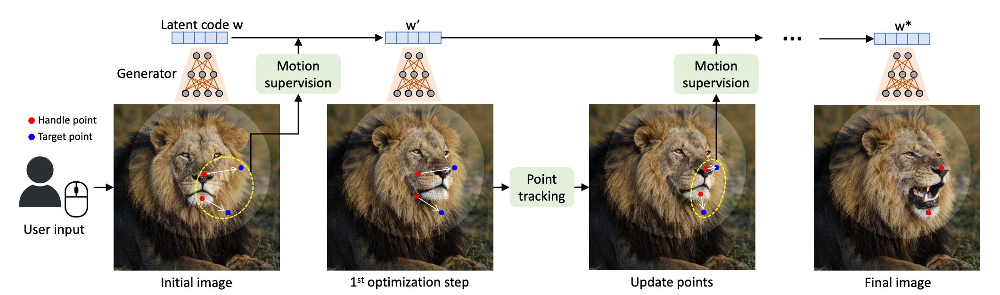
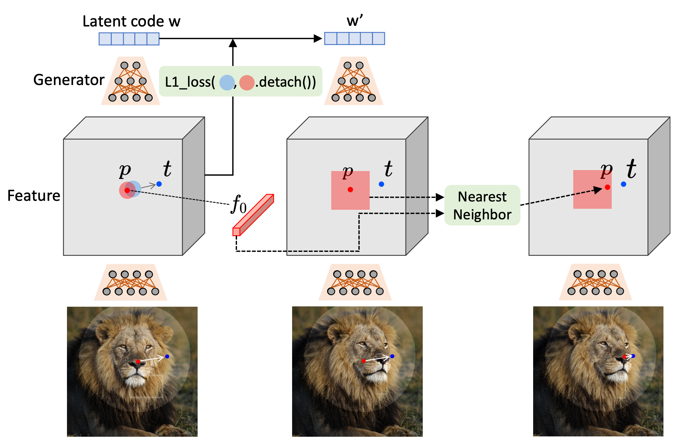
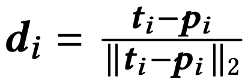
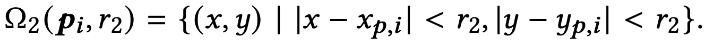
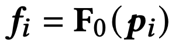
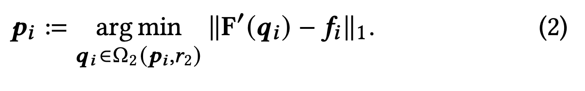
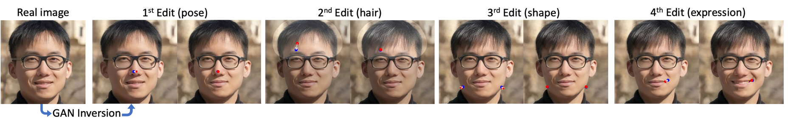
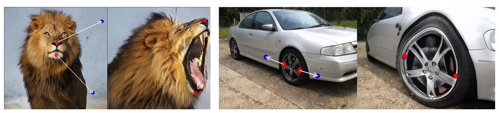

drag로 human interaction을 받아 generative image를 editing하는 논문
(이 논문도 기본적으로는 “생성된” 이미지를 대상이다. 뒷 부분에 real 이미지에 대한 실험도 있다.)

기존에 비슷한 task의 연구들이 있었는데 이 논문은 2가지 차별점이 있다.
1. 다중 포인트에 대한 제어가 가능하다.
2. 핸들포인트 (시작점)이 타겟 포인트 (도착점)에 정확하게 도달해야 한다.

이를 해결하기 위해 2단계를 제안한다.
1. Motion Supervision
2. Point Tracking

기본적으로 잘 학습된 GAN의 중간 feature가 매우 discriminative하기 때문에 간단한 loss로 모션을 supervise할 수 있다는 가정이다.

컨셉은 feature space에서 포인트를 아주 조금씩 움직이면서 (30~200 step) 매 step에서 이동 전후의 좌표는 다르지만 feature value는 같도록 해준다.

## Motion Supervision

여기서 generator는 StyleGAN2를 사용한다.
전체 레이어 중에 6번째 레이어를 통과한 Feature를 사용하고, 이 때 해상도는 256x256이다.
이 Feature를 최종 출력 이미지와 같은 해상도로 bilinear interpolation해준다.
이렇게 했을 때 최종 이미지와 같은 픽셀에서는 같은 의미를 같은 feature를 표현한다는 아이디어이다.

      

빨간원(하이퍼파라미터 r1 크기의 p주변 픽셀)을 파란원으로 이동시킨다.
이동시키는 (q_i + d_i)는 bilinear interpolation으로 정한다. (p_i에서 t로의 방향벡터를 말하는 것으로 이해함)
빨간원과 파란원의 feature에 대해서 distance가 같도록 loss를 준다.

마스크가 입력될 경우에는 un마스크 부분은 원본이 고정되도록 하는 loss도 추가된다.

이 때, F(q_i)에는 gradient가 backpropagation되지 않는다.
이렇게 했을 때, p_i가 p_i+d_i로 이동하도록 동기를 주고, 역방향으로는 되지 않는다고 설명한다.
(아직 이해안됨. 다시 생각해보자)

## Point Tracking

일단 위처럼 이동을 진행했는데, 새로운 이미지에서 포인트가 어디인지 알아야 한다. (코가 어디로 이동했는지)
이를 위해 nearest neighbor search를 사용한다.
   

하이퍼 파라미터 r2 범위내에서 이동한 포인트를 선택할 것이다.

initial handle point에서 p_i에 해당하는 feature가 f_i이다.
(notation이 좀 이상하다. 맥락적으로 i-1로 이해하면 될 것 같다.)

feature를 기준으로 nearest neighbor search한 가장 가까운 지점을 선택하고 다음 step에 point로 사용한다.

## Experiment (조금만)

real image에서도 잘된다. 노이즈는 GAN inversion했다고 한다.

