T2I Diffusion is high-quality but, lack of editing ability.
this method allows for 4 edits to be made to either the generated image or the actual image.

- Object moving
- Object resizing
- Object appearance replacement
- Content dragging

## Introduction

- DragGAN
    - this paper propose point-to-point dragging scheme.
    - but it is constrained by the capacity and generalization of GAN model
    - Diffusion based model has higher stability and superior generation quality
      (I don't think the generation quality of diffusion is always better).

 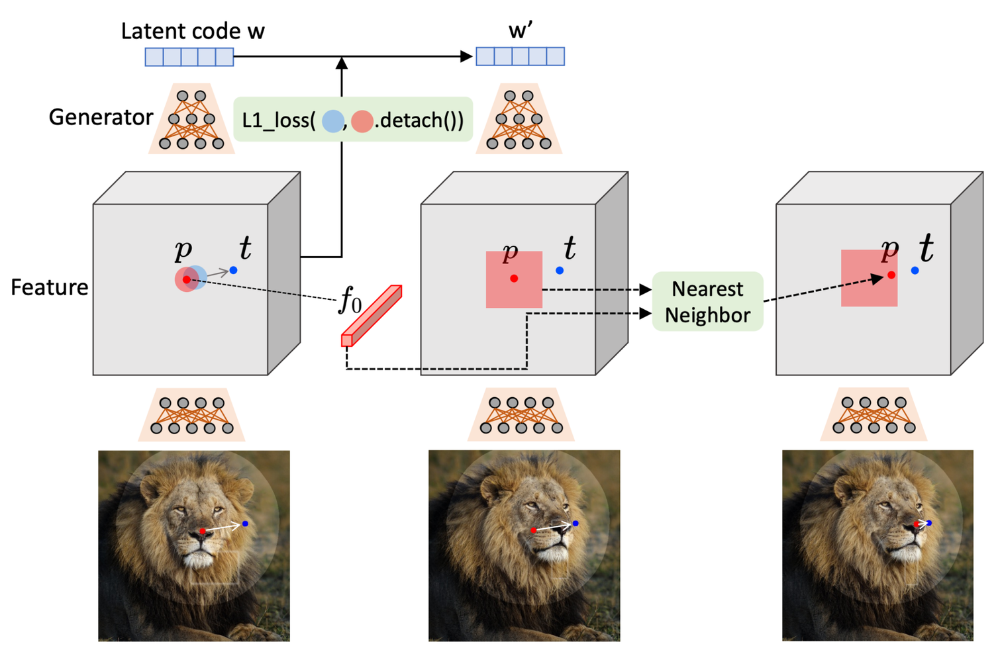

- Prompt-to-Prompt
    - they find the cross-attention map between the feature of word and object has a notable local similarity
    - but this method heavily relying on the design of prompts.
    - and in multi-object scenarios have problem to build correctly local similarity.
    - so Dragon Diffusion aim to explore a more fine-grained editable space.

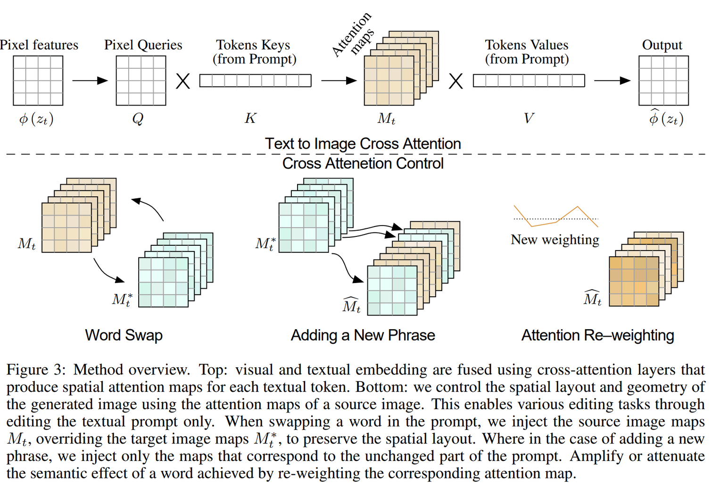

- Dragon Diffusion
    - propose classifier-guidance image editing.
      and study how affect the intermediate feature in diffusion to result image.
    - no fine-tune, no training. like Drag GAN
    - extensive experiments

## Method

this paper wants to change content for editing and preserve other content.

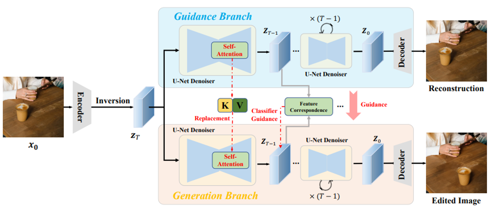

The Guidance Branch is Reconstruction process like default LDM.

The Generation Branch is editing process.

To preserve the content of the original image, transferring content information through cross-branch self-attention design.

### DIFT
https://diffusionfeatures.github.io/

The recent work, DIFT(Emergent Correspondence from Image Diffusion, 2306), discovers that the intermediate features of diffusion models have a strong correspondence

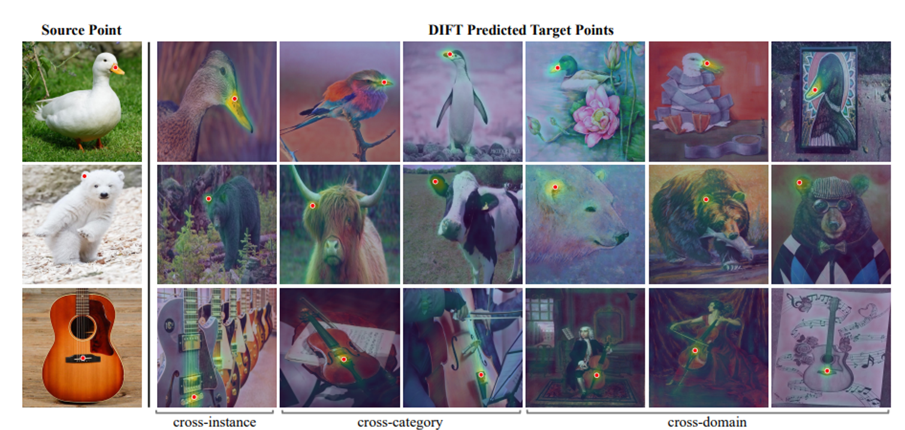

A “diffusion feature” is a feature in the middle of denoising that is noisy in the image.
And DIFT says Diffusion's U-Net is strong at extracting features from noisy data because it was trained on noisy data.
so they calculate cosine distance between the intermediate feature of source point and all point in the target Diffusion Feature to find the closest point was an exact match.

This method can be used for point-to-point matching between different images.

(I will read this paper soon…)

## Classifier-guidance-based Editing Design

### Dragon Diffusion

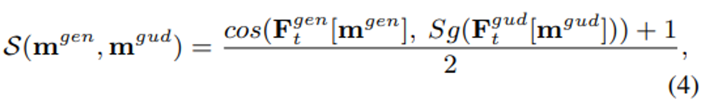

Both feature of generation and guidance branch are need to have high similarity.
so they want to content appearing in the position of m^gud to appear in the target position m^gen
the optimization goal is to make the similarity in Eq.4 as large as possible.

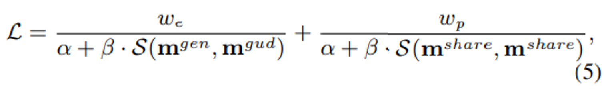

They added “share mask” to preserve uneditable areas.****

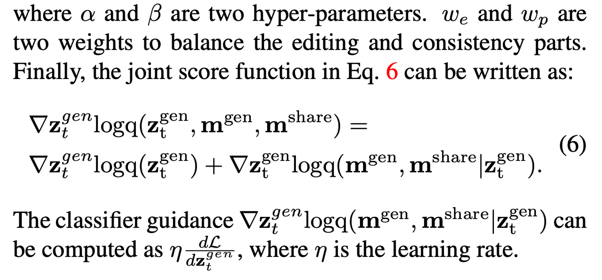

### Multi-scale Guidance

DIFT says that in U-net's decoder, the second layer contains more semantic information, the third layer contains more geometric information.

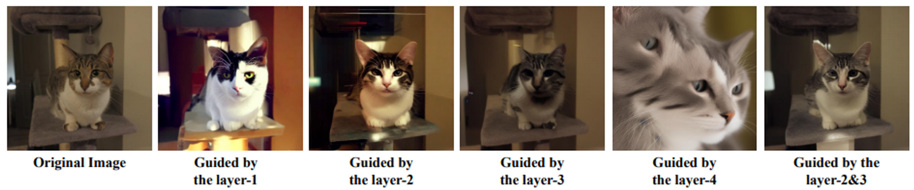

this paper experiment what DIFT said, this figure is the results.
start denoising from random Gaussin noise, but use cross-branch self-attention design proposed in this paper.
first layer is too high-level to reconstruct the original image accurately.
fourth layer have weak feature correspondence.
second and third layers are more suitable for reconstructing the original image as DIFT say in their paper.

### Implementation Details for Each Application

- Object moving

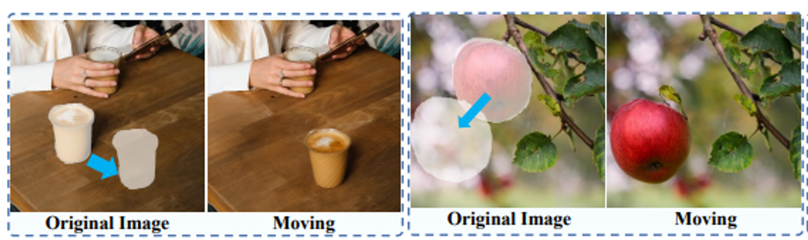

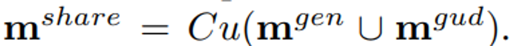

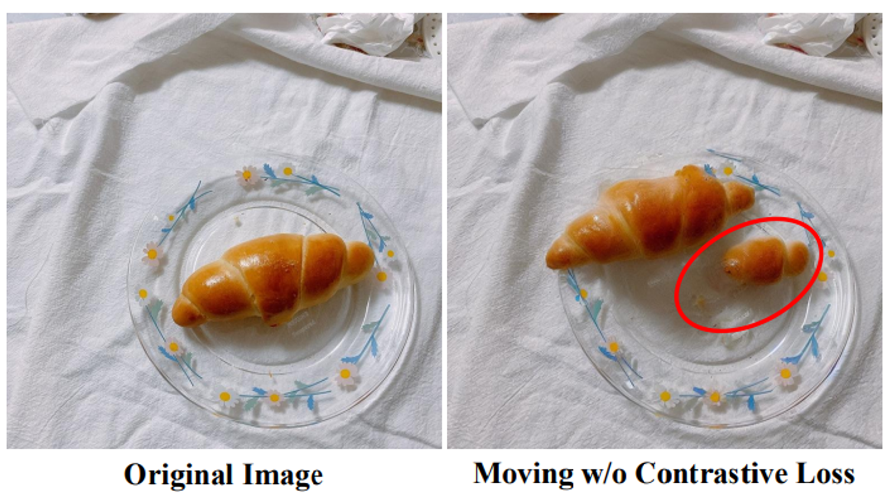

As a result, the object moved well, but parts of the object preserved in previous position.
so they added Contrastive Loss to avoid this phenomenon.

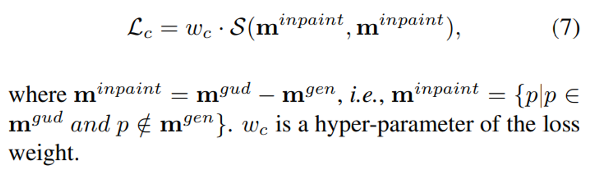

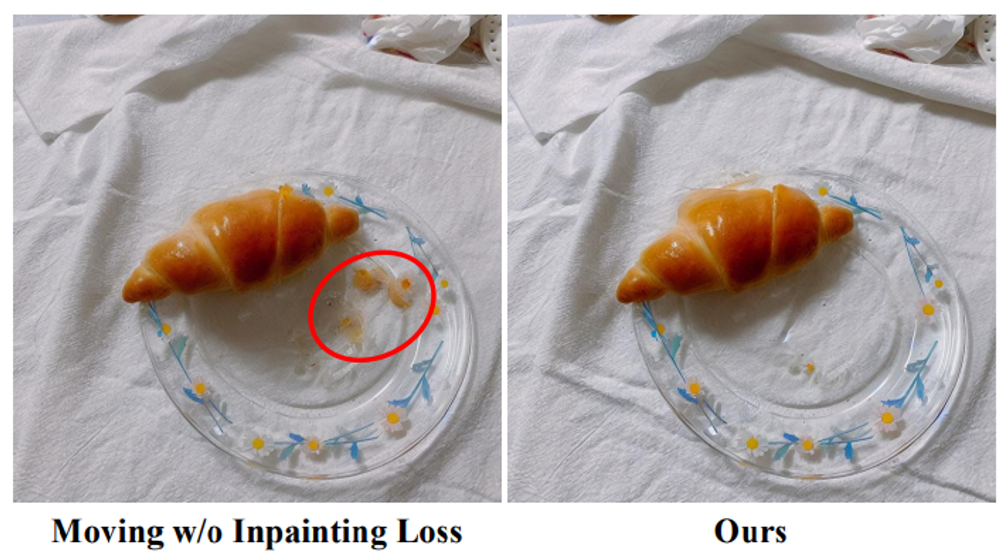

But it's not very good at inpainting the previous position.
So, they design Inpainting Loss.

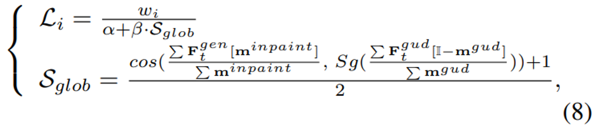

- Object resizing

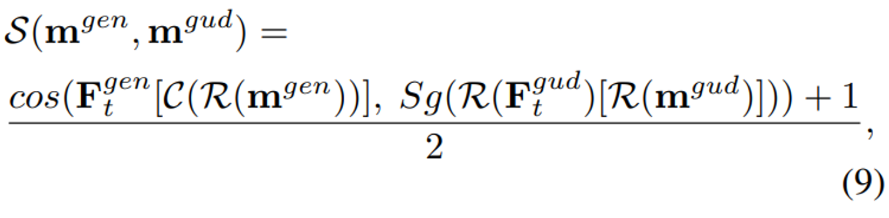

R: interpolation
C: center croping/expansion

- Appearance replacement

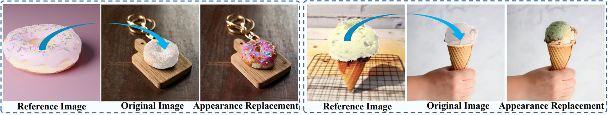

replace the appearance between object of **same category.**
(This is only possible if they are in the same category, as it only calculates the average of the feature values)
  
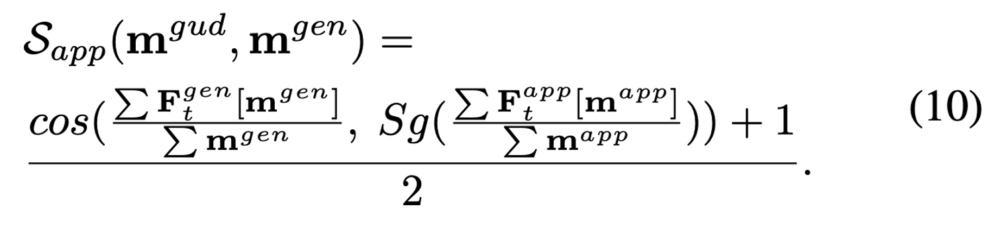

- Point dragging

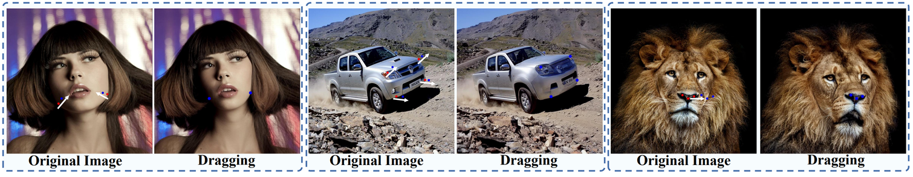

In this case, m^gen and m^gud denote the destination and starting points.
but m^share is manually defined.
The gradient guidance comes from Eq.5 with out other specific designs.

## Cross-branch Self-attention

In this paper, use DDIM inversion for consistency.
However, it is still challenging to maintain high consistency with DDIM inversion alone.
so, they designed Corss-branch Self-attention.

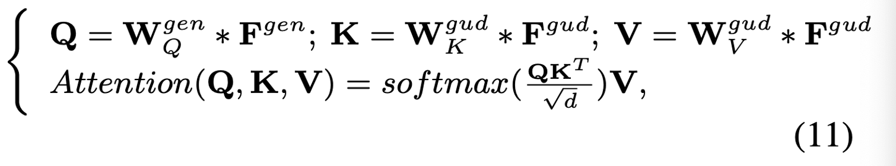

W is learnable projection matrices / * refers to the convolution operator

In the generation branch, replace the decoder’s self-attention key and value with the corresponding key and value in the guidance branch.

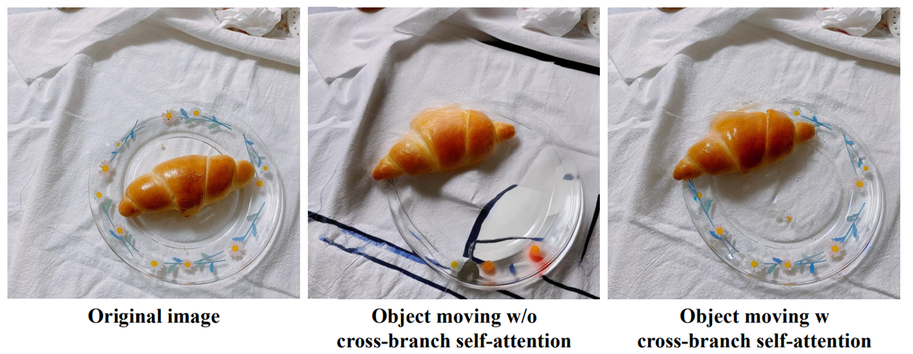

## Experiments

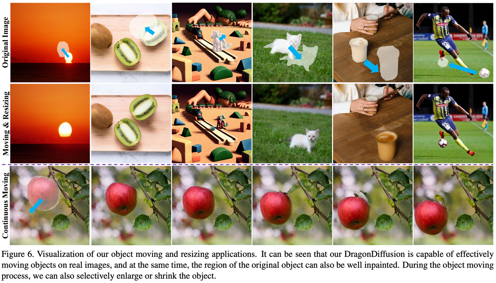
           
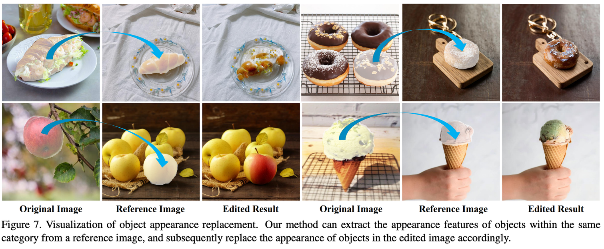
                         
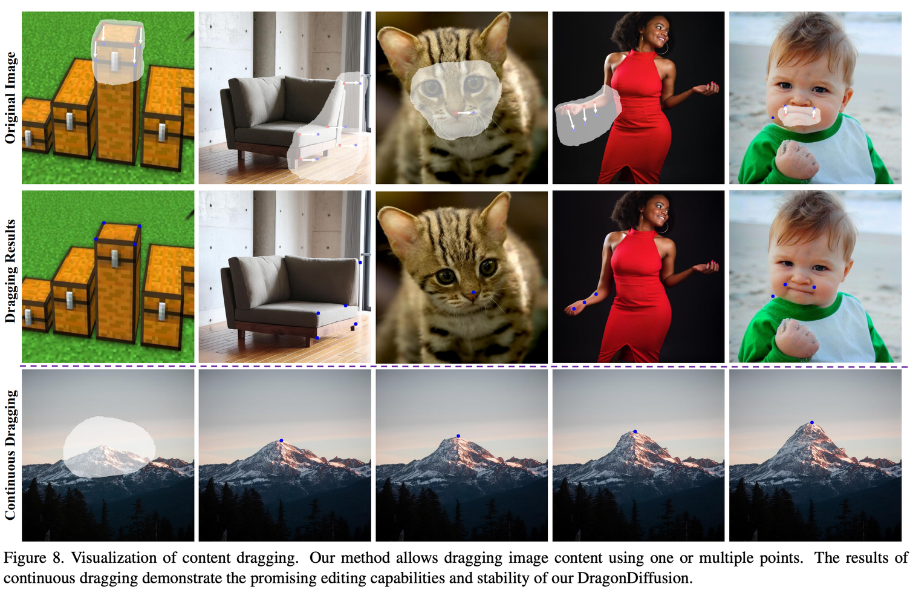
