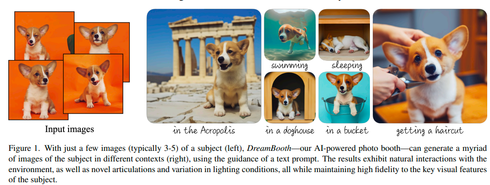
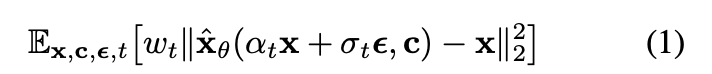
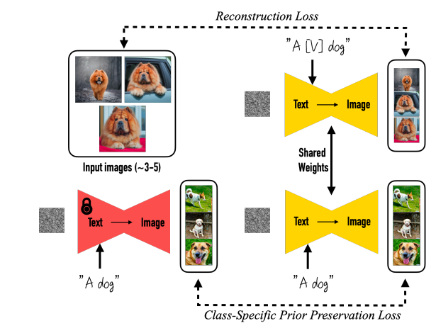
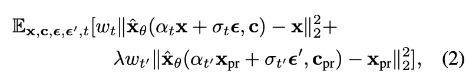
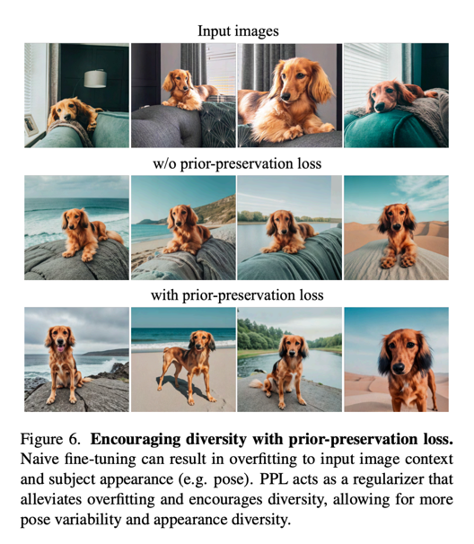
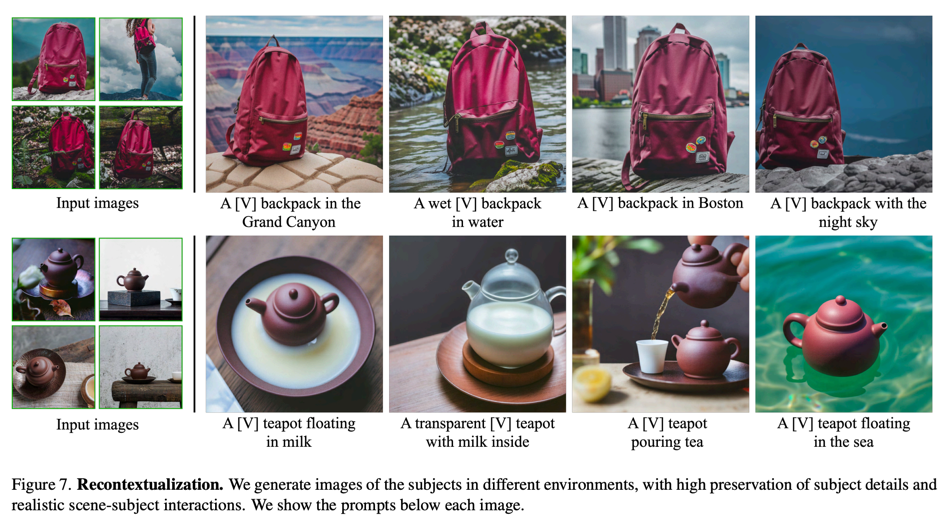

DreamBooth: Fine Tuning Text-to-Image Diffusion Models for Subject-Driven Generation
===
textual inversion의 대표 논문
> 요즘에는 Concept Learning, Personalized Generation 등 다양하게 불리는 것 같다.    
  

Text-to-Image Diffusion Models

노이즈와 컨디션을 입력하여 생성하면서 reconstruction loss

## Personalization of Text-to-Image Models

unique identifier를 붙여줘서 personal한 객체를 fine-tuning해준다.디퓨전 모델의 dictionary에 새로운 단어를 입력한다는 느낌또한 완전 의미없는 unique한 것을 붙여줘야 한다. (“unique”, “special” 이런 거 말고, “xxy5syt00” 이런거)

## Class-specific Prior Preservation Loss

dog에 대한 정보는 잊지 않으면서 personal한 dog만 학습하도록 하기 위해서 사용됨  
쉽게 말하면 입력한 dog를 학습시키지만 dog에 대한 전반적인 표현에 대해서 catastrophic forgetting 을 예방하기 위해서 pre-trained 모델에서 "a dog"로 생성해서 같이 입력으로 넣어줌  
> 굉장히 심플한 방법이지만, "[V] dog" 가 "dog"에 포함관계라는 가정을 당연히 한 것 같다.  
> 물론 대부분에 상황에서는 포함관계일 것이다.
 

## Experiments
  
  
