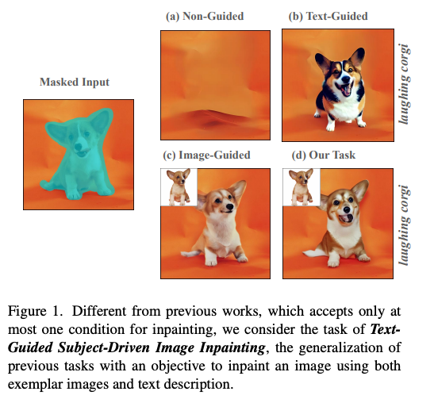
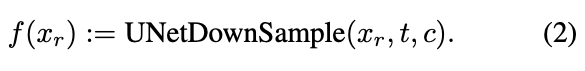
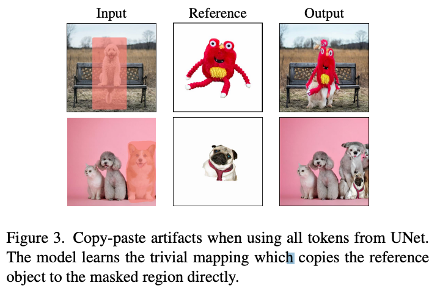
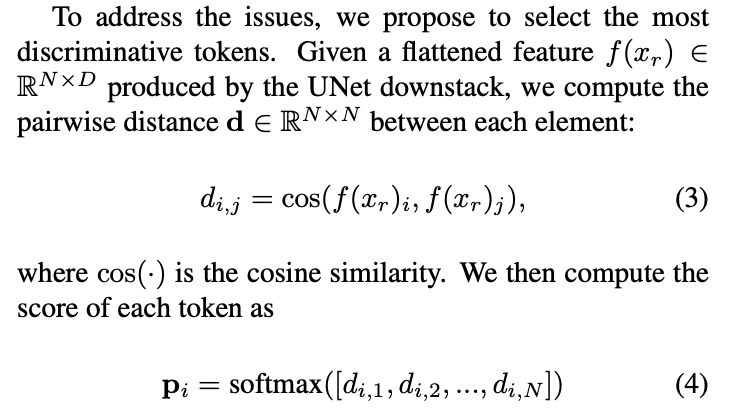
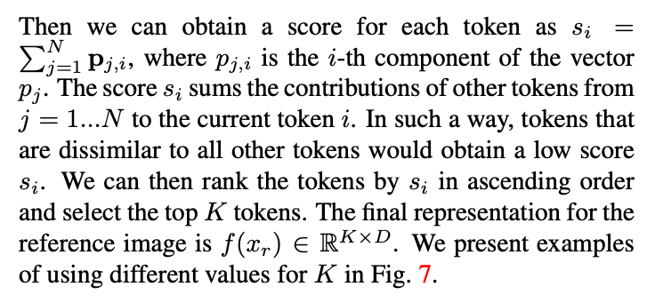
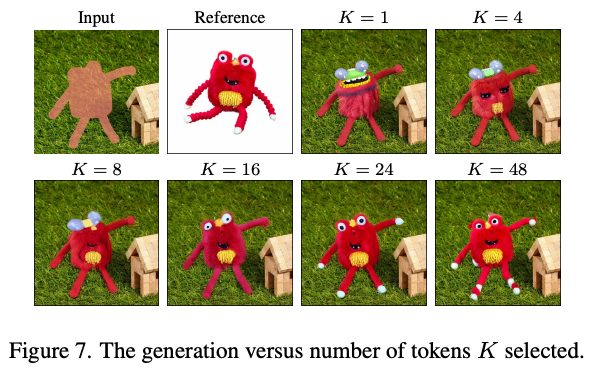
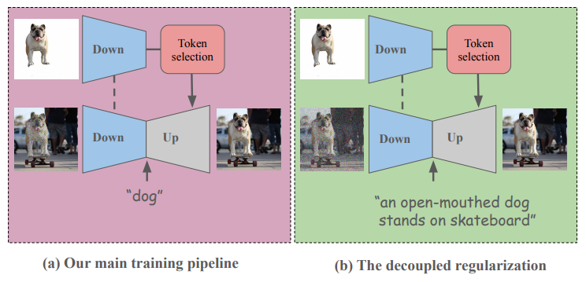
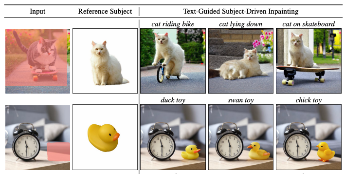
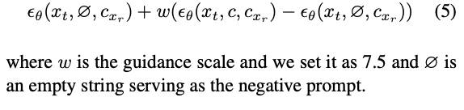

DreamInpainter: Text-Guided Subject-Driven Image Inpainting with Diffusion Models
===
arxiv 23.12
 
## Introduction  
  
우리는 text guide와 image reference를 동시에 사용한다!!  
이것을 "Text-Guided Subject-Driven Image Inpainting"이라고 부르자!!
즉 text-to-image인데 personalized generation(dreambooth like)를 동시에 하겠다는 논문이다.

이 task의 목적은 3가지로 정의한다.  
1. Preservation of subject identity  
    reference image와 생성된 이미지의 시각적으로 유사해야 한다.
2. Alignment with texts
    inpainted subject이 text prompt의 묘사와 align되어야 한다.
3. Background Unaltered(변경되지않음)
    마스크 외부는 원본과 생성된 이미지가 동일해야한다.                                 
  
  
## Methods  
현존하는 방법들은 CLIP과 같은 모델을 사용하여 subject identity를 capture한다.  
하지만 CLIP은 high-level semantic한 정보를 주로 학습하였기 때문에 low-level detail을 뽑는 것에는 한계가 있다.
> 입력 이미지에 대한 클래스를 예측하는 것은 잘하지만 personalized generation을 위한 attribute를 뽑는 것은 어렵다는 말인 것 같다.  
> 기존에 Paint by Example로 실험했을 때 결과가 좋지 않았던 것이 이런 이유인 것 같다.

                     
그래서 이 논문에서는 Stable Diffusion의 중간 레이어에서의 출력을 사용한다.  
t=0으로 고정하여 Downsampling 2번째 block의 출력이 가장 좋았다고 한다.   
   
  
하지만 reference에 대한 과도한 정보를 주는 것이다보니 그림처럼 단순 copy-paste하는 결과가 발생한다.  
  
  
이 논문에서는 입력되는 모든 토큰을 다 사용하였기 때문에 똑같이 나온다고 판단하였고, 주요한 정보만 포함하는 토큰을 선택하여 이를 해결한다.  
  
2번째 레이어 출력은 32x32x768이라고 한다.  
즉 D은 768, N는 32*32이다.  
  
이것을 기준으로 K개의 토큰을 선택해서 사용한다. (논문에서는 24개)  
  
  
  
### Decoupling Regularization  
이 논문은 기존의 객체에 대한 cropped 이미지와 class label로만 학습하는 방식으로 인해 "A smiling cogi"와 같은 설명을 잘 표현하지 못한다고 말한다.  
이를 해결하기 위해 마스크 영역과 class 이름으로만 학습하지 말고 이미지 전체를 디노이징하고 전체에 대한 캡션을 사용할 것을 제안한다.  
  
  
> 이것도 의미있는 것 같다.  
> 실제로 Dall-e3도 캡셔닝을 도입하는 것이 메인 contribution이였다.  
> 캡션 데이터를 확보하는 것이 문제이지만 이를 위해 캡셔닝 쪽을 살펴볼 필요가 있다.
 

  
> 알고 있는 CFG와는 조금 다르다. 이에 대한 수식적인 설명은 없다.  
> 맥락적으로 보자면, 일단 reference의 attribute를 base로 해서 text에 대한 반영을 조절해준다고 생각할 수 있다.  
> 마치 지금 배경을 uncondition으로 사용하는 것과 비슷한 맥락인 것 같다.

