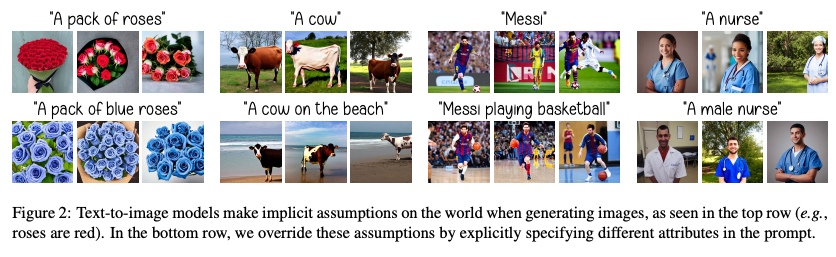
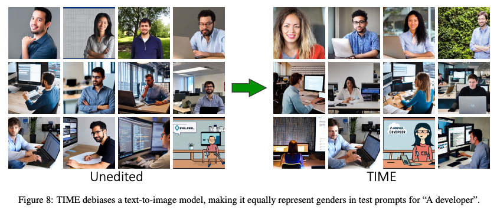
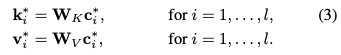
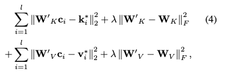
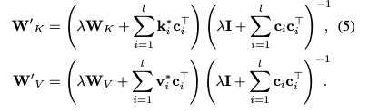
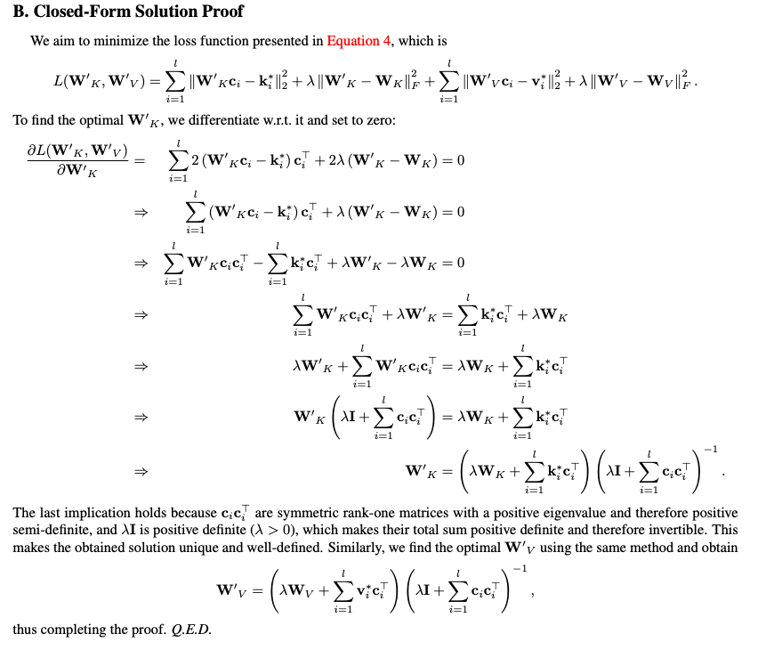
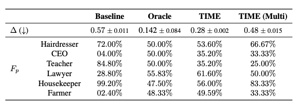

Editing Implicit Assumptions in Text-to-Image Diffusion Models
---
ICCV 2023 / arXiv 23.03

Text-to-Image로 학습된 모델은 특정 텍스트에 대한 Implicit Assumption이 존재한다.  
(하늘-파란색, 장미-빨간색, 간호사-여자 등...)

이러한 문제를 해결하기 위해서 데이터를 다시모아서 fine-tuning하는 것은 돈이 많이 든다.  
또는 catastrophic forgetting을 유발한다.  

  
이 논문에서는 텍스트에 명시적으로 속성을 추가하였을 때에 Implicit한 속성을 대체한다는 점을 사용한다. 
> Editing이 목적인 것처럼 보이는데 관점이 약간 다르다.                                        
> PtP나 IMagic처럼 모델의 출력을 변경하는 것이 주요관심사가 아니고 모델의 편견을 수정하는 것이 목적이다.  
> 논문에서도 최초 제안하는 "모델 편집 방법"이라고 표현한다.  

  
이를 위해서 cross-attention의 projection 메트릭을 수정한다.  
이 방법은 추가적인 fine-tuning이 필요하지 않고 전체 파라미터의 2.2%만 편집하면서 단일 RTX 3080에서 0.4 초만에 가능하다.  
                     
---

  
이 논문의 메인 overview이다.  
부정확한 source 프롬프트("A pack of roses")와 함께 특정한 destination 프롬프트("A pack of blue roses")를 준비한다.  
두 텍스트를 임베딩한 결과를 c'과 c이라고 하자.  
c에 있는 "roses"에 해당하는 임베딩과 c'에 있는 "roses"에 해당하는 임베딩은 다른 벡터 값을 가질 것이다.  
c에서 중복된 ["A", "pack", "of", "roses"]에 해당하는 임베딩들을 c*라고 하자
  
  
cross-attention을 하기 위한 k와 v를 뽑는다.  
                                                  
  
이 손실함수를 통해서 W'_k와 W'_v를 최적화한다.  
소스의 k와 v가 목적 프롬프트에 의한 것과 같아지도록 하면서 동시에 원래 값과 너무 멀어지지 않도록 해주는 꼴이다.  
λ=0.1
> 논문에 명시되지는 않았는데 늬앙스상 W'의 초기값은 W인 것 같다.
> 
> W를 변경하는 것이기에 다른 단어들에 대해서도 영향이 있을 것이다.      
> 논문에서는 λ항을 통해서 '최소화'했다고 표현했고 그에 대한 예시는 아래와 같다.  
> 호랑이를 보면 영향이 확실히 있다. 사용하게 되면 일반적인 상황보다는 특정한 객체만 생성할 때 사용해야할 것 같다. (smoke...)    
> 
          
                                                     
---
  
게다가 닫힌 계에서 global minimum이 존재한다고 한다.  
  
                      
### Result  

