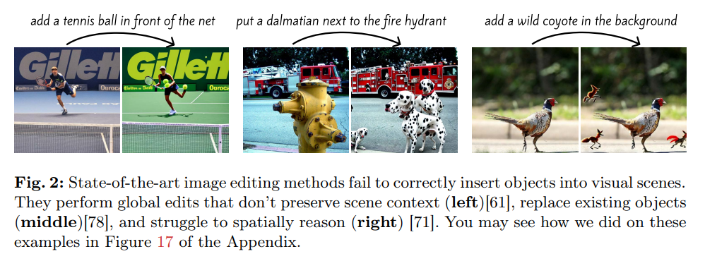
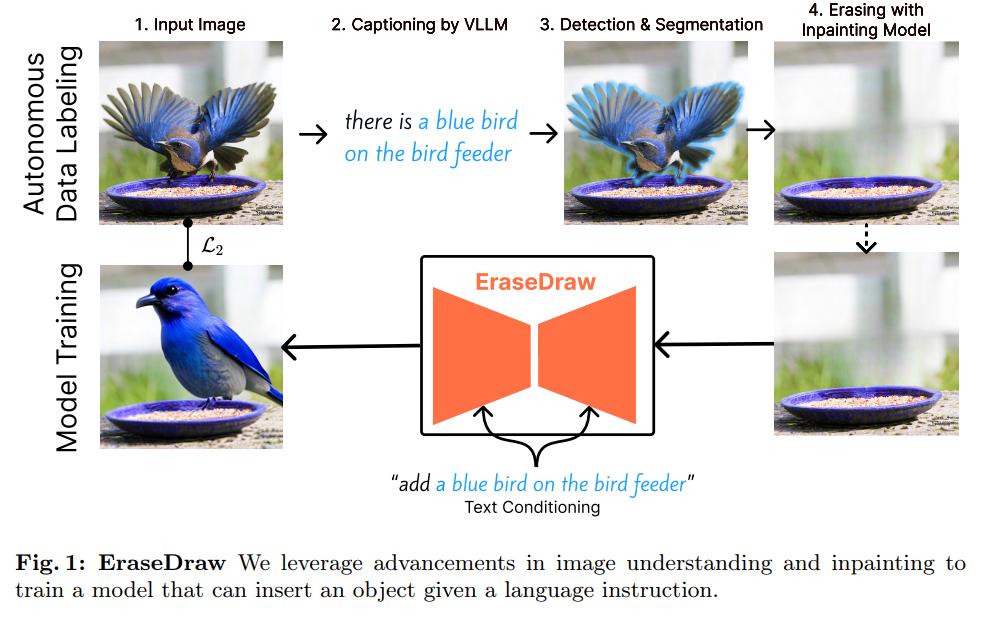
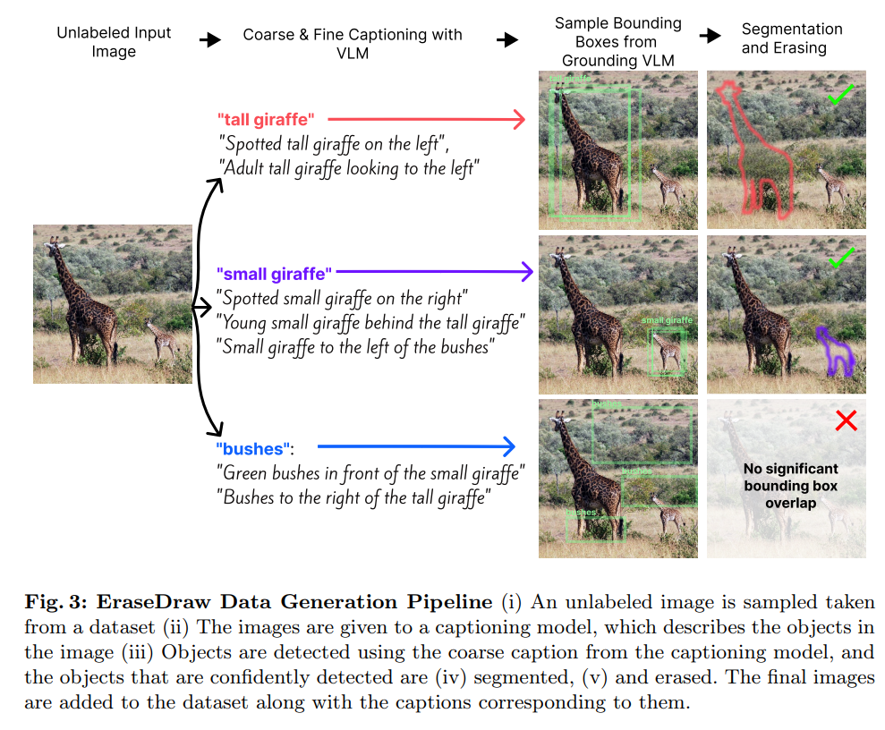
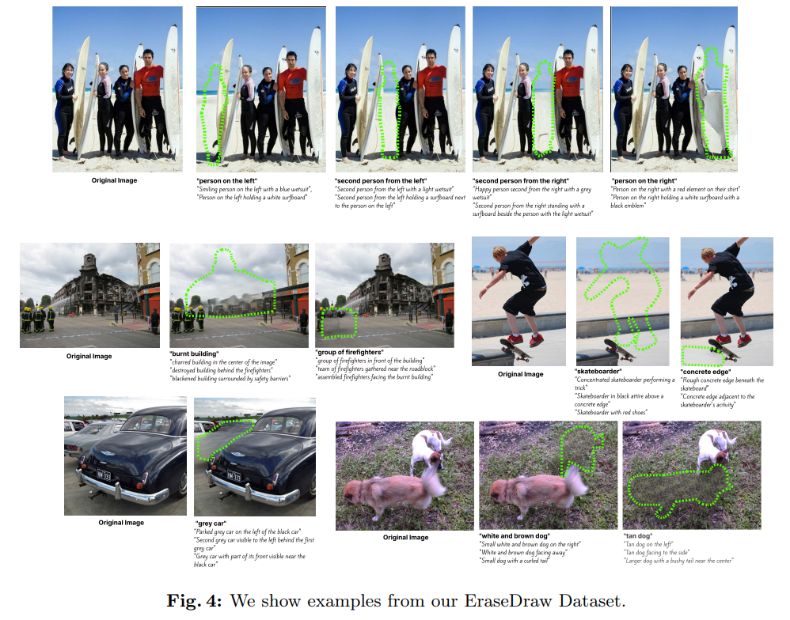
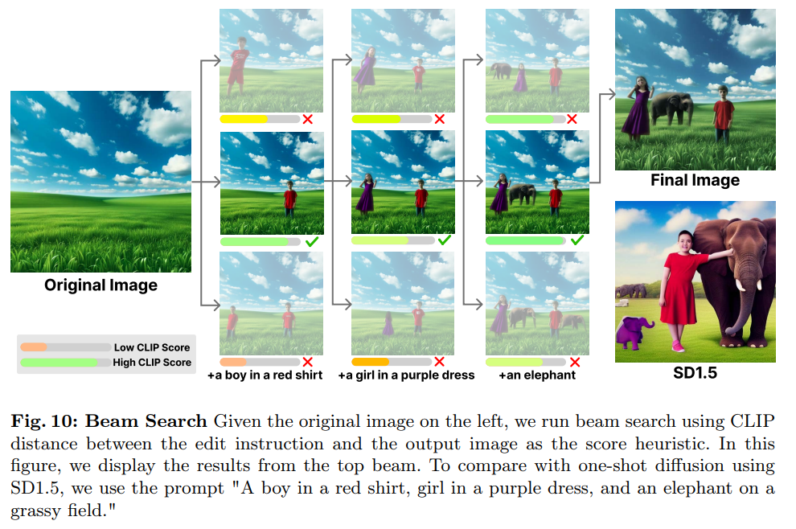
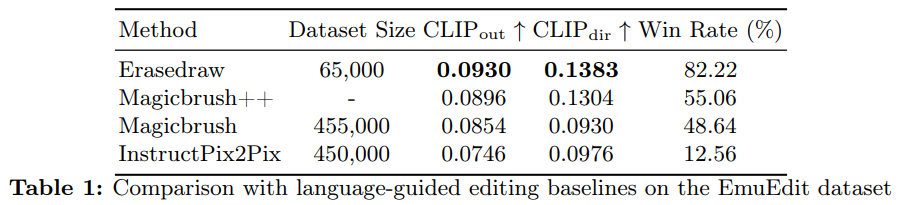
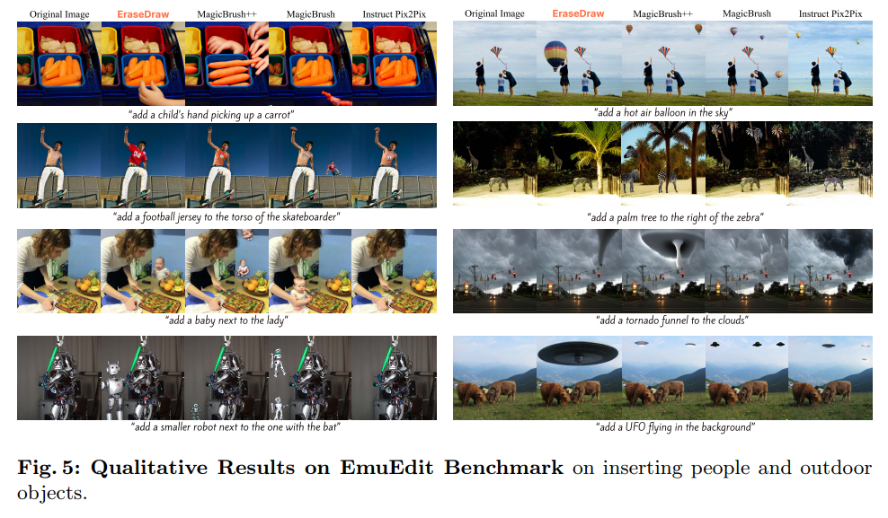
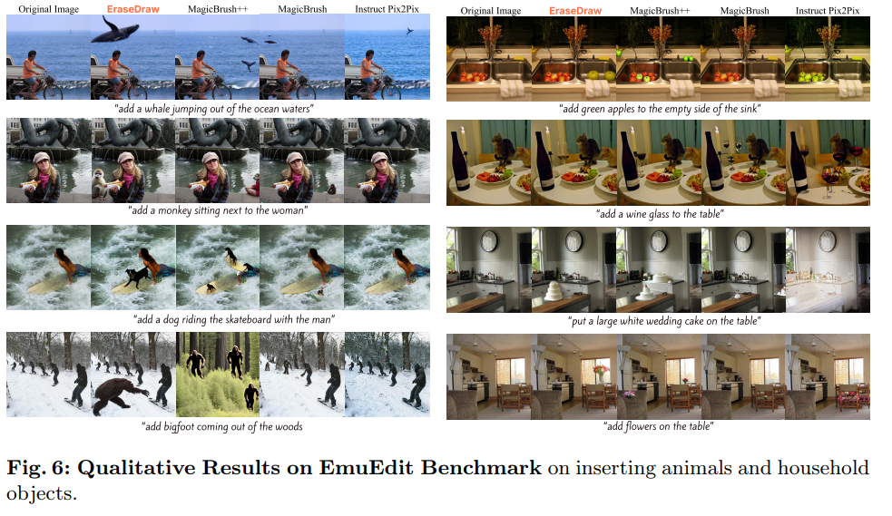

EraseDraw: Learning to Inser Objects by Erasing Them from Images
===
ECCV 2024, 24.09

# Introduction
  

현재 Object Insertion모델들은 객체가 부자연스러운 위치에 생성되거나 조명같은 디테일이 부정확하다.  
InstructPix2Pix처럼 데이터를 만들건데, 여기에서는 객체를 'edit'하는 것이 아니라 'insert'하는 것이 목적이다.  
즉 객체가 없는 배경 이미지가 필요한데, 이를 획득하기 어려우니까 Inpainting으로 지워서 만들겠다는 연구이다.  
이를 "autonomous data generation pipline"이라고 표현하고 있다.  

# Method
  

## Automatic Dataset Generation
1. 입력된 이미지에 VLLM(CogVLM)으로 Caption을 만든다. (Caption이 디테일할 수록 좋으니 VLM성능이 중요하다고 강조하고 있다.)  
2. Caption을 기준으로 객체들을 Detect(or segment)한다.  
3. 2번에서 얻은 mask를 기준으로 객체를 지운다.  
4. 이제이 pair이미지로 Instruct pix2pix처럼 학습한다. (모델이 IP2P가 베이스인지는 모르겠다.)

  
다만 이 과정에서 caption에 대한 유효성을 검사하기 위해서 3개의 검출 bbox간의 IOU가 80%이상인 것만 사용한다.  

  

## Iterative Generation 
  
모든 객체를 한번에 생성하지 말고 iterative하게 생성할 것을 제안하고 있다.  
이 때, [Beam search](https://en.wikipedia.org/wiki/Beam_search)의 방식을 사용해서 단계마다 CLIP score로 top-k개의 후보군을 둔다.

# Experiments
  
* CLIP_out : caption과 최종 생성된 이미지간의 CLIP score
* CLIP_dir : 캡션과 이미지의 변화에 대한 alignment
> CLIP_dir에 대해 자세한 설명은 없지만, "원본이미지와 생성이미지의 벡터(피쳐) 차이"와 "caption과 instruct의 벡터 차이"의 CLIP score가 아닐까 추측된다.  

  
  