Erasing Concepts from Diffusion Models
===
ICCV 2023 / arxiv 23.03
####
## Introduction
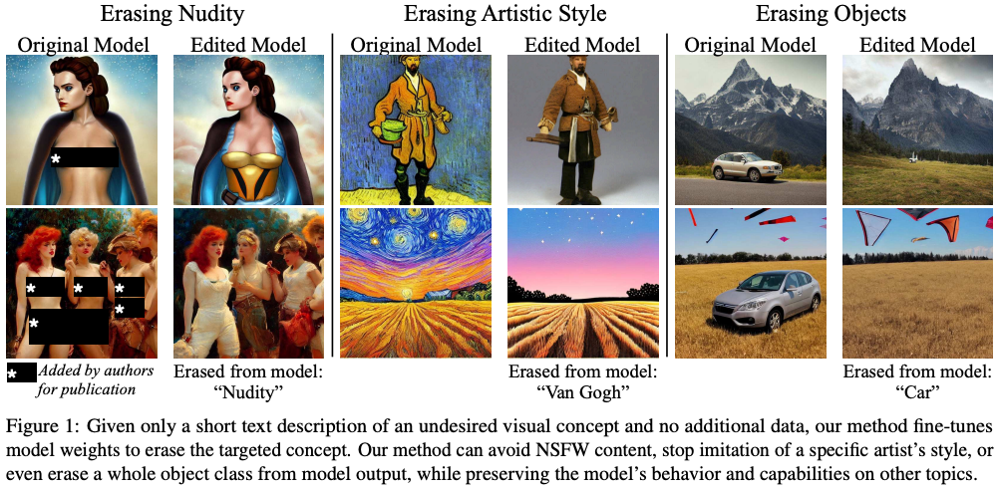
이미 학습되어있는 Diffusion 모델에서 NSFW에 대한 개념을 지우는 연구    
더 나아가 text로 표현되는 특정 개념을 제거하는 것도 가능하다.
####
기존 방법은 생성 후 필터링하거나 생성과정에서 제거하고자 하는 컨셉에 대해서 제거하도록 가이드하였다.  
SD 2.0에서는 이 문제를 해결하기 위해 데이터셋을 필터링하여 학습하였지만, 총 데이터가 줄어든 만큼 성능에 문제가 있다는 주장이 있다.  
게다가 여전히 NSFW한 내용이 생성된다.  
> 그럴만도 한게 SD 2.0에서 사용한 LAION데이터셋이 50억장인데 미리 필터링한다는게 말이 안된다.  
> CLIP같은 걸로 했을 것 같은데, 분명히 놓친 데이터들이 있었을 것이고 그 영향인 것 같다.  
####
또한 저작권에 대한 문제가 있다.  
실제로 작가들이 Stable Diffusion에게 소송을 제기한 적이 있다고 한다.  
####
* 기존 방법과 달리 약간의 fine-tuning만 진행  
* 추가 학습데이터가 필요하지 않음  
* 필터링, 블랙리스팅 방법과 달리 쉽게 위회되지 않는다.  

***
## Methods
이 논문에서 최종적으로 하고 싶은 것은 모델의 출력분포에서 특정 context에 대한 확률을 줄이는 것이다.  
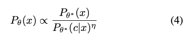   
####
결론만 보자면 CFG의 반대방향으로 모델을 업데이트하는 것이다.  
condition과 uncondition의 차이, 즉 해단 context에 대한 생성을 η만큼 빼주는 것이다.  
(*는 frozen)  
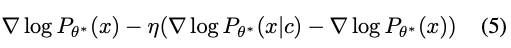  
####
이를 반영하여 fine-tuning함으로 모델의 출력 분포를 변경해준다.  
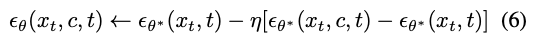  
####
fine-tuning 과정도 심플하다.  
condition으로 생성한 결과가, 역 CFG를 취해준 결과와 같도록 reconstruction L2 Loss를 취해준다.  
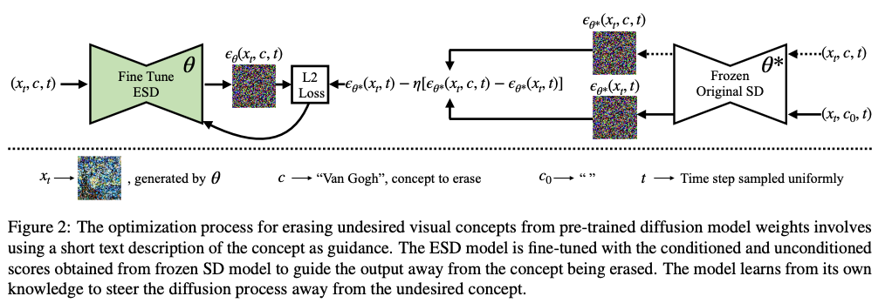  
####
### Importance of Parameter Choise  
> 논문에 언급은 없지만 모델 전부를 fine-tuning하는 것은 catastrophic forgetting을 유발할 수도 있고 생성 결과에 영향을 줄 수 있다.  
> 때문에 최대한 효율적으로 특정 파라미터만 튜닝하겠다는 내용

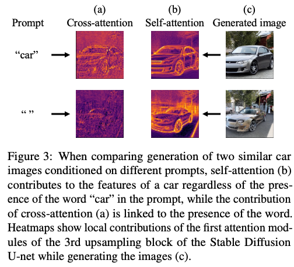  
text와 생성 결과에 직접적인 영향을 주는 부분은 Cross attention 부분이다.  
위 그림처럼 Self attention은 text가 다르지만 차에 대한 시각적인 개념에 기여하는 경향이 있다.  
####
* ESD-x : 예술 스타일 제거와 같은 특정 프롬프트에 대한 제거는 cross attention만 fine-tuning한다.  
* ESD-u : NSFW와 같은 전역적인 개념을 제거할 때는 나머지 레이어를 fine-tuning한다.  
####
반 고흐 스타일을 제거하는데 다른 레이어를 튜닝하면 다른 예술가의 스타일도 같이 제거된다.  
ESD-x만 사용할 때 반 고흐만 딱 골라서 제거할 수 있었다.  
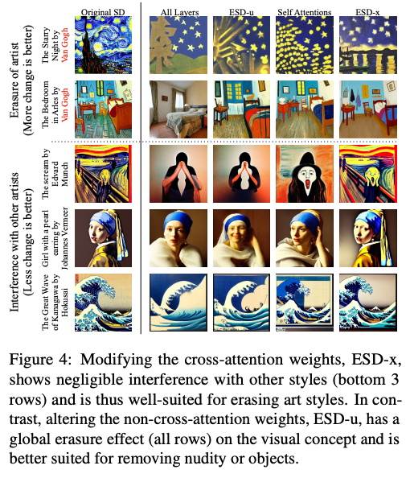
####
NSFW를 제거할 때는 "nudity"와 같은 단어를 직접 언급하지 않아도 해당 컨셉이 생성되지 않아야 한다.  
때문에 text와 별개로 전역적으로 제거를 해야하기 때문에 cross attention이 아닌 다른 레이어들을 튜닝한다.  

***
## Experiments  
* SD: pretrained Stable Diffusion
* SLD: Safe Latent Diffusion, 기존 SOTA(이긴한데 아마 이 논문밖에 없는 것으로 알고 있음), inference guide방식  
* SD-Neg-Prompt: 논문은 아니고 community에 공유되는 테크닉인데, negative prompt pool을 만들어서 생성할때 가이드하는 방식
> SLD랑 SD-Neg-Prompt가 비슷해보이는데  
> SD-Neg-Prompt는 단순히 입실론을 빼주는 naive한 방식이고  
> SLD는 momentum을 사용하여 원래 생성하던 content에서 안 벗어나고 해당 concept만 제거하려한 논문으로 알고 있다.  
####
diagonal 부분이 해당 작가의 style이 제거되어야하는 부분이고, 나머지는 최대한 안변해야 한다.  
> Our Method에서 3,3은 여자가 사라졌는데, 이러면 안되는 것 아닌가...

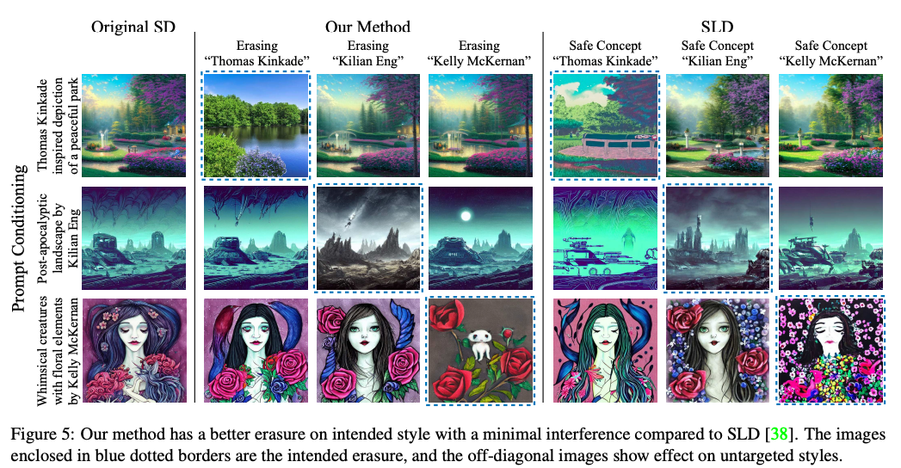  
####
다른 모델에 비해 효과적으로 NSFW 요소를 제거하였다.  
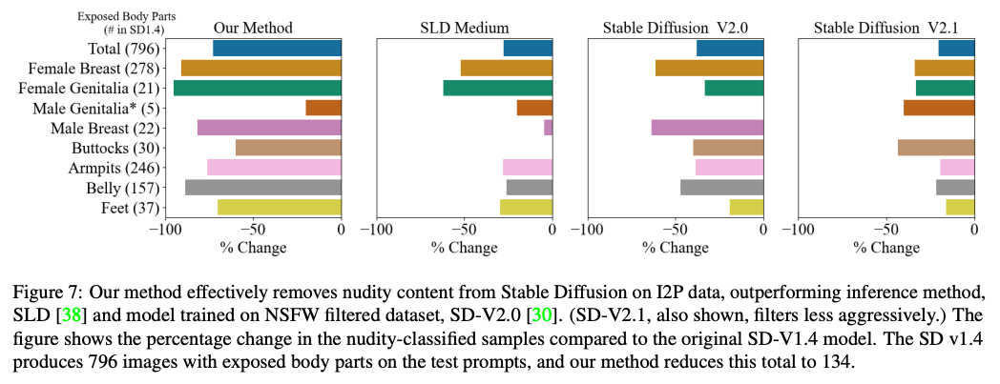
####
Fudelity 저하도 거의 없다.  
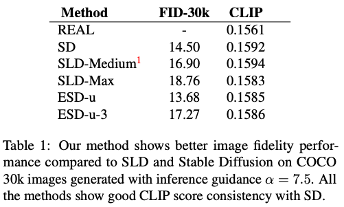
####
Re-training비해서 효과적으로 특정 객체의 개념을 제거할 수 있다.  
제거 작업을 진행한 후에 생성해서 classification한 결과이다.  
> 다른 class 성능이 감소하면 안되는 거 아닌가...  

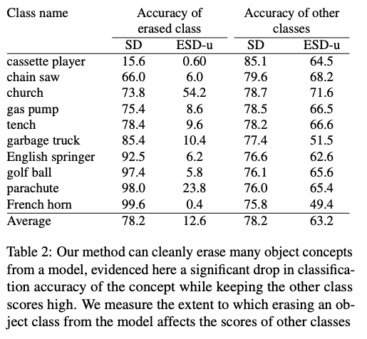
####
교회를 지우는데 십자가만 지우는 문제가 있다.  
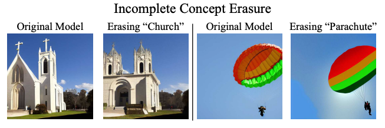
####
이런 것도 가능하다.  
> 위에 교회 예시와 함께 생각해보면 아무래도 Diffusion이 text에 대해서 맥락적으로 학습된 컨셉이 있는 것 같다.  

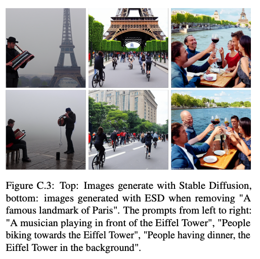
####
사실 내가 관심있는 건 특정 객체 컨셉 제거이다.  
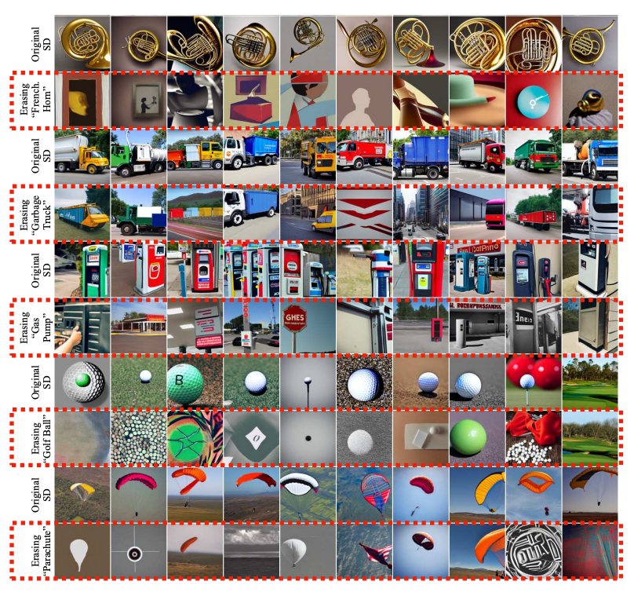  
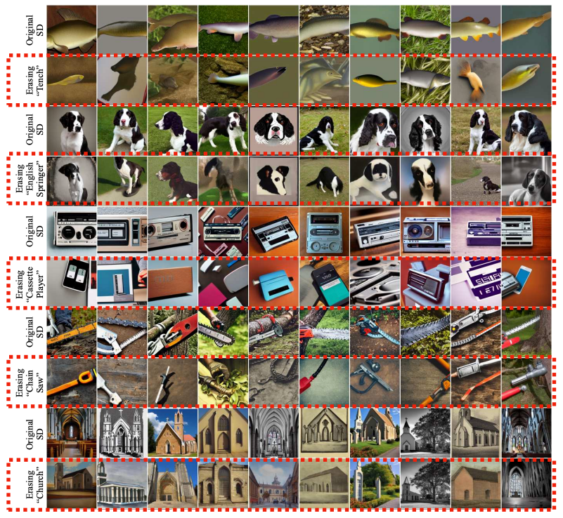
