GLIGEN: Open-Set Grounded Text-to-Image Generation
===
CVPR 2023 / 23.01
###
  

grounding data: 객체의 위치가 어디있는지 정보가 있는 데이터

텍스트만으로는 물체의 위치를 완전하게 표현할 수 없으니, grounding data를 사용하겠다.

기존에 grounding data만 사용하는 연구들은 있었지만, text까지 사용하는 연구는 거의 없었다.
게다가 우리는 LDM의 가중치를 유지하면서 학습했기 때문에 수십억장의 이미지-텍스트 데이터의 정보를 사용한 것이다.

ground 기반의 texet-to-image 생성

기존 가중치를 유지하면서 학습

layout2img에서 제로샷으로 SOTA

Related Work

LDM    
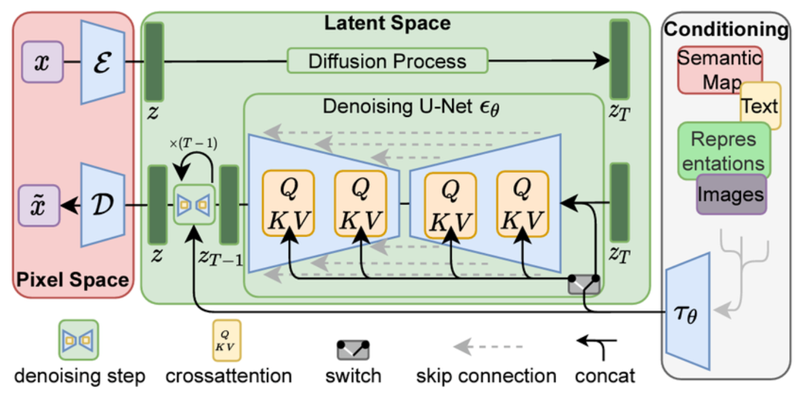  

GLIP     
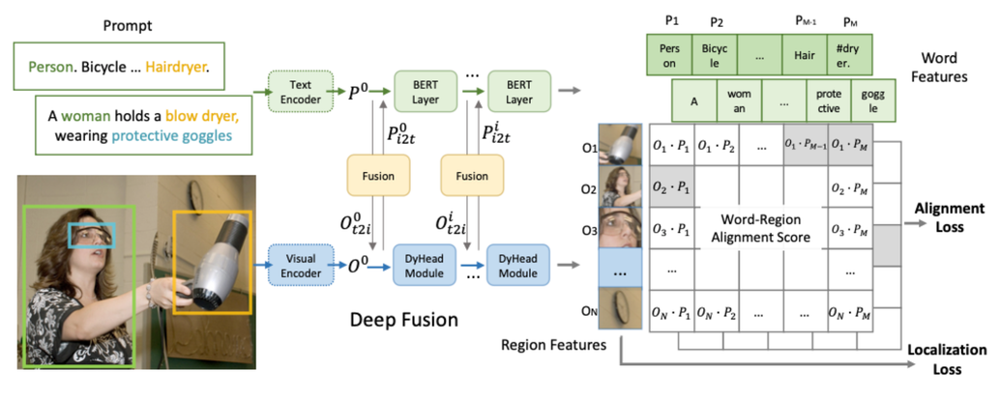

## Open-set Grounded Image Generation

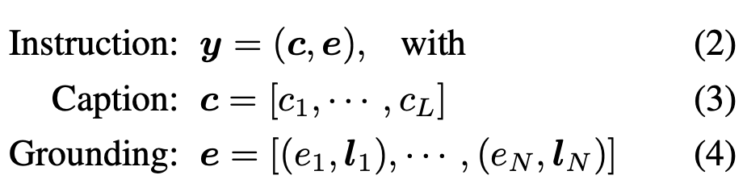

Grounding spatial : bounding box(이 논문에서 주로 사용), key point …  
Grounding entity : image, text + grounding spatial

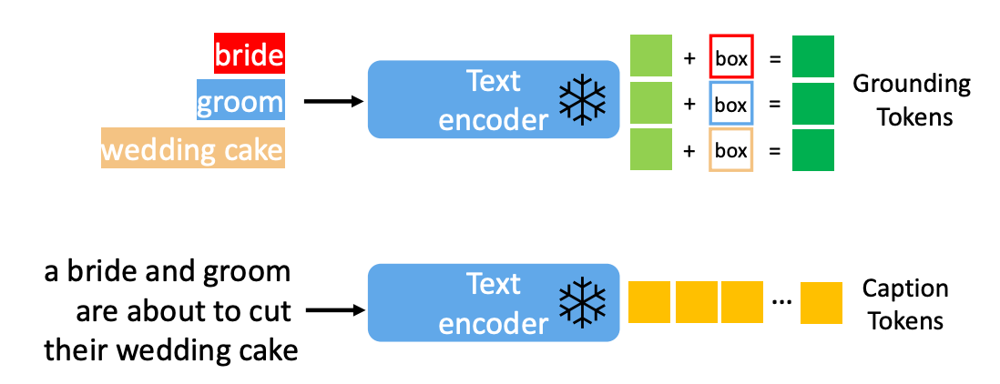

h^c는 Caption Tokens   
LDM과 같은 방식으로 얻음 = 인코더 사용

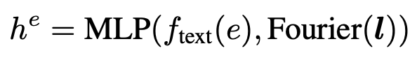

h^e는 Grounding Tokens
여기서 l=[x1,y1,x2,y2], Caption Token과 똑같은 인코더로 feature를 뽑은 후 bbox정보와 concat해서 만든다.

* From Closed-set to Open-set
  * 기존에는 마땅한 텍스트 인코더가 없어서 Closed-set으로 연구되었다. 
  * (coco class…)하지만 텍스트 인코더를 사용하기 때문에 Opne-set으로 동작할 수 있다.

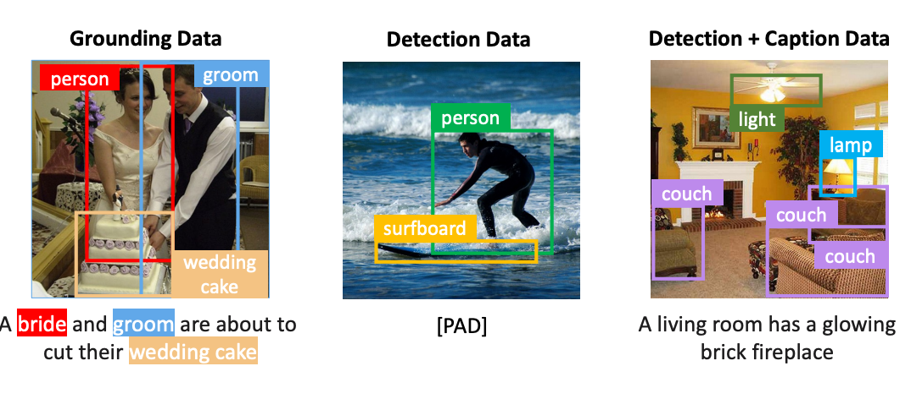

* Dataset (from coco-2014)
  * Grounding data : 이미지 + 캡션, GLIP을 사용해서 pseudo box label를 만들어서 사용Label(entity) > from caption / Caption > use
  * Detection data : Label(entity) > coco category / Caption > null text
  * Detection and caption data : 이미지 + 캡션, 캡션은 각 라벨에 대한 것이 아니라 이미지에 대한 전체적인 설명Label(entity) > coco category / Caption > use

## Continual Learning for Grounded Generation

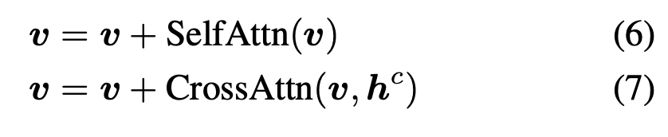

LDM based

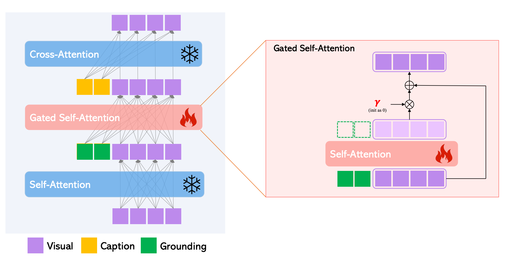

원래 LDM에서 사용하는 Self-Attention과 Cross-Attention을 freeze시키고 그 사이에 Gated Self-Attention을 추가한다.

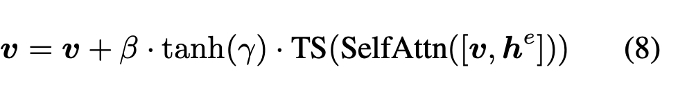

TS : visual token만 다음으로 넘기는 연산
γ : trainable scalar → init = 0
β : inference할 때 scheduled valuie

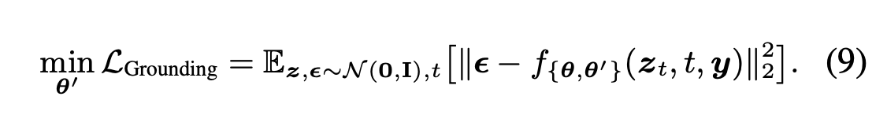

grounding input y에서 localization 정보를 가져와 사용하는 방법을 학습한다.
동시에 기존에 학습된 캡션에 대한 정보는 유지한다.

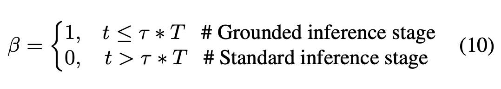

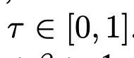

막상 grounding token을 계속 넣다보니까 오히려 그냥 text-to-image보다 퀄리티가 떨어진다.
때문에 초반에만 위치 정보를 넣어주고 후반에는 퀄리티 향상에 집중할 수 있도록 β를 설정해준다.

(prompt-to-prompt에서 봤던 것처럼 구조는 초반 스텝에서 결정되기 때문에 말이 된다. 다만 왜 퀄리티가 떨어지느냐에 대한 원인 분석은 본문에는 없음)

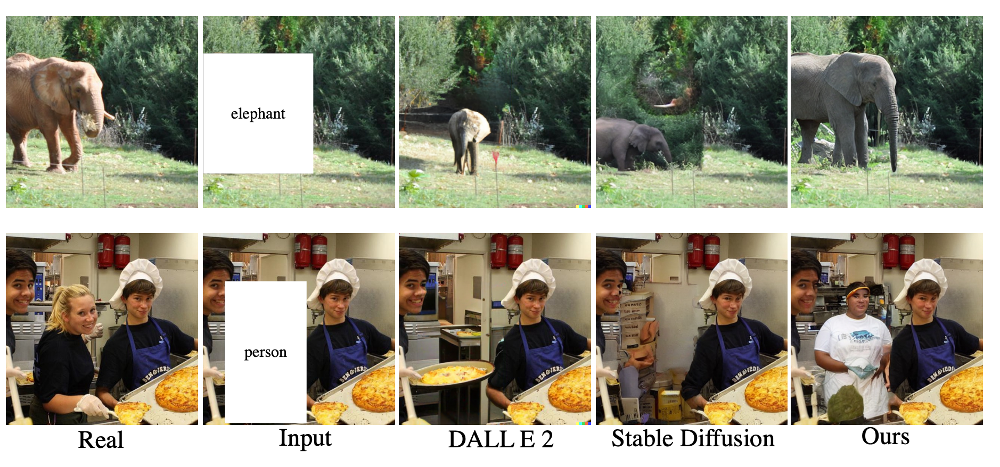
