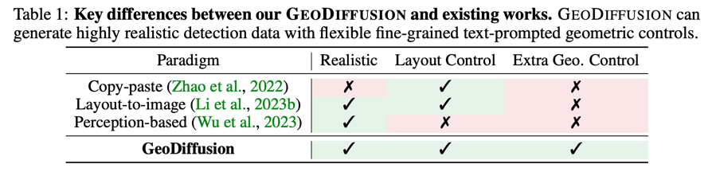
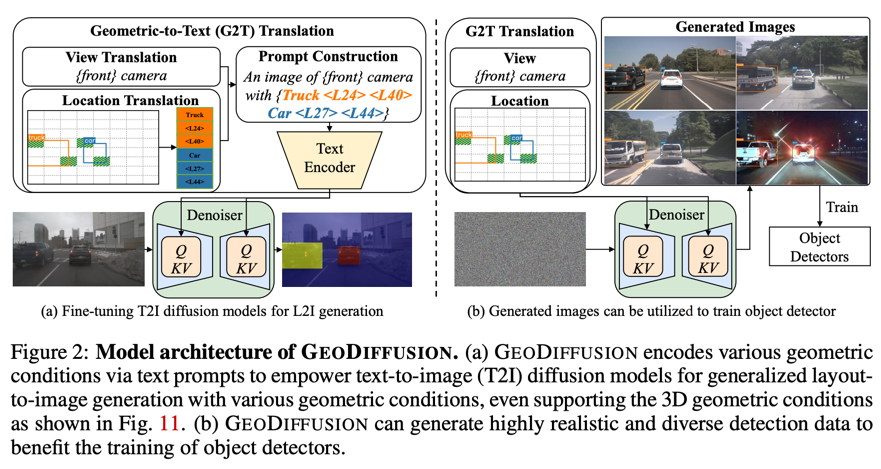
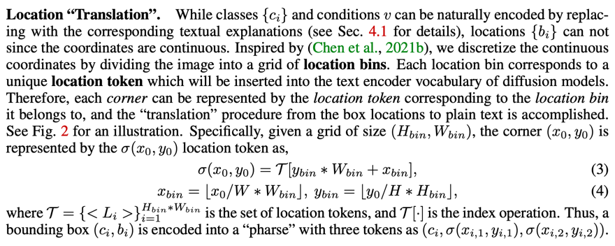
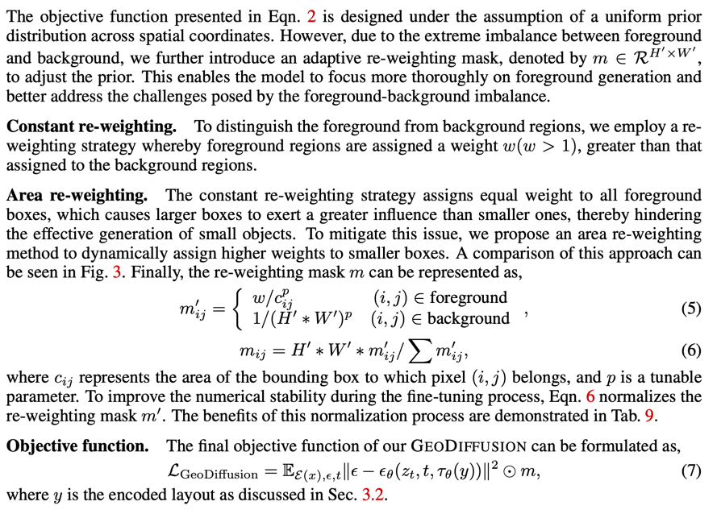
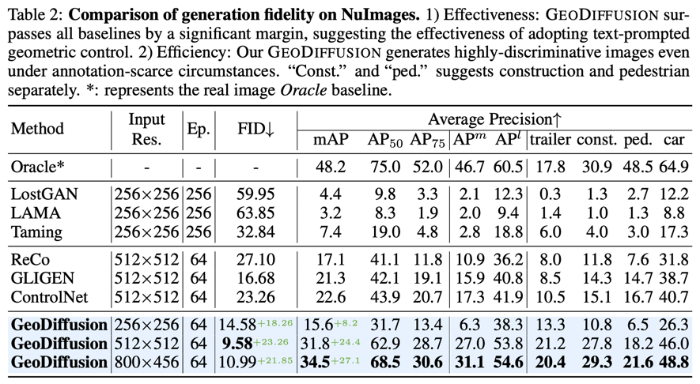
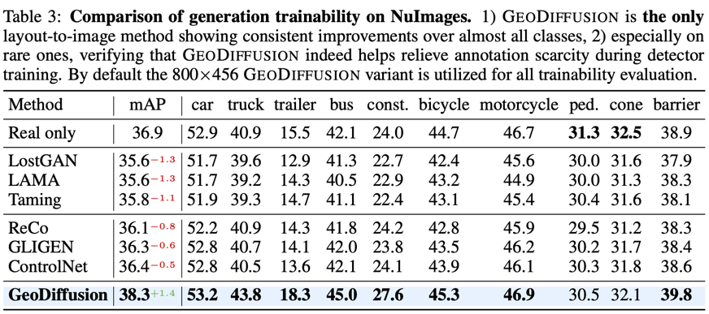
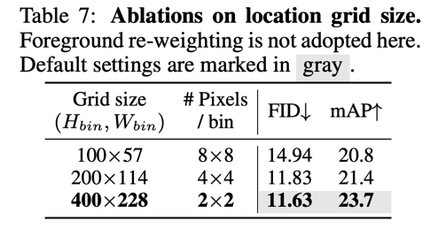
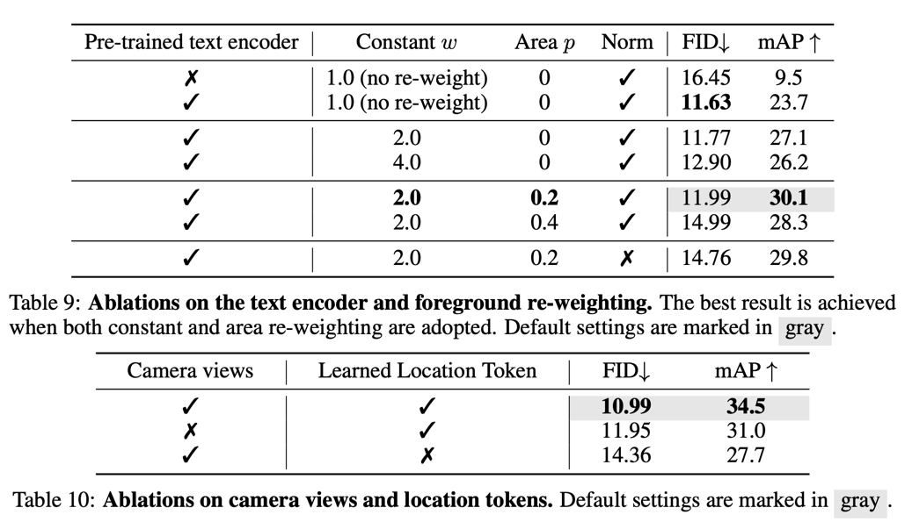

GeoDiffusion: text-prompted Geometric control for Object Detection Data Generation
===
(구조조정으로 타노스당해서 당분간 세미나할 시간 없음... 그래도 읽은 논문 간단하게 정리...)

ICLR 2024 / arxiv 23.06
####
## Introduction
Object Detection을 위한 데이터 생성에는 bbox label이 문제다.  
기존의 copy-paste는 품질이 낮고, L2I 생성은 별도의 모듈에 의존하기 때문에 카메라 뷰와 같은 추가적인 가하학 조건을 사용하기 어렵다.  
text를 기반으로 bbox의 위치를 가이드하겠다.  
  

###
## Method
  
####
* 이미지를 패치단위로 나눈뒤 각 객체의 bbox의 좌표를 패치번호로 대체하여 가이드한다.  
* 이를 통해 각 객체에 대한 정보뿐만 아니라 객체의 위치도 같이 학습한다.  
* inference할 때 위치를 가이드할 수 있고, Object Detection을 위한 annotation으로 바로 사용가능하다.  
####
### Location "Translation"  
  
#####
각 패치를 좌상단부터 우하단까지 순서대로 번호를 매긴다.  
이 번호를 "pharse"로 변환하여 사용한다.  
### Forground Prior Re-weighting  

#####
* 배경보다 객체에 가중치를 더 줌 (w는 하이퍼파라미터)
* bbox 크기에 반비례하게 가중치를 줌
* 최종적으로 마스크를 reconstruction L2 Loss에 씌워주는 방식으로 사용

## Experiments

####

####
  
> 당연하게도 패치가 많을 수록 성능이 좋음
> 근데 아래보면 각 위치에 대한 토큰을 learnable token으로 사용하는 것 같은데, trade-off가 있는 것 같다.  
####

