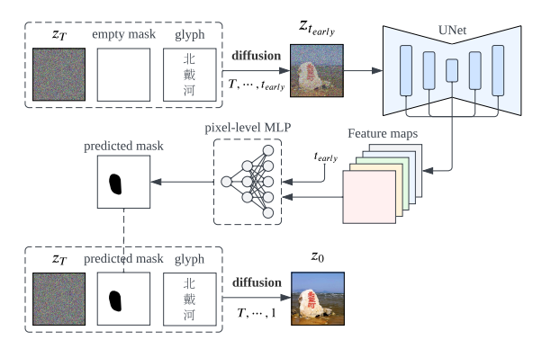
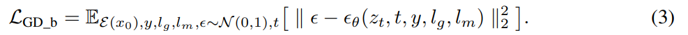
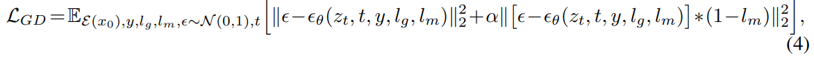
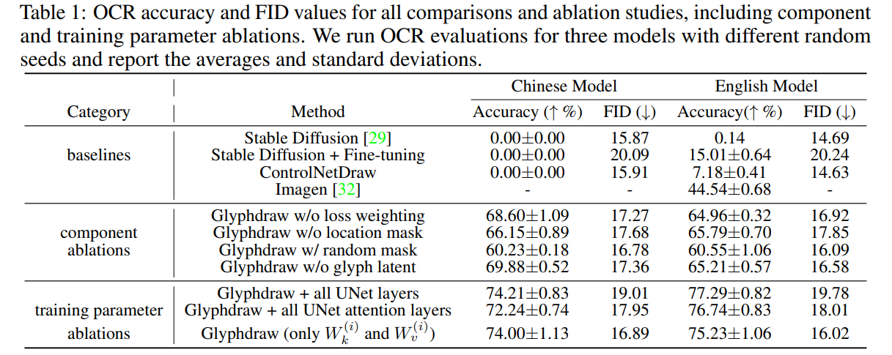

GlyphDraw: Seamlessly Rendering Text with Intricate Spatial Structuers in Text-to-Image Generation
===
arxiv 23.03

## Introduction
아직 한자같은 복잡한 형태의 텍스트를 이미지에 생성하는 것은 어렵다.  

## Method

### Exploitation of Auxiliary Information
* Location Control  
    글자 이미지의 feature의 분포는 일반적인 자연 이미지의 feature와 다르다.
    그렇기 때문에 specific local area에 대한 attention이 필요하다.
    > 솔직히 feature 분포가 다른 것은 이해가 되지만, local attention이 필요한 것과 연결은 잘 모르겠다.   
    어쨌든 Inpainting처럼 글자 영역에 집중하기 위해 필요한 것은 맞는 것 같다.
    
    결론은 OCR Detection을 사용하겠다는 것이다.  
    학습 중에는 입력 이미지에 대해서 OCR Detection을 얻어 mask를 입력,  
    Inference 중에는 초기 노이즈에서 마스크를 예측하는 모듈을 추가하여 사용한다.
    

* Glyph Control
    기존에 Latin계열 언어들은 데이터양이 워낙 방대하지만 한자, 일본어, 한국어와 같이 복잡한 구조의 언어들은 데이터가 부족하다.

    그렇기 때문에 이 논문에서 Glyph image라고 부르는 흰 배경에 검은 글자가 렌더링된 이미지를 같이 입력하여 subject guided와 같이 설계한다.

    1. 일단은 Inpainting처럼 concat하여 입력으로 들어간다.
    2. 또한 이미지 인코더를 추가해서 fusion module에서 텍스트 인코더 결과와 조합하여 사용된다.
    

### Training Strategies
catastrophic forgetting을 예방하기 위해서 fusion module과 conv_in, cross attention의 kv만 학습한다.

### Loss weighting
마스크 안쪽 영역에 대한 loss에 가중치를 준다.  
Experiment에 보면 마스크 바깥쪽을 0.5를 줄이고 있다.  

## Experiments

