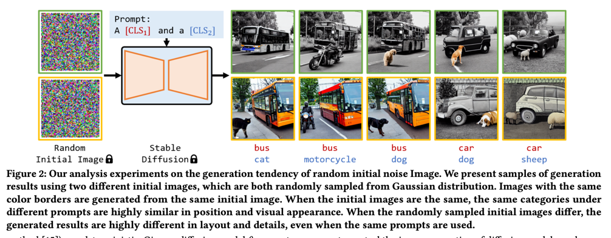
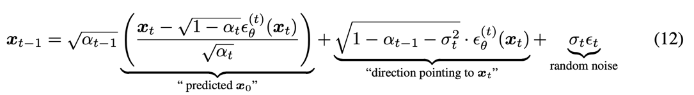
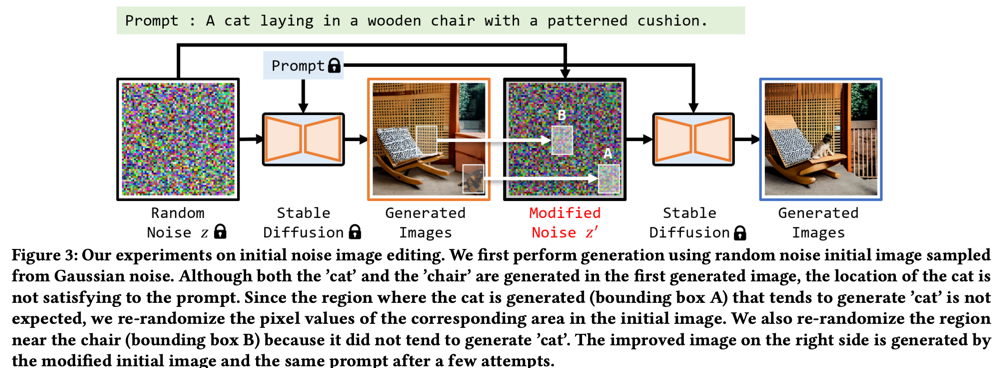
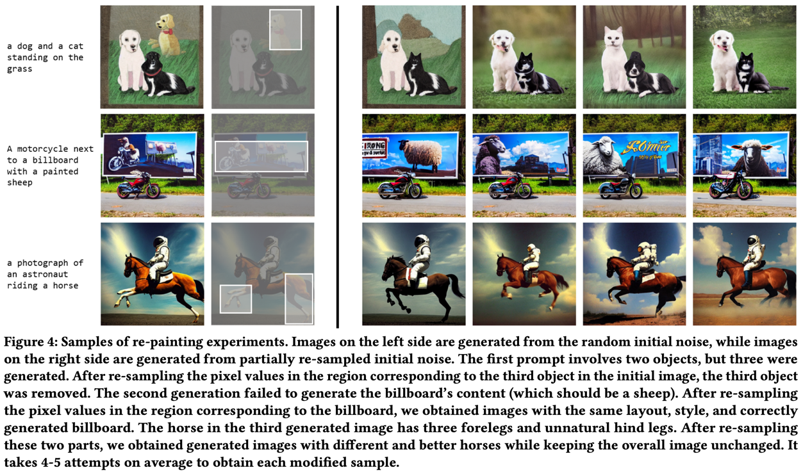
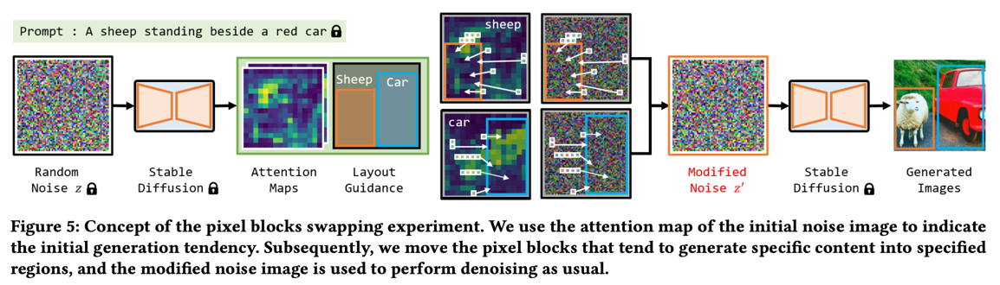
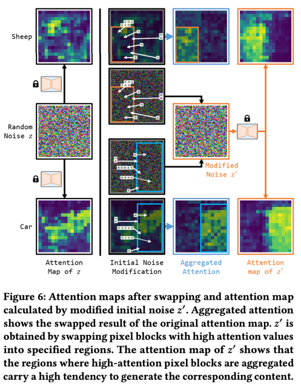
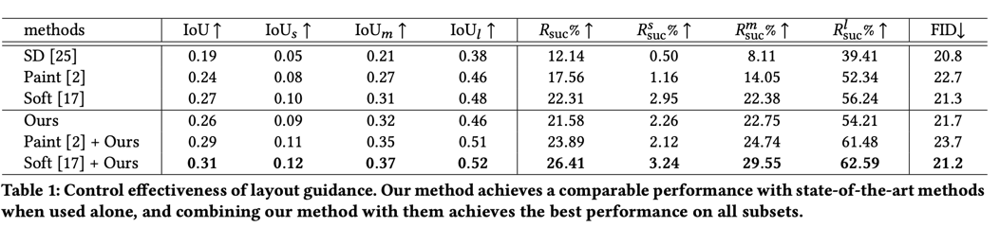
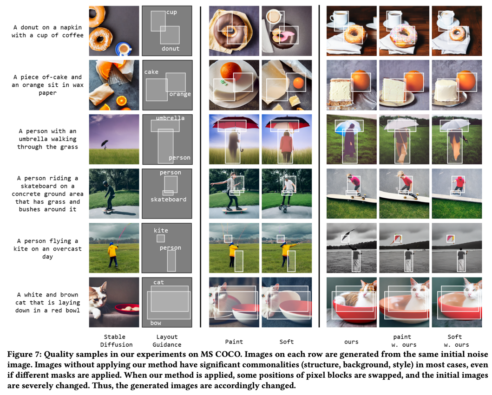

Guided Image Synthesis via Initial Image Editing in Diffusion Model  
===
ACM multimedia 2023 / arxiv 23.05  
                                   
DDIM을 쓰면 z_0는 z_T에 의존성이 있을 수 밖에 없는데 연구가 안되고 있었다.  
이 논문에서 실험해본 결과 z_T에서 각 영역이 상대적으로 생성된 영역에서 독립적으로 영향을 준다는 것을 발견하였다.  
이 논문에서는 이를 generation tendency라고 부른다.  
이 점을 이용해서 re-painting하는 것을 제안한다.  
또 다른 발견은 특정 콘텐츠를 생성하는 결과에는 공간적인 위치보다 픽셀 값이 주로 연관이 있다는 것이다.  
때문에 초기 노이즈에서 해당 값들을 다른 곳으로 옮겨주어서 생성되는 객체의 위치를 옮길 수 있다.  
  
  
## Generation Tendency of Initial Image  
  
두개의 객체에 대해서 같은 노이즈로 실험한 결과이다.  
동일한 노이즈에서 비슷한 객체의 구조로 생성되는 것을 확인하였다.  
> 개인적으로는 "A cat and a bus"로 해본 결과도 궁금하다.  
> bus와 car가 비슷한 의미에 객체라 그런 것인지, 프롬프트 내에서 토큰의 순서에 의한 영향도 있는지 궁금하다.  

이러한 이유를 아래와 같이 분석하고 있다.  
* ### DDIM
  * DDIM은 결국 sigma=0으로 설정하여 스텝을 줄이겠다는 이야기이고, 이로 인해 z_T도 Determinisitc하게 영향을 준다.  
    
    > 처음에 이 논문을 봤을때 혼란을 겪은 부분은 PtP에서는 초기 노이즈로 객체 유지가 어렵다고 주장하기 떄문이다.  
    근데 생각해보니 PtP의 해당 주장은 text condition이 추가되는 상황에서이다.  
    그렇기 때문에 PtP에서 소스 텍스트에 해당하는 어텐션맵을 가져다 사용한다.  
    이 점을 생각해보면 PtP도 generation tendency를 은연중에 사용한 것이다.  
* ### Image Synthesis from Random Initial Image
  * (Initial Image는 z_T로 보면 된다. 논문상 표현이 혼돈할 수 있게 되어 있다.)
   * 현재 상태에서 cross-attention을 통해 각 컨디션 토큰들과 유사도가 높은 영역에 주로 변화를 준다.
    > 아래는 개인적인 해석이다.  
    cross-attention의 역할 현재 상태에서 각 토큰들과 가장 유사한 곳에 해당 토큰에 대한 의미를 더 강화시켜주는 것이다.  
    초기 노이즈가 랜덤한 값이지만 그나마 가장 유사하다고 생각되는 부분을 attention하고  
    이것이 누적되면서 해당 위치에 해당 토큰이 표현되는 것이다.  
* ### Analysis of generation failure
  * 그렇기에 초기 노이즈 이미지의 생셩 경향과 프롬프트가 inconsistency하면 생성이 실패되는 것이다.  
  * 많은 Layout기반의 방법들이나, attention map에 마스크로 생성 영역을 강제하는 논문드로 실패하는 케이스들이 있는 것이 이런 이유 때문이다.  
    > 즉 초기 노이즈부터 글러먹었으면 그 상태로 attention이 누적되어 실패한다는 것이다.  
    이 논문에서는 re-painting으로 이를 해결하지만 근본적인 문제를 해결하는 것은 아니다.  
    근본적으로 해결하려면 학습할 때에 초기 스텝에서 어떤 노이즈가 와도 attentnion을 잘 잡도록 constraint를 걸어주어야 해야할 것 같은데,  
    충분히 고민해볼 가치가 있을 것 같다.  

## Generated Image Re-painting  
  
생성해보고 마음에 안드는 영역만 노이즈를 바꿔서 다시 생성한다.  
이를 통해서 마음에 드는 영역은 유지하면서 마음에 들지 않는 영역만 다시 생성한다.  

  
이 결과들은 평균적으로 4~5번 다시 생성했다고 한다...  
그래도 마음에 들었던 부분을 유지할 수 있지 않냐는 주장이다.  
> 하지만 예시를 보면 변경하지 않은 영역이 100% 유지되지는 않는다.  
> 의미론적으로는 어느정도 유지되지만 개와 고양이가 바뀔 정도로 차이가 발생한다.  
> 이 부분을 잘 해결한다면 inversion 기법이랑 결합해서 새로운 Inpainting 방법을 제안할 수도 있을 것 같다.

## Layout-to-Image Synthesis  
  
* Layout generation은 {B, C}를 같이 입력으로 넣어준다.  
    B: 지정된 영역, C: 카테고리인데 p에 반드시 포함되어있어야 한다.  
* 가장 직관적인 방법으로 c_i에 해당하는 attention을 b_i로 강제로 이동시키는 것이다.
  * LDM기준 64x64에서 16x16 attention map을 뽑으면 attention map에서 1픽셀이 z_t에서 4x4 픽셀에 대응한다.
  * attention 값이 높다는 것은 해당 위치에 해당 c_i가 생성되는 tendency가 높다는 것이다.
  > ecoder에서 뽑았는지 decoder에서 뽑았는지, 32x32가 아니고 16x16으로 했는지에 대한 근거는 언급하지 않는다.  
  > 구현하려면 PtP 참고하면 될듯
  
  
* s_i=b_i의 크기, b_i의 픽셀 갯수  
* c_i에 해당하는 어텐션 맵에서 값이 큰 것 s_i개 선택
  * 이 중 가장 작은 (=s_i번째로 큰) 값이 A_min

  
* b 밖에서 A_min보다 큰 것들과 b 안에 A_min보다 작은 것들을 무작위로 바꾼다.  
* 그리고 초기 노이즈에서 이 위치에 해당하는 4x4픽셀의 값도 바꿔준다.  
> 이걸 모든 스텝에 대해서 하진 않을 테고 늬앙스 상으로는 T > T-1로 갈 때 하나만 할 것 같은데, 정확한 언급은 없다.  
> 아니면 비슷한 위치에 계속 누적된다고 가정하면 큰 차이가 없을 수도 있을 것 같다.  
> 이런 부분을 ablation study로 다뤄줬을면 좋았을텐데 아쉽다.

## Resutls
  

