Photorealistic Text-to-Image Diffusion Models with Deep Language Understanding
===
NIPS 2022 / 22.05 / 3135 Citations (24.04.18)
####
They proposed using text encoder of LLM.They said that larger text encoders are more effective.  
Output of Imagen is high resolution and high fidelity.                                             
They proposed new benchmark, DrawBench.                                                              
And simple to train. (…?)                                                                              
####
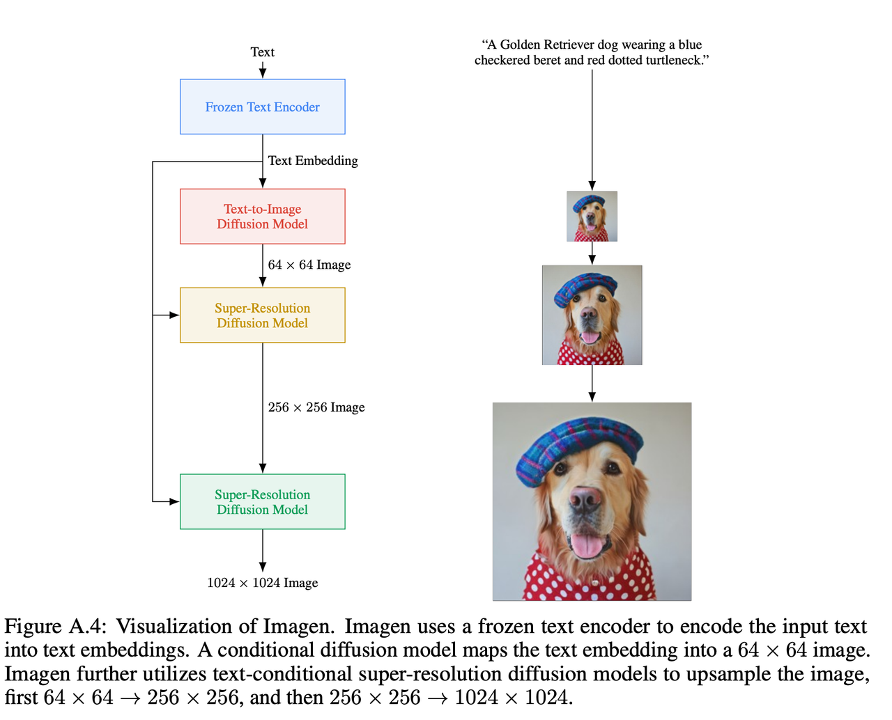
####
### Pre-trained Text Encoder

Using a pre-trained text encoder for text-to-image diffusion is standard.                                
CLIP is commonly used for text-to-image generation, but more recent LLMs such as BERT and GPT have shown better results.  
they said that LLMs trained on rich and extensive text are generally better than CLIP trained on image-text pair data.      
In this paper, they experimented with different sizes of text-encoders and found that larger is better.                       
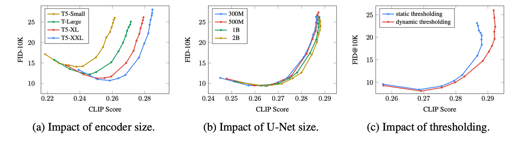
###
### Large Guidance Weight Samplers
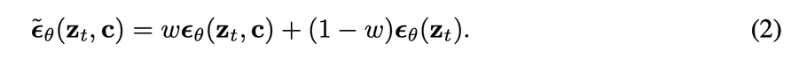

This is the formulas for classifier-free guidance.    
w = 1 : no guidance, w ∝guidance                        

Recent studies have shown that increasing guidance improves alignment but waste fidelity, resulting in oversaturated and unnatural images.                                        
If the output of u-net is out of range([-1, 1]) during the sampling process, it will diverge until t=0.  
To solve this problem, they propose solutions.  

Static thresholdingElementwise clipping the predicted noise to [-1, 1].  

Dynamic thresholdingPick a specific percentile s and if s>1, divide by s after clipping to [-s, s].  

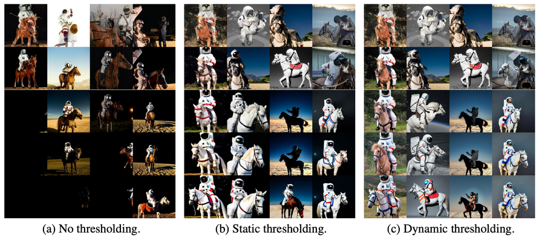
“A photo of an astronaut riding a horse.”

### Robust cascaded diffusion models

Upsample using a super-resolution model. 64x64 > 256x256 > 1024x1024.  
This worked well for artifact removal and high fidelity.

## Evaluating Text-toImage Models

FID is not fully aligned with perceptual quality, and CLIP is ineffective at counting.  
so they use human evaluation.

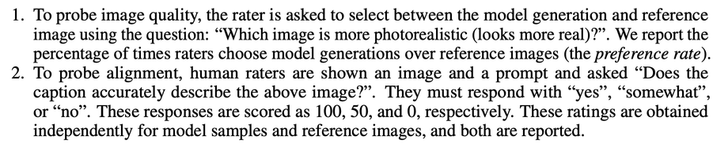  
And they proposed DrawBench  
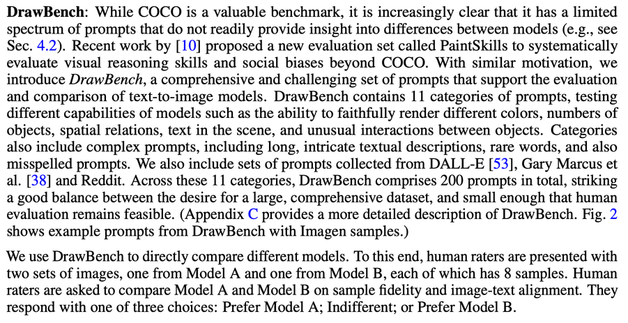   
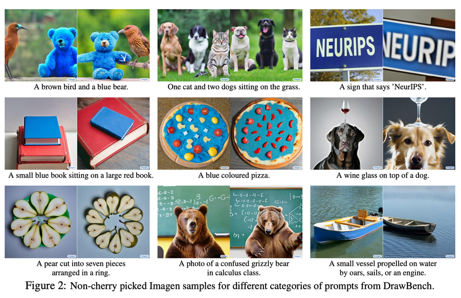  
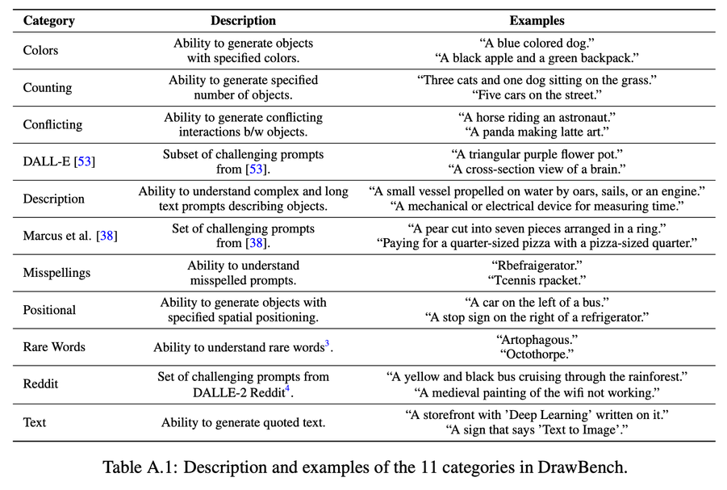
###
## Experiments
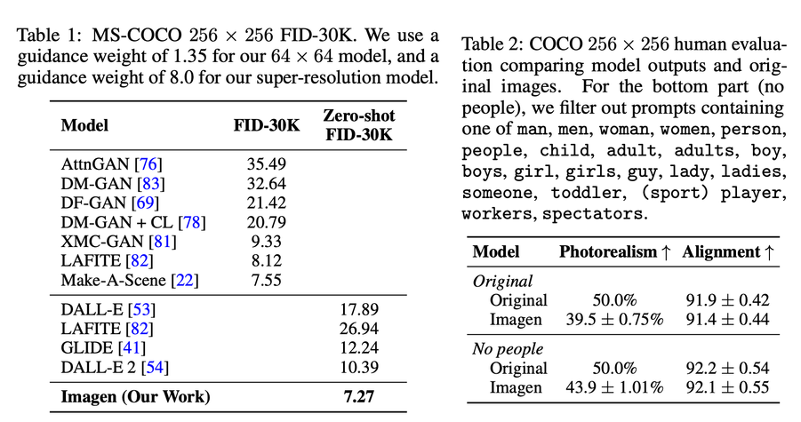  
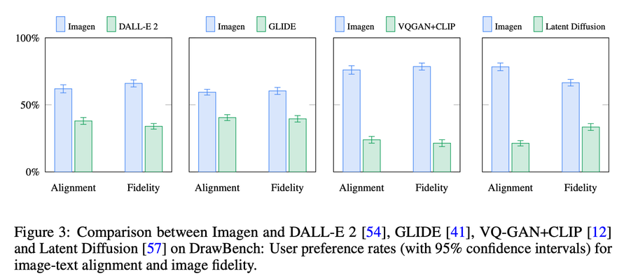  
### vs Dall-E 2
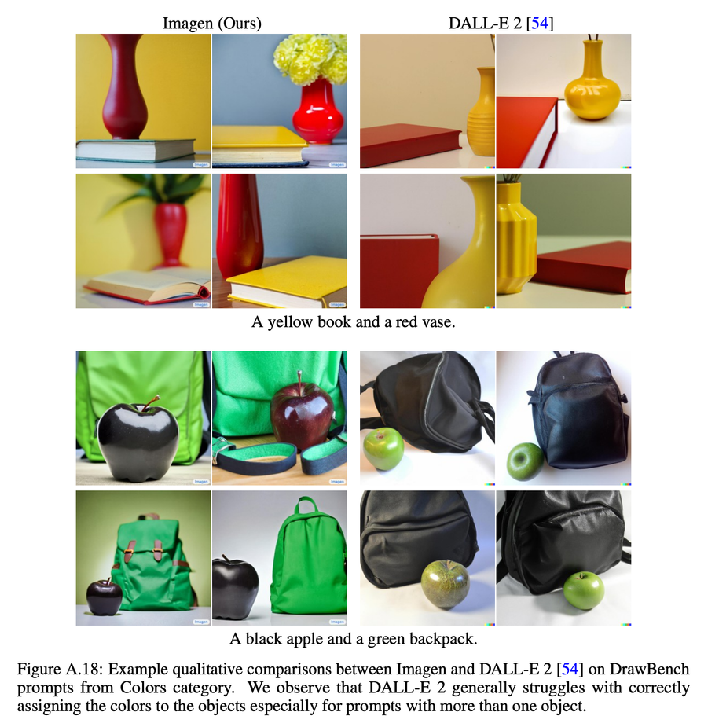  
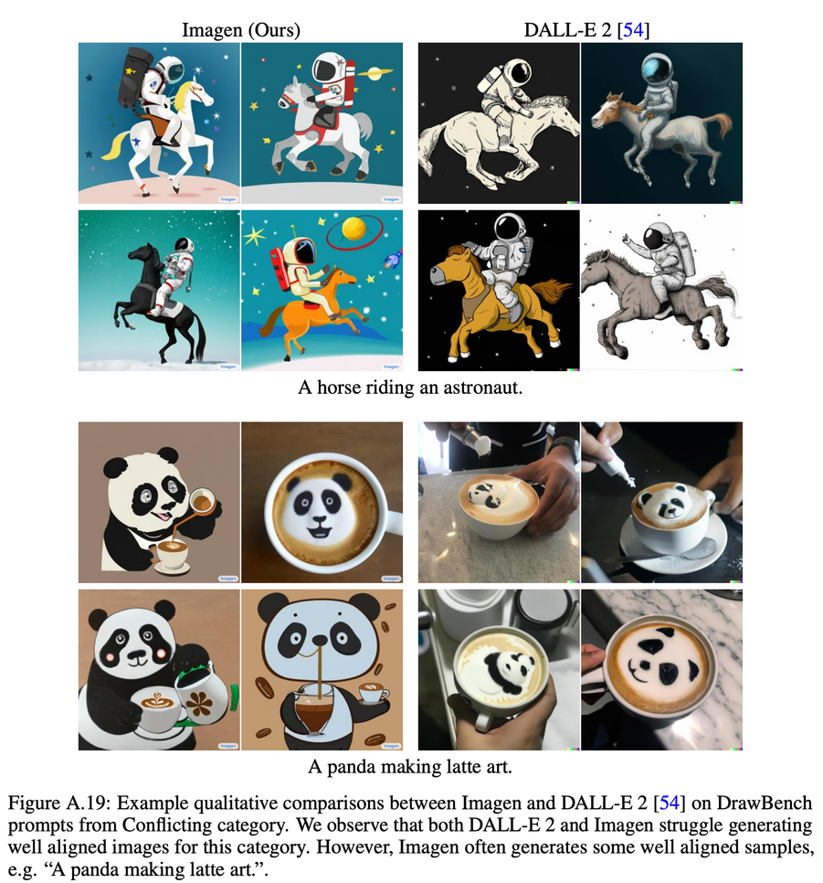  
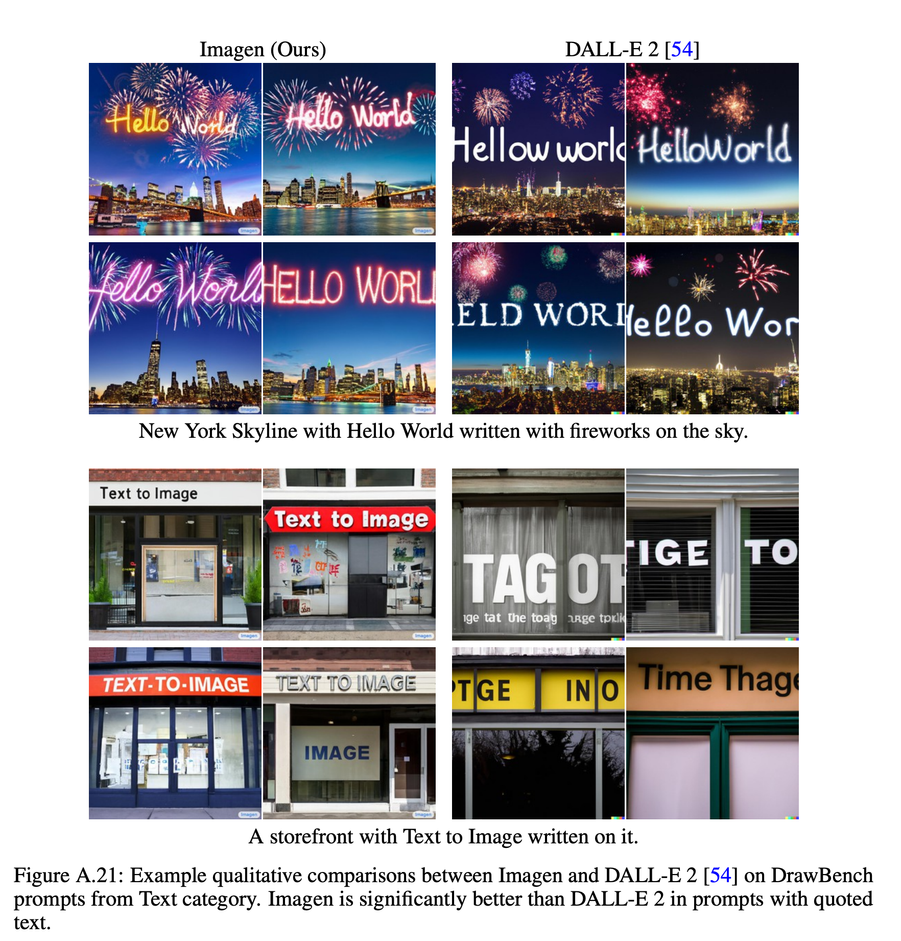
    
