IMAGENHUB: STANDARDIZING THE EVALUATION OF CONDITIONAL IMAGE GENERATION MODELS
===
ICLR 2024 / arxiv 23.10  

## Introduction
T2I 생성 모델들이 많은데, 공정한 비교가 어렵다.  
* 논문마다 평가 데이터셋이 다르다.  
* 일부 논문은 좋은 성능을 위해 하이퍼파라미터 튜닝과 프롬프트 엔지니어링을 요구한다. 이 또한 표준이 없다.    
* User study만 평가되고 있다.

원스톱으로 조건부 이미지 생성 모델의 추론 => 평가를 표준화 하는 라이브러리를 제안한다.   
정성적으로 비교할 수 있는 페이지도 제공한다.  https://chromaica.github.io/#imagen-museum  
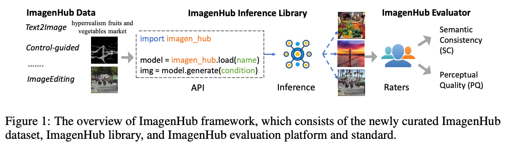  
이를 위해 현존하는 T2I 생성 모델의 task를 7가지로 나눈다. 
* 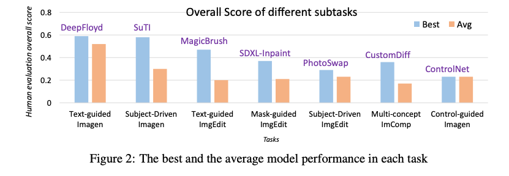  
* 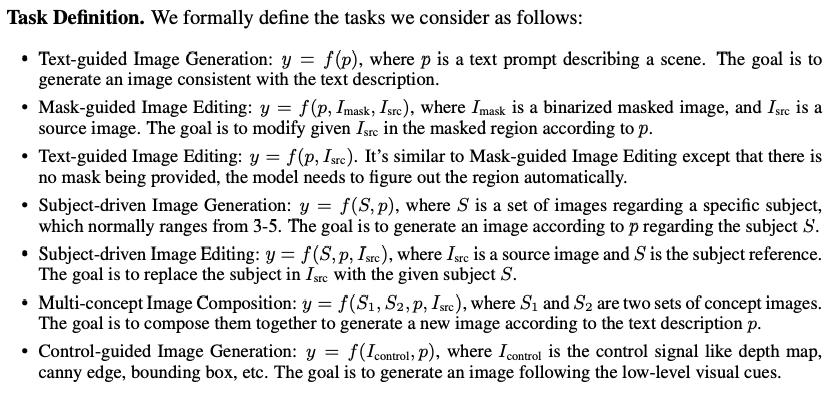  
* 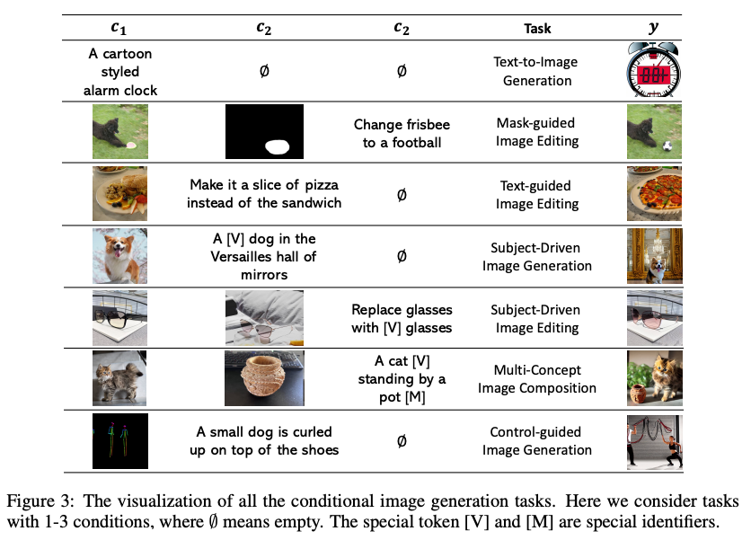  

***
## Method
### Human Evaluation metrics  
여기에서는 두가지 지표를 제안한다.
* semantic consistency: condition과 생성된 이미지가 얼마나 일치하는가  
  * 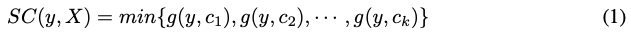  
  * g는 일관성을 계산하는 모듈화된 함수로 [0, 0.5, 1]의 값을 갖도록 설정한다.  
  * 0은 일치하지 않음, 0,5는 부분적으로 일치함, 1은 완전히 일치함
* perceptive quality: 이미지의 품질을 측정  
  * 아티팩트가 있는지, 흐린지, 비자연스러움이 있는지 평가  
  * 마찬가지로 [0, 0.5, 1]이고 0.5는 수용 가능한 품질이라고 설명한다.  
* 최종 점수
  * 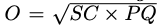  
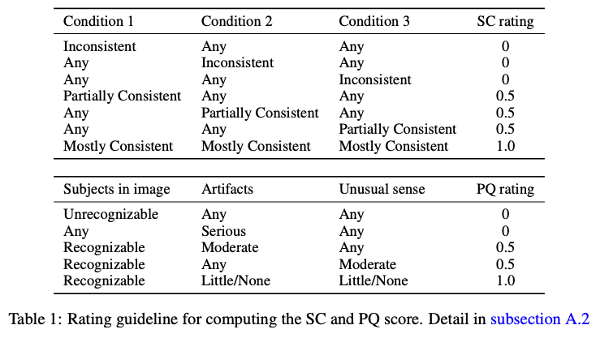  

### Dataset and Available Models  
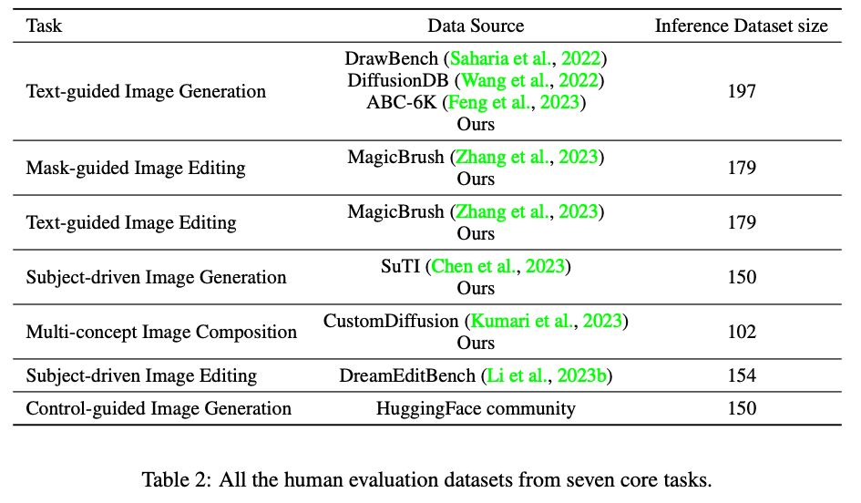  
* Task별로 데이터셋을 수동으로 만들었다.  
* HuggingFace를 통해서 호스팅한다.  
* 일반적으로 text는 전역 설명인데, Instruct계열은 지시문이다.
    이 점을 고려하여 수동으로 같은 의미를 가지도록 데이터셋을 만들었다.
    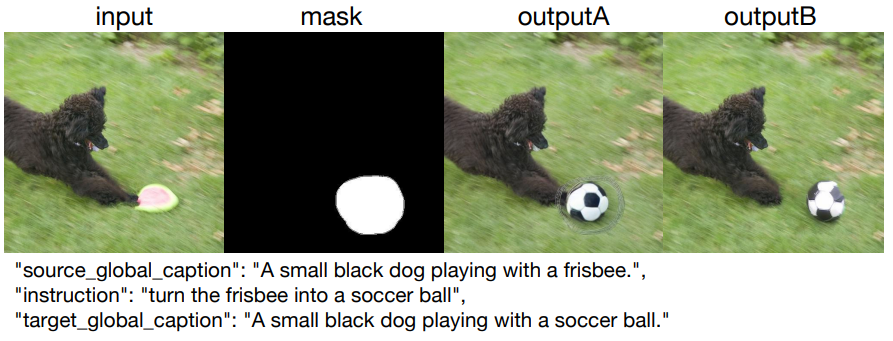  
  
***
### Experimental Results  
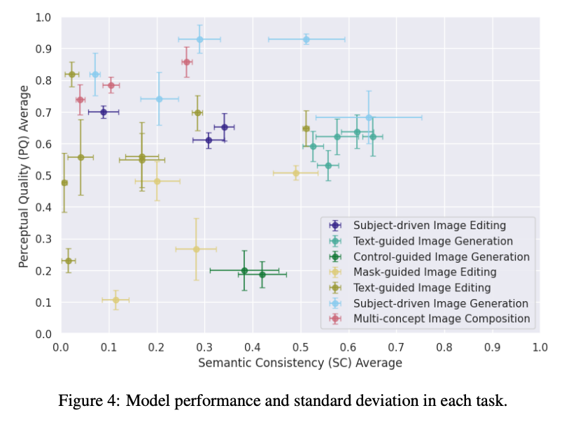  
공정한 평가를 위한 프롬프트 엔지니어링은 다 제거하였다.  
막상 평가를 해보니 Text-guided Image Generation과 일부 Subject-driven Image Generation을 제외하고는 문제가 있음을 발견하였다. 
* 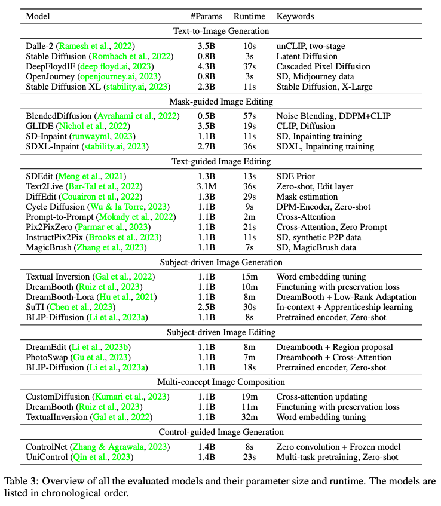  
* 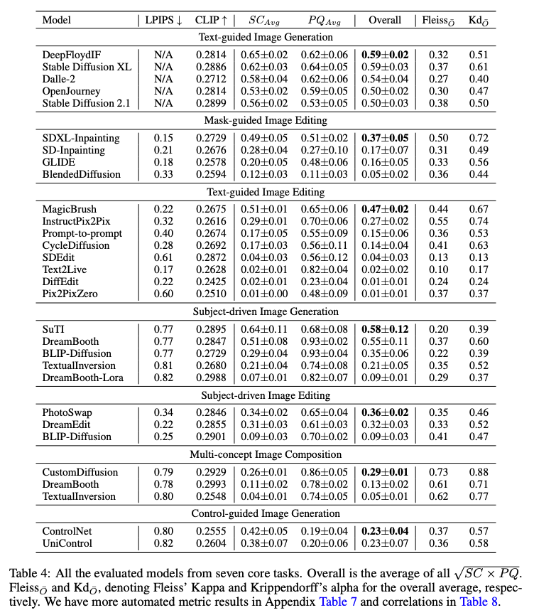  
* 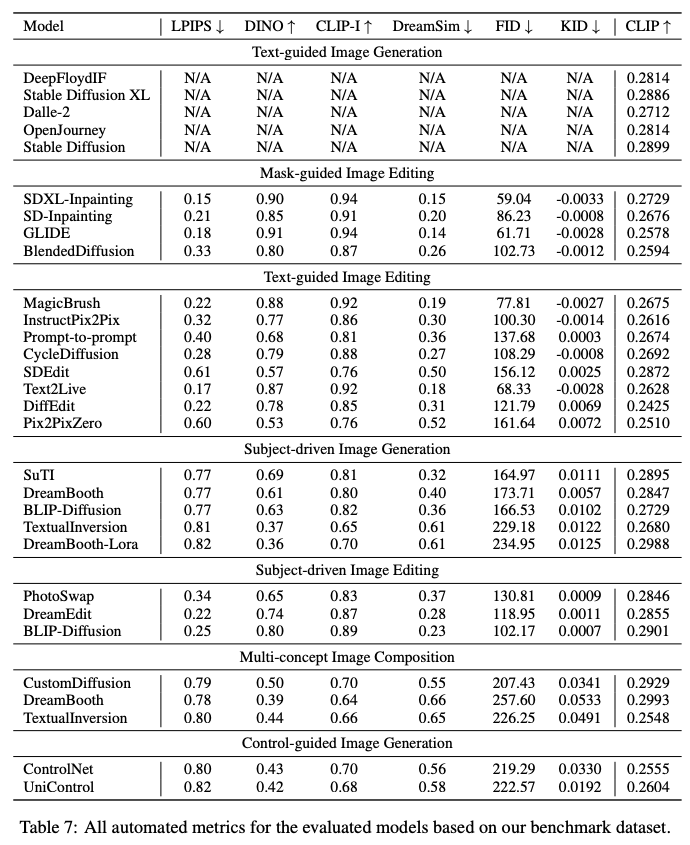  
* 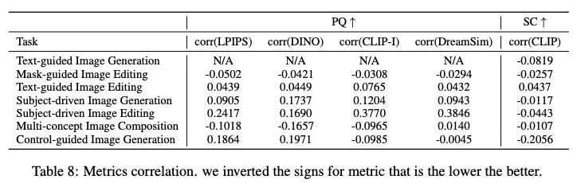  
여기에서 주요 논점은 대부분의 정량적인 결과와 정성적인 결과가 일치하지 않는다는 것이다.  
표 8을 보면 정량적인 결과 정성적인 결과의 피어슨 상관계수를 나타내는데 대부분의 경우 0.2이하이다.  

### Discovery and Insights  
약 30개의 모델을 다 실험하면서 얻은 관찰을 task별로 정리하고 있다.  
* Text-guided Image Generation
  * "팬더가 라떼 아트를 만드는 모습"과 같은 복잡한 프롬프트는 SDXL이 잘한다.  
  * 대부분 모델은 "팬더 라떼 아트"로 이해한다.  
       
* Mask-guided Image Edinting
  * 마스크 영역에 대한 아티팩트 - SD, GLIDE
  * 인식할 수 없는 출력 - Blended Diffusion, SDXL
  * SDXL이 가장 좋긴하지만 overall 성능이 불만족스럽다.  
  * 공통적으로 채워진 영역이 배경과 조화를 이루기 어렵다고 한다.   
      
* Text-guided Image Editing  
  * 종종 완전 다른 배경을 생성함 - PtP, Pix2PixZero, SDEdit
  * 입력을 그대로 출력함 - Text2Live          
     
* Subject-driven Image Generation
  * 막상 해보니 대부분 subject 표현이 어렵거나 그대로 복사하는 경우가 많았다.
  * SuTI는 원하는 subject을 문맥에 맞게 잘 생성하지만 일부 용납할 수 있는 아티팩트가 발생한다.        
     
* Multi-concept Image Composition  
  * CustomDiffusion이 비교적 잘되지만 동작과 위치에 대한 표현을 잘 하지 못한다.      
     
* Subject-driven Image Editing  
  * 소스표현 잘하지만 배경 유지 실패 - PhotoSwap  
  * 문맥을 유지하지만 눈에 띄는 아티팩트 - DreamEdit
  * 잘 안되고 현실적인 생성을 한다 - BLIP-Diffusion         
     
* Control-guided Image Generation  
  * 큰 차이는 없다.

### Ablation Study  
* Method of overall human score computation   
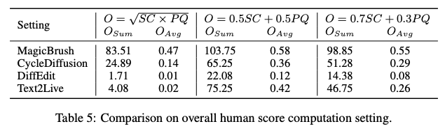   
Text2Live의 경우 입력을 그대로 출력하는 경우가 많다. (=미생성)
이 경우에 SC=0, PQ=1인데 이게 낮은 점수로 반영되어야 한다.  
이를 가중합으로 표현하면 어느정도 생성되는 것으로 보이기 때문에 기하 평균을 사용한다.  
 
* Design choice of human evaluation metric range  
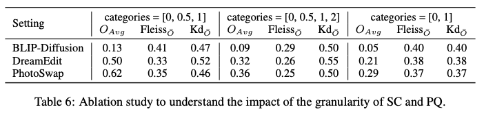  
평가 점수로 [0, 0.5, 1, 2]를 해보았다. 2는 "완벽한 이미지"이다.  
이 경우 작업자간의 일관성이 떨어진다.
[0, 1]로도 해봤는데 너무 극단적인 값이 나왔다.
