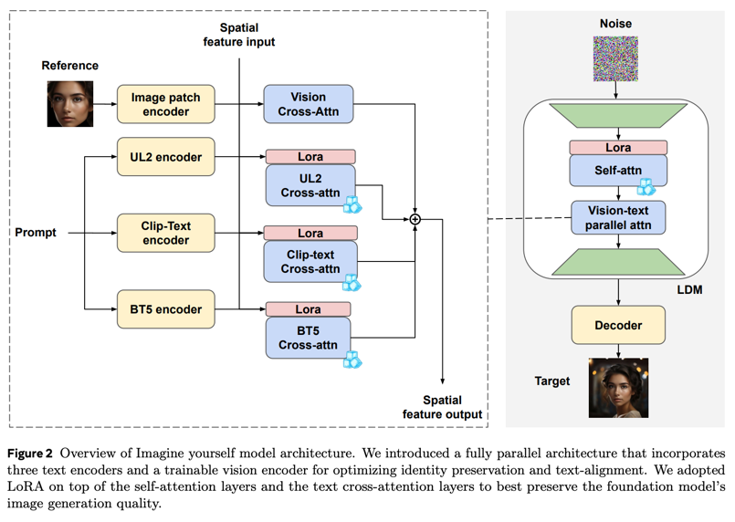
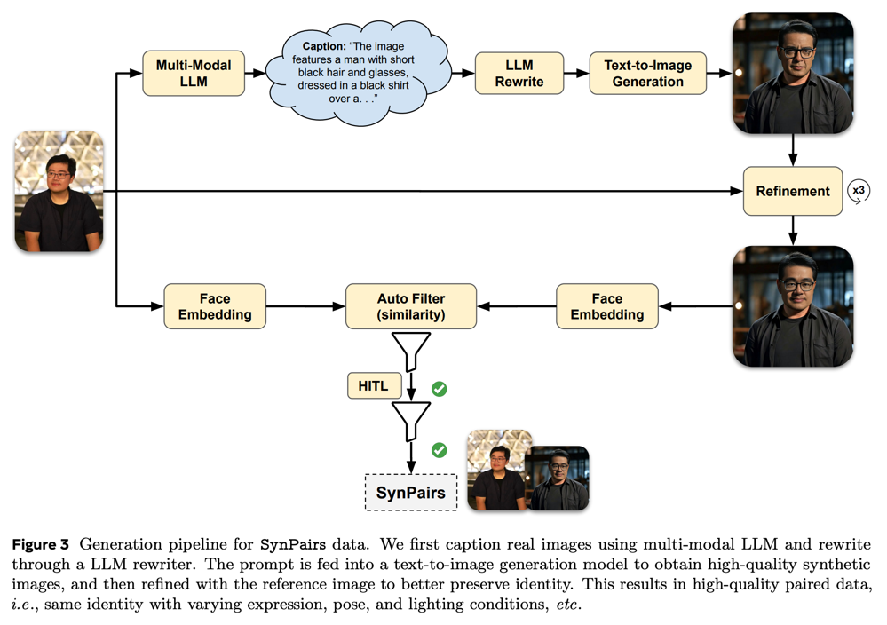
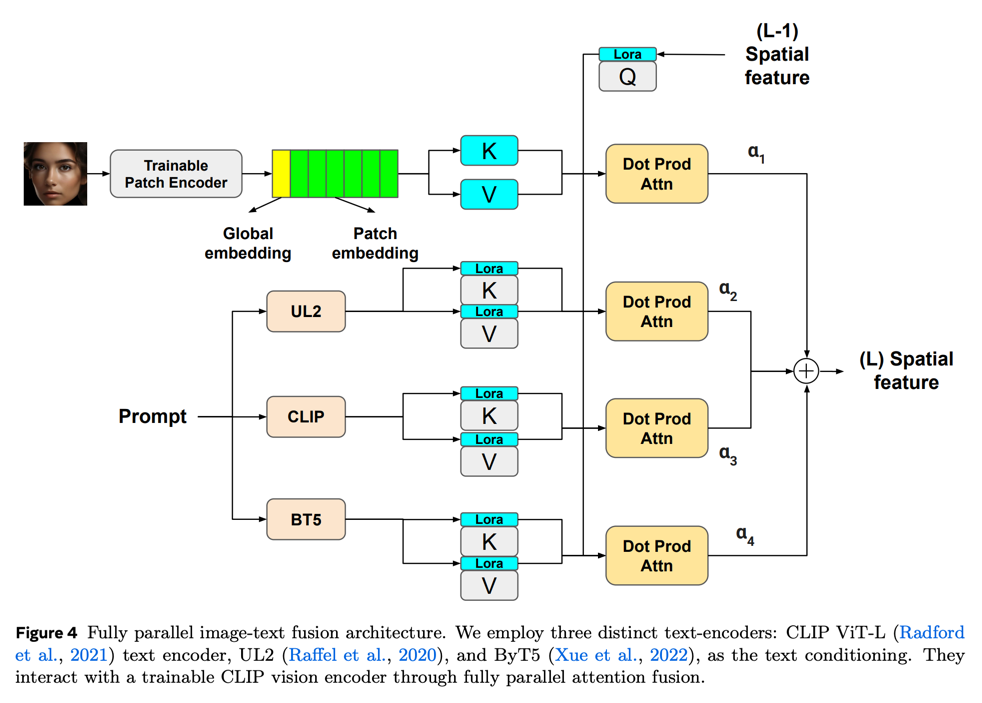
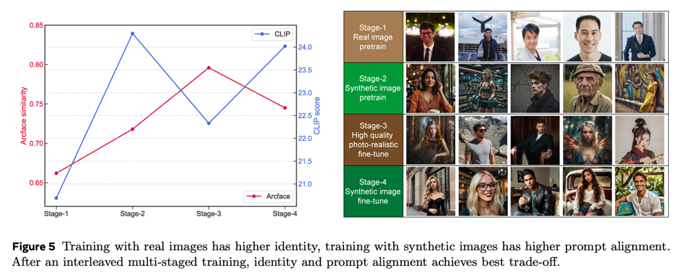
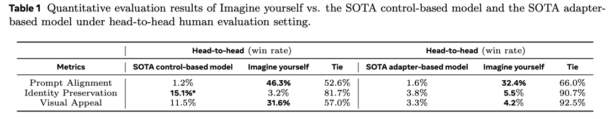
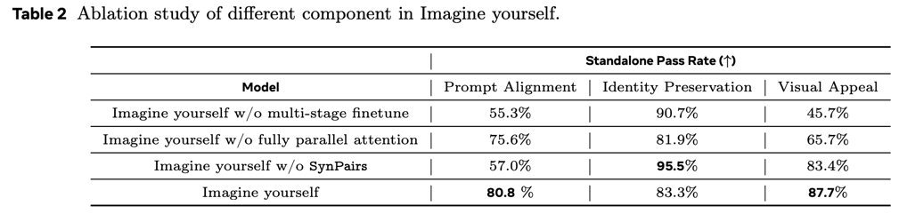

Imagine yourself: Tuning-Free Personalized Image Generation
==
arxiv 24.09 / Meta

# Introduction
Tuning-Free하게 Personalized 생성하는 것이 목표이다.  
용어 표현에 오해의 여지가 있는데 'Training-free'가 아니라 'Tuning-free'이다.  
아예 학습을 하지 않겠다는 것이 아니고 기존 방법들에서 reference 이미지가 들어왔을때 'Tuning'하는 과정을 제거하겠다는 것이다.  
즉, 이 논문에서는 reference 이미지의 feature를 잘 뽑아내는 것을 목적으로 한다.  
foundation model의 성능을 유지하기 위해 최소한의 LoRA와 어댑터만 학습한다.
> 언급이 애매하게 되어있긴 한데 추측해보자면 객체별로 사전 학습하여 사용하는 방식인 것 같다.  
> ('face', 'dog', 'car'가 각각 모델이 따로 있는 방식)  
> 논문에는 얼굴에 대한 예시만 나오는데, 맥락적으로는 reference에서 정해둔 객체의 특징을 더 잘뽑도록 만드는 목적인 것 같다.

# Methods

## Synthetic Paired Data (SynPairs)

이 논문에서도 paired dataset의 중요성을 강조하고 있고, 이를 해결하기 위해 데이터셋을 생성하여 만든다.  
1. LLM(정확히는 VLM기반 captioning 모델일듯)을 사용해서 reference 이미지의 caption을 만든다.  
2. Llama3를 사용해서 caption에 시선, 자세 등의 정보를 추가한다.  
3. Emu를 사용해서 2번에서 만들어진 caption에 대한 이미지를 생성한다.
4. 이후 reference 이미지로 refine한다.
> refinement 방법에 대해서 설명하지 않고 있다.  
> 핵심이니까 숨기는 것이거나, 수동으로 포토샵한 것 같다.  
> 
> 모델기반의 방법이라고 가정한다면 모순이 된다.  
> 예시 이미지는 진짜 이상적으로 나오는데, 그럼 이 과정으로 personalized 하면 되지 왜 이 데이터로 다시 학습이 필요한 것인가...?
> 그렇기 때문에 모델기반의 방법은 아닐 것으로 생각된다.
5. 이 후 유사도를 기반으로 샘플링하여 데이터셋을 구축하였다.  
    본문에는 적혀있지 않지만 그림을 보니 수동으로 한번 더 샘플링하는 것 같다. (HITL)

## Model Architecture

* Vision Encoder
  * CLIP ViT-H을 학습
  * 배경은 crop하고 이목구비만 사용
* Text Encoder
  * CLIP text encoder, UL2, ByT5 3가지를 모두 사용함
  * LoRA만 학습
* Fully Parallel Image-Text Fusion
* LoRA
  
## Multi-Stage Finetune

생성된 데이터가 좋긴 하지만 아무래도 real data만큼 identity가 다양하지 않다.  
그렇기 때문에 단계별로 데이터를 나눠서 학습하는 것을 제안하고 있다.  
                
# Experiments
* human evaluation  

