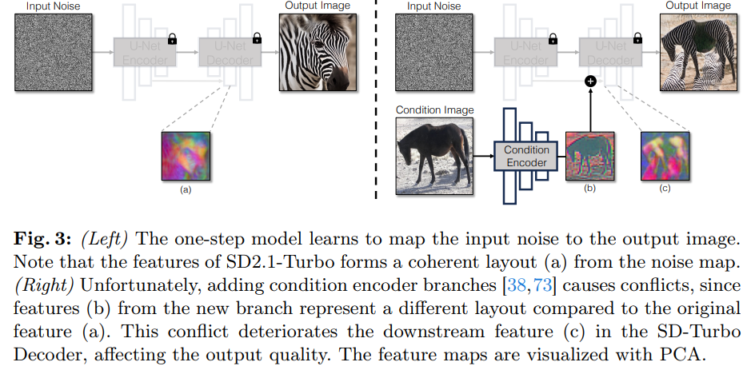
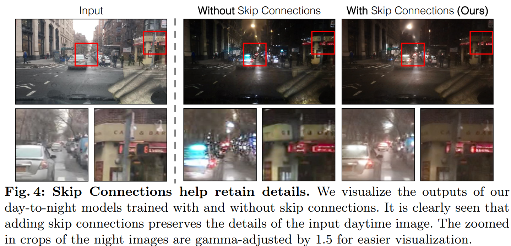
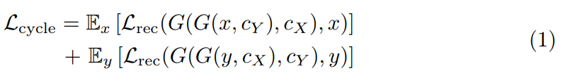
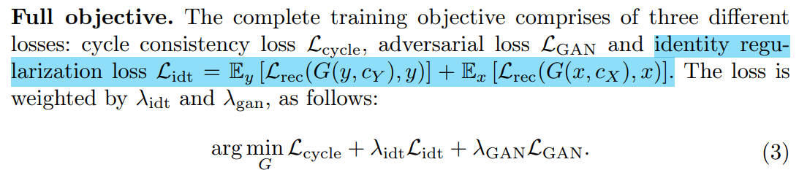
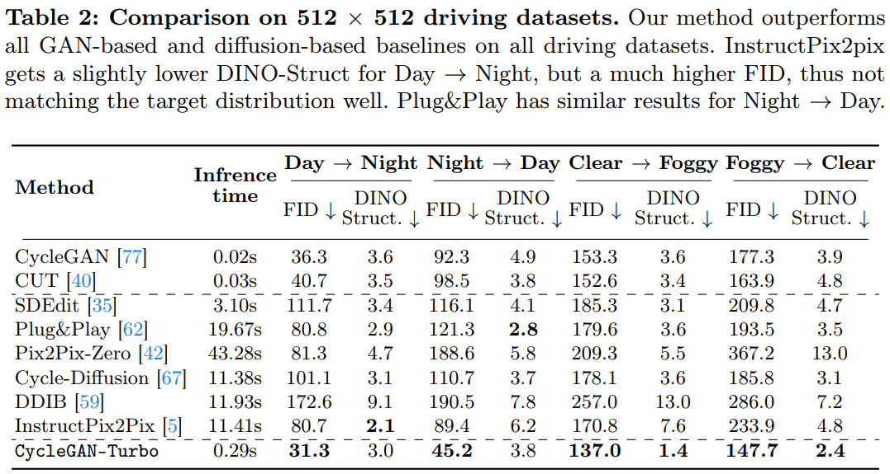
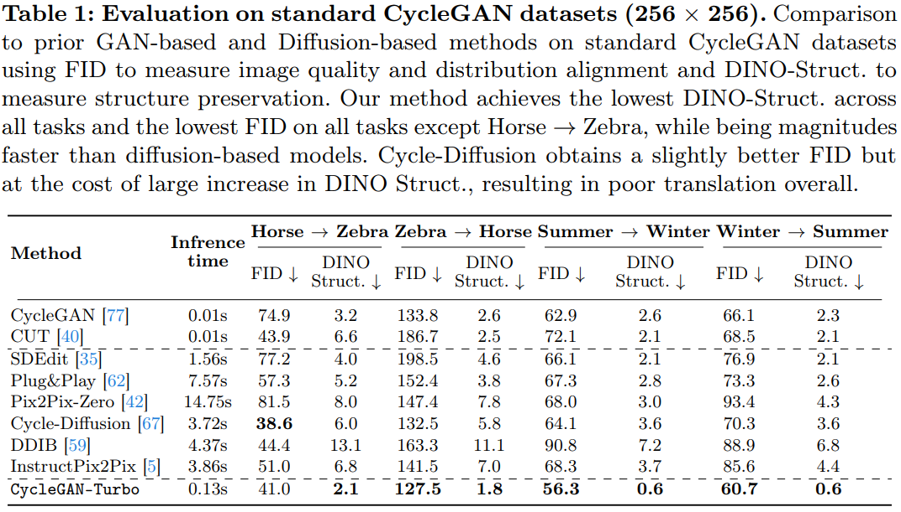

One-Step Image Translation with Text-to-Image Models
===
arxiv 24.03

## Introduction
  
이 논문에서 하고 싶은 것은 one-step image-to-image translation with unpaired training이다.  
하지만 diffusion은 너무 느리고, 현재 image-to-image task들은 대량의 paired image를 사용한다.  
본 논문에서는 빠르게 생성하면서 unpair로 학습가능한 방법을 제안한다.

## Method

### Adding Conditioning Input
  
controlnet과 같은 branch형태로 접근시 위 그림처럼 one-step으로 생성할 때에는 문제가 생긴다.  
one-step의 경우 초기 노이즈가 구조에 대한 영향력이 큰데, 두가지 인코더에서 서로 다른 구조에 대한 정보를 받게 되어서 학습이 어려워진다.  
그래서 저자는 LoRA를 사용해서 직접 컨디션을 주는 방향으로 접근한다.  
> 개인적인 견해:  
multi-step의 경우, 초반에 구조를 잡고 후반에 채우는 과정으로 생성하기 때문에  
두 인코더 간에 일종의 '합의'가 이루어지는 과정이 있는데,  
one-step의 경우 그 과정이 없다보니 생기는 문제인 것 같다.

### Preserving Input Details
LDM은 latent에서 디노이징을 함으로 속도에서 이점을 갖고 있다.  
하지만 image translation task에서는 세부적인 디테일을 유지해야하기 때문에 문제가 될 수 있다.  
이를 해결하기 위해서 vae의 인코더와 디코더에 skip-connection을 추가한다.  
(U-Net이 아니라 image->latent->image해주는 인코더, 디코더를 말하는 것이다.)  
  

### Unpaired Training
CycleGAN의 학습 방법과 loss를 적용하여 unpair한 데이터에서 학습이 가능하게 한다.  
* Cycle consistency with perceptual loss
      
    L_rec는 L1과 LPIPS를 같이 사용한다.  
    CycleGAN에서 사용하던 Loss를 그대로 가져온 형태이다.
* Adversarial loss
      
    Discriminator로는 CLIP을 백본으로 사용한 cassifier를 사용한다.

  

## Experiments
* Unpaired data  
    

* Paired data
    