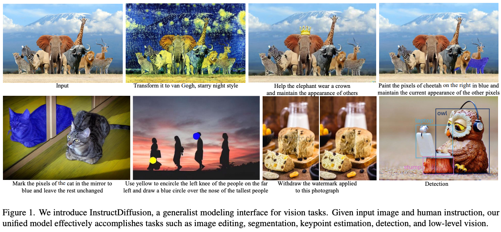
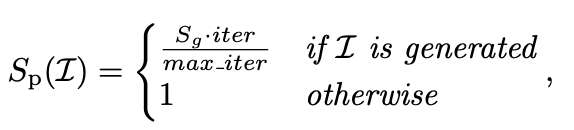
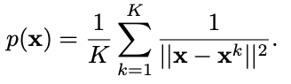
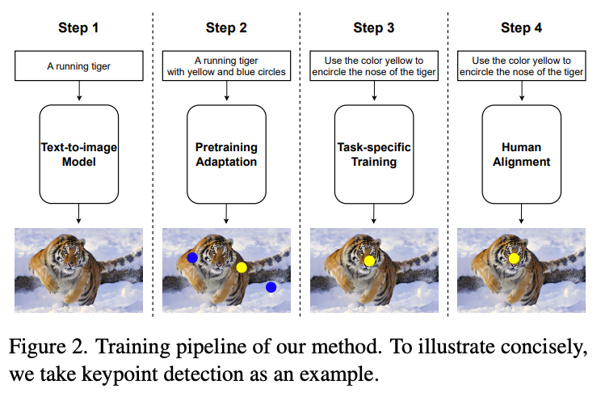
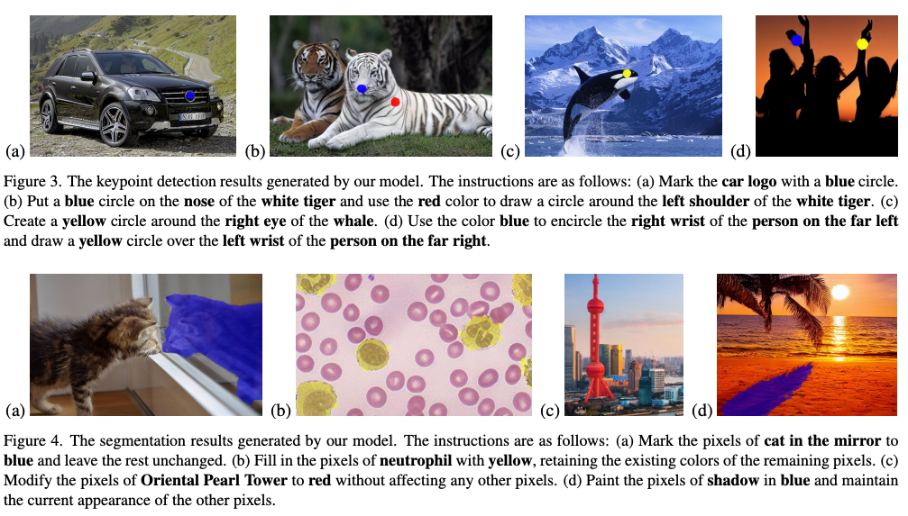
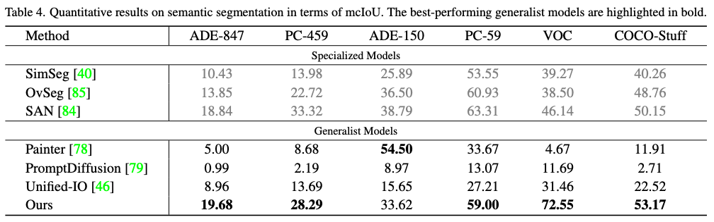
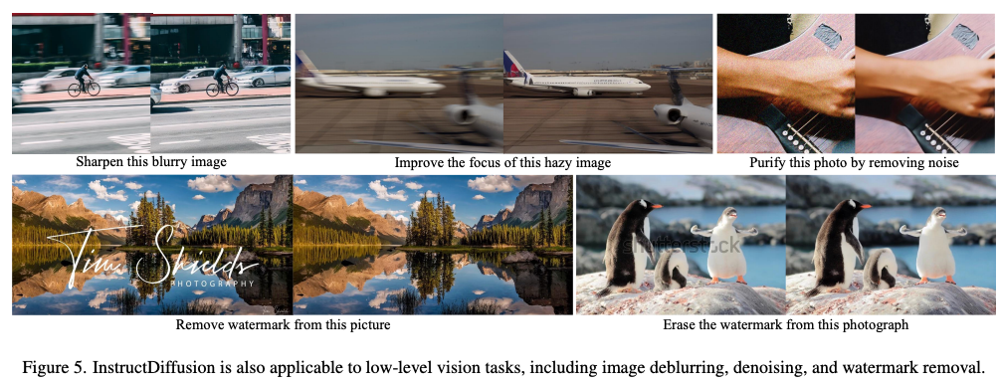
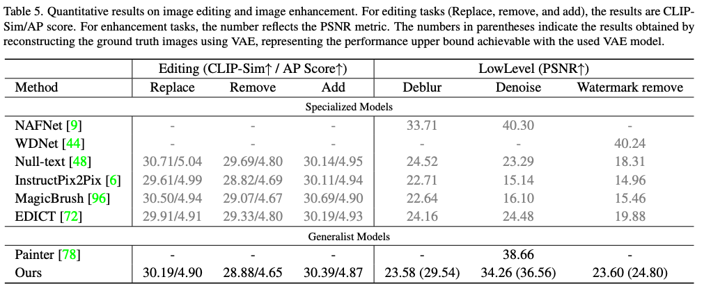
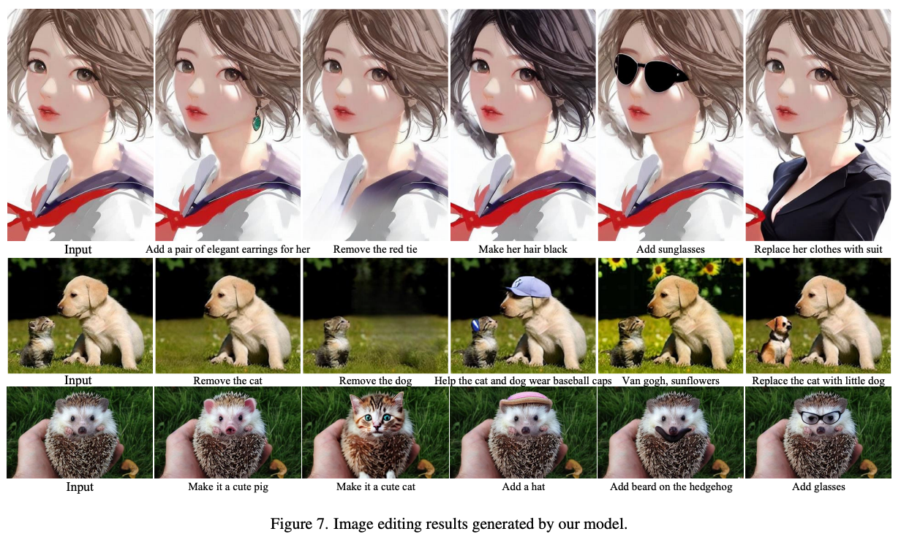

InstructDiffusion: A Generalist Modeling Interface for Vision Tasks
===
arxiv 23.09  
Diffusion을 사용해서 vision task를 통합하려는 연구  
NLP에서는 GPT(Generative Pre-trained Transformer)가 있는데 vision에서는 다음과 같은 이유로 통합 프레임워크가 어렵다.  
* OD, segmentation, image generation, keypoint detection등 다양한 task마다 출력이 다르다.  
* 각 task마다 사용되는 기술이 다르다.  
  생성에서는 GAN이나 Diffusion을 주로 사용하는데 다른 task에서는 전혀 사용하지 않는다.  
* 일반적으로 vision에서 입출력인 이미지나 좌표는 연속적인 값이다.  
  NLP에서는 텍스트 토큰으로 쉽게 이산화가 가능하다.  
  이를 위해서 VQ-VAE같은 연구에서 embedding space로 이미지를 변환하여 사용하는데 이 자체의 성능이 완벽하지 않을 수 있다.  

때문에 이 논문에서는 각 task를 image generation으로 프롬프트로 우회하여 통합하는 것을 제안한다.  
  
  
***
## Method  
### Unified Instructional for Vision Tasks
기존에 "semantic segmentation", "keypoint detection"과 같은 용어를 프롬프트에 추가해서 학습하려는 시도들이 있었다.  
하지만 이 논문에서는 상세한 지시를 사용해서 task를 지시하도록 한다.  
* keypoint detection : "Please use red to encircle the left shoulder of the man"  
* segmantation : "apply a blue semi-transparent mask to the rightmost dog while maintaining the remainder unaltered"  
* Image enhancment and Image editing : 기존 생성모델과 동일 (디블러링, 워터마크 제거, 객체 추가 등)  

각 task마다 10개씩 수동으로 만들고 GPT-4를 사용해서 당야성을 늘리고 학습할때는 랜덤으로 선택해서 입력된다.  

### Training Data Construction  
IP2P(Instruct Pix2Pix)는 GPT-3를 사용해서 "Editing"용 데이터셋을 만들었는데, 지역적인 편집보다는 전역적인 편집 중심이다.  
그리고 무시할수 없는 아티팩트가 나타난다.  
이 논문에서는 159,000쌍의 데이터셋인 Image Editing in the Wild(IEIW)를 제안한다.  
> 어떤 아티팩트인지는 예시가 없다. IP2P에서도 이런 예시는 찾지 못했다.  
> IP2P는 454,445장이였는데 퀄리티가 더 좋다고 주장하고 싶은 것이면 IP2P의 단점을 더 자세히 설명해주지...  

* Object removal  
  prompt기반의 segmentation모델로 객체 선택, inpainting모델로 객체 제거  
  "remove the ~"를 "add ~"로 바꿔서 객체를 추가하는 데이텉 셋으로 사용  
* Object replacement  
  이미지에서 semantic-aware region을 선택, 오픈 데이터셋에서 nearest neighbor을 검색해서 객체 선택  
  PaintByExample를 사용해서 해당 객체로 inpainting한다.  
  캡션은 "please change the A to B"와 같은 형태로 사용한다.
* Web crawl  
  "photoshop request"를 키워드로 구글에서 크롤링해서 23,000쌍의 데이터를 만들었다.  
> 근데 이건 드립용으로 사용되는 것들도 있지 않을까...  

이렇게 생성된 데이터를 샘플링하는데 GIQA와 LAION-Aesthetics-Predictor를 사용한다. 
* GIQA learning base  
  생성모델이 학습할수록 성능이 좋아지니까 iteration에 정비례하게 score를 정한다.  
  
* GIQA data base  
  feature extract해서 실제 데이터중에 KNN을 찾고 거리의 평균을 score로 사용한다.  
  

### Unified Framework  
  
1. Pretraining adaptation  
Stable Diffusion v1.5를 사용하는데, 특정 task에 대한 결과물은 학습되어있지 않으니까 추가적인 학습이 필요하다.  
target 이미지를 학습하는데 source의 prompt에 task에 대한 지시를 접미사로 더해서 text prompt로 사용한다.  
이렇게 했을 때에 이미지에 대한 표현과 task에 대하 표현이 같이 사용되니 이론적으로는 catastrophic forgetting없이 원하는 출력을 학습할 수 있다.  
> Dreambooth 생각하면 될듯  
2. Task-specific trainging  
이후 IP2P의 방법대로 입력 채널을 늘려서 원본이미지를 같이 입력하는 방식으로 지시문을 학습한다.
3. Human alignment  
이후 하나의 지시문에 대해서 20개의 샘플을 생성하고 이 중에 0~3개를 골라서 10에폭만 fine tuning을 한다.  
  
***
## Results
batch 3072 / epoch 200 / 4 days / v100 * 48
*   
*   
*   
*   
*   
* 
