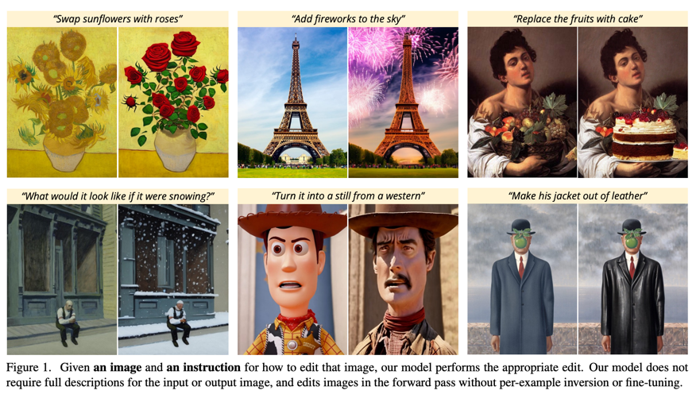
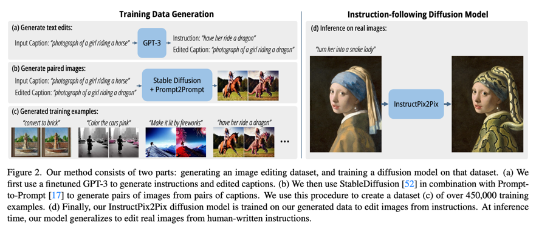
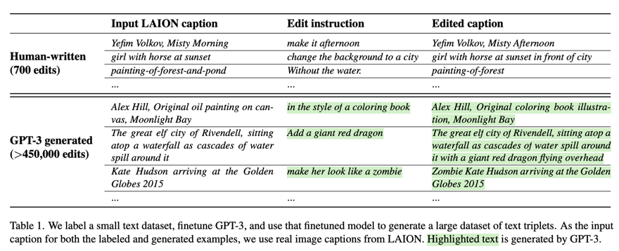
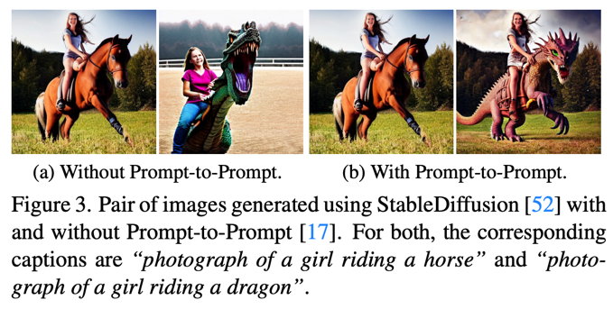
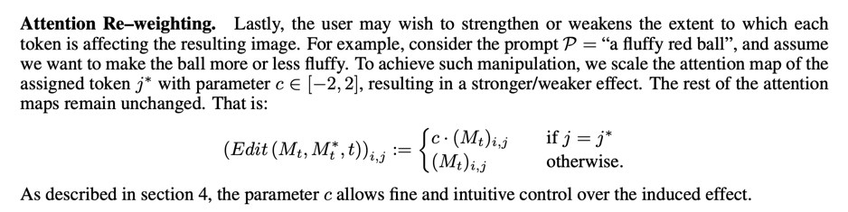
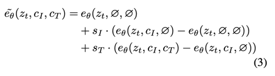
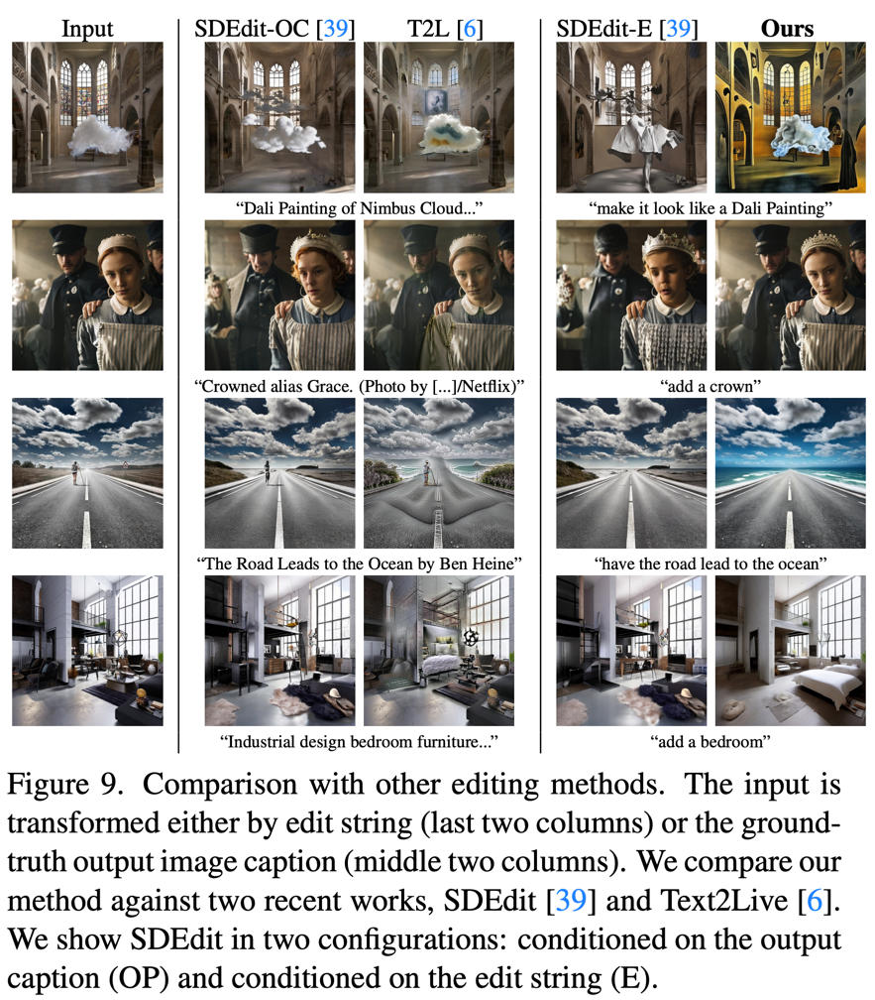
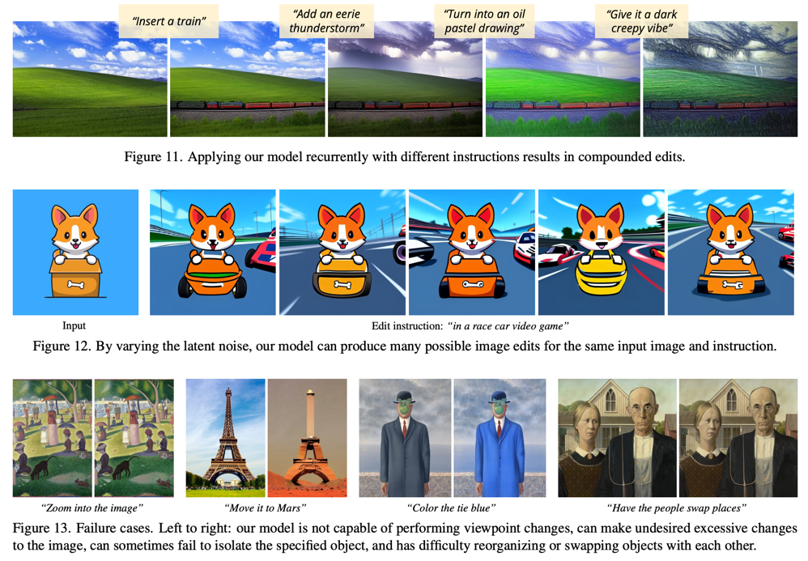

InstructPix2Pix: Learning to Follow Image Editing Instructions
==
CVPR 2022, arXiv 22.11  

생성모델 기반의 Image Editing을 학습시키고 싶은데, 생성모델 학습에 필요한 데이터가 너무 많이 필요하다.  
심지어 Editing이기 때문에 원본과 수정된 pair이미지가 있어야하는데 이건 더 힘들다.  
그래서 GPT-3와 Stable Diffusion을 사용해서 학습용데이터를 생성한다.  
  
  
## Generating a Multi-modal Training Dataset    
  
캡션과 지시문이 입력되었을 때에 변환된 캡션을 생성하도록 GPT를 학습한다.  
이를 위해서 700개의 캡션을 골라서, 지시문과 출력 캡션을 수동으로 만들었다.  
1에폭만 학습했기때문에 창의적이면서도 합리적으로 생성할 수 있다고 주장한다.  
LAION 데이터셋을 사용하였고, 캡션을 입력했을 때에 적절한 지시문과 출력 캡션을 생성하도록 학습되었다.  
  
하지만 중요한 이 캡션을 사용해서 새로 생성된 이미지가 원본과 동일한 context를 유지한다는 보장이 없다.  
그래서 그냥 Stable Diffusion이 아니라 Prompt-to-Prompt를 사용한다.  
  
그래도 객체 이동, 객체의 모양이 아예 바뀌는 정도에서는 유지가 제대로 안될 수 있다.  
P2P에서 이를 제어하는 파라미터 p를 제공한다고 한다.  
이를 0.1~0.9의 무작위 값으로 생성하게 하고 CLIP으로 필터링해서 사용한다고 한다.  
그렇게  454,445쌍의 데이터를 만들었다.  
> P2P에 그런 파라미터가 있었나? 이걸 말하는 건가...?  
>   
  
## InstructPix2Pix  
Pretraining is all you need 논문에서 말한 것처럼 task가 달라서 입력이 다르더라도 차라리 추가 입력을 0으로 초기화시키고 fine-tuning한다.  
또한 condition이 2개가 들어가기 때문에 Composible Diffusion에서 제안하는 방법대로 CFG를 사용한 방법을 사용한다.  
  

## Results  
  
  
> 방법을 보면 예상할 수 있듯이 약간의 나이브함이 있는데 그래서 실패 케이스도 있다.  
