Interpolating between Images with Diffusion Models
===
arxiv 23.07  

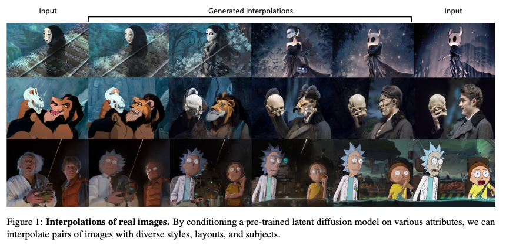  
기존의 interpolation하는 실험들이 있었지만 사실적인 표현이 잘 되지 않았다.  
또한 reconstruct도 잘 되지 않고, style transfer 기반의 방법들은 내용을 interpolation하지는 않았다.  
실제 이미지에서 interpolation하는 것은 이 논문이 처음이라고 말하고 있다.  
> 내가 알기로도 interpolation을 메인으로 연구한 논문은 못 보긴했다.  
> 여기에 참조된 논문들도 "이렇게도 해보니 되더라" 정도의 추가적인 실험으로 다루고 있다.  

우리는 StableDiffusion에다가 deploy할 계획이다.  
> 뒤에 결과를 보면 알겠지만 나라면 reject할거다.  

  
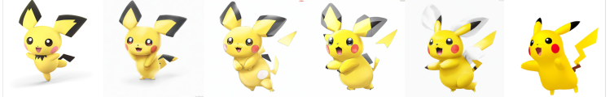  
> 주장과는 다르게 의미론적으로 interpolation을 잘 하지 못하는 경우가 있다.  
> 딱히 실패 케이스라고 언급하지는 않는다.  
> 조금 이상하긴 하지만 오히려 지금 연기를 이렇게 하고 싶은 거라 참고할 수는 있을 것 같다.  

***
## Real Image Interpolation  
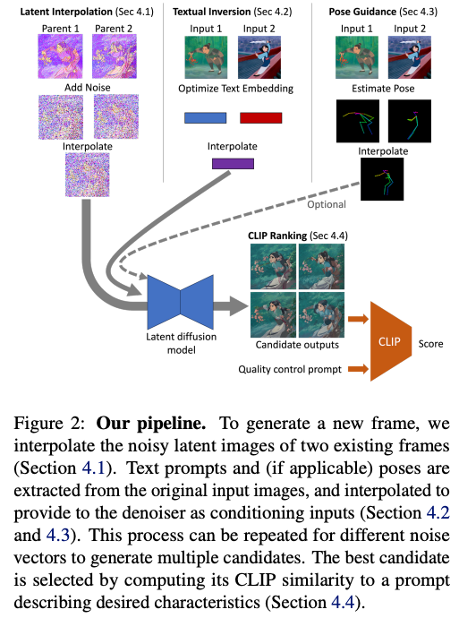  
### Latent interpolation  
가장 기본적인 방법은 똑같은 noise로 forwad => interpolation => denoising하는 것이다.  
경험적으로 두 부모 이미지(입력 이미지)가 차이가 클수록 노이즈를 많이 줘야 중간 값을 더 잘 찾더라.
두 부모 이미지를 0과 N이라고 할 때, N/4에 해당하는 이미지를 얻고 싶다면 0과 N을 사용해서 N/2을 구함 => 0과 N/2을 사용해서 N/4를 구함.
바로 노이즈를 1:3으로 섞지 않은 이유는, 이렇게 해야 부모와는 가깝지만 각 형제와는 분리가 된다고 한다.  
> 물론 O(N^2)이다. 실험적인 결과인 것 같다.  

DDIM으로 최소 200스텝은 해야 LDM 품질이 유지된다.  
schedule의 25% 미만으로 denoise된 latent는 알파 블렌딩한 것과 같은 결과가, 65% 이상인 경우 부모 이미지에서 상당히 벗어난다.  
  
### Textual inversion  
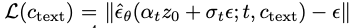  
inversion을 잘하도록 prompt embedding을 최적화 한다.  
논문에 정확한 언급이 없는데, 두 부모 이미지를 모두 다 잘 reconstruct하도록 embedding 레이어를 fine-tuning하는 것 같다.  
10^-4 lr로 100~500 이터레이션 진행한다.  

### Pose guidance  
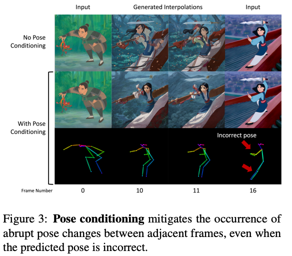  
사람 생성의 경우 포즈가 많이 다르면 해부학적 오류를 발생한다고 한다.  
이를 해결하기 위해서 OpenPose와 ControlNet을 사용한다.  
OpenPose를 사용해서 두 이미지의 포즈를 예측, 키포인트 값를 interpolation해서 중간 포즈를 얻는다.  
이를 노이즈와 함께 ControlNet에 condition으로 주어 생성한다.  
OpenPose가 성능이 좋지 않아도 포즈가 갑작스럽게 변하지 않기 때문에 안쓰는 것보다 좋다고 한다.  
> 사실 위 이미지도 손이 이상한 것 같은데...  
  
***
## Results  
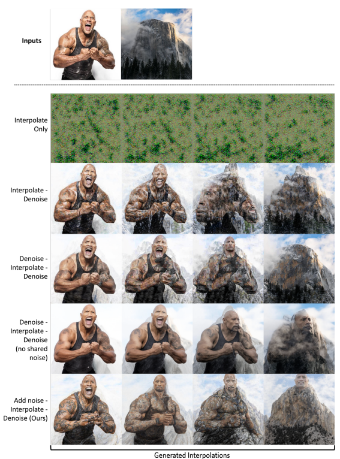  
* Interpolate only : z0에서 interpolate => forward => denoising  
* Interpolate-denoise : zt까지 각각 forward => interpolate => denoising
  * 단, 위에서 설명한 것처럼 N/4를 구할 때 분기를 타지 않고 zt에서 1:3으로 섞은 경우  
* Denoise-interpolate-denoise : N/4를 만들때 분기를 타면서 denoising  
  *  0과 N으로 T/2까지 진행 => T/2에서 0과 N/2로 진행 (O(N)으로 만들려는 실험)  
* DID w/o shared noise : 두 부모가 다른 노이즈로 forward 되는 경우 
* Add noise-interplate-denoise : 제안하는 방법  

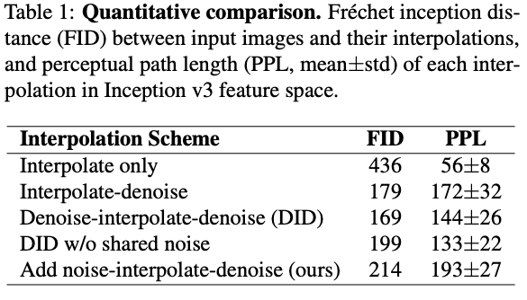  
정성적으로는 다른 방법들이 단순히 알파 블렌딩한 것과 같은 결과인데 FID나 PPL은 이를 반영하지 못한다.  
두 메트릭은 이러한 덜 창의적인 결과보다 단순한 알파 블렌딩 결과를 선호한다.  
그러니 future work이다.  
> ???  

* 실패 케이스  
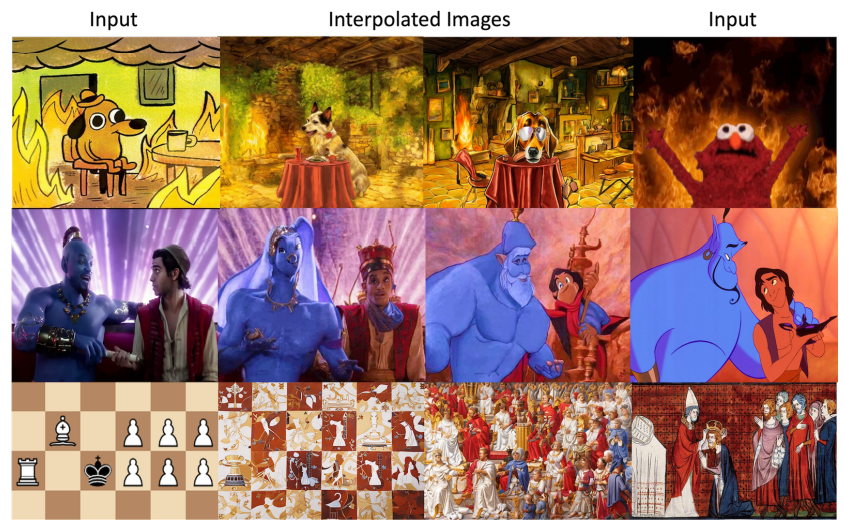  
위 : 포 예측이 불가, 가운데 : semantic 매핑이 제대로 안됨, 아래 : 스타일이 너무 다름  

* 성공이라 주장하는 케이스  
  * 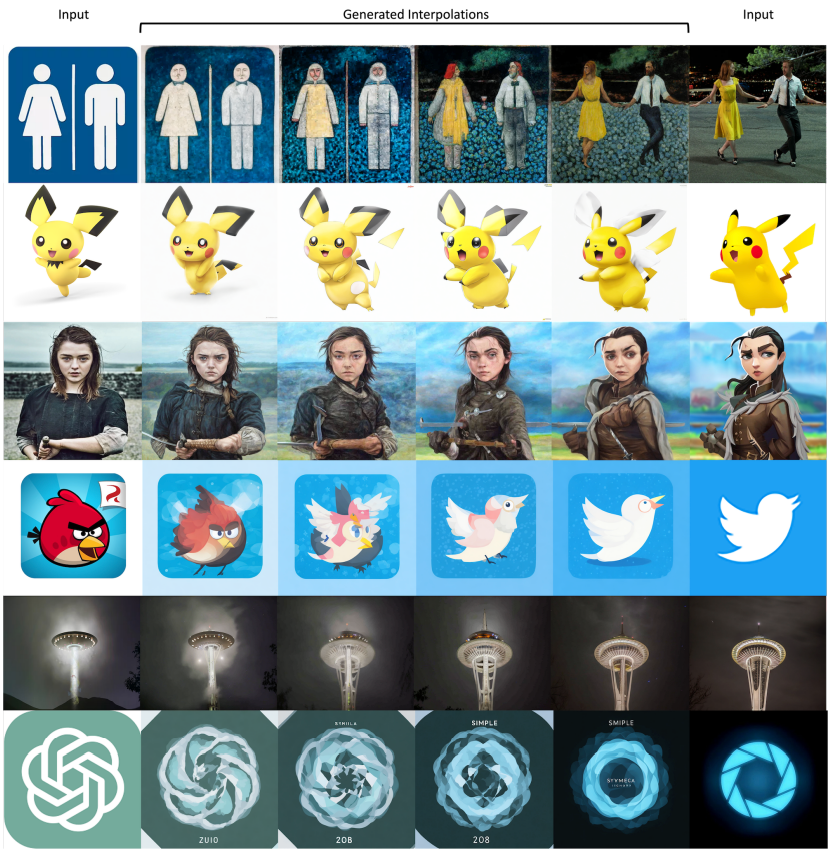
  * 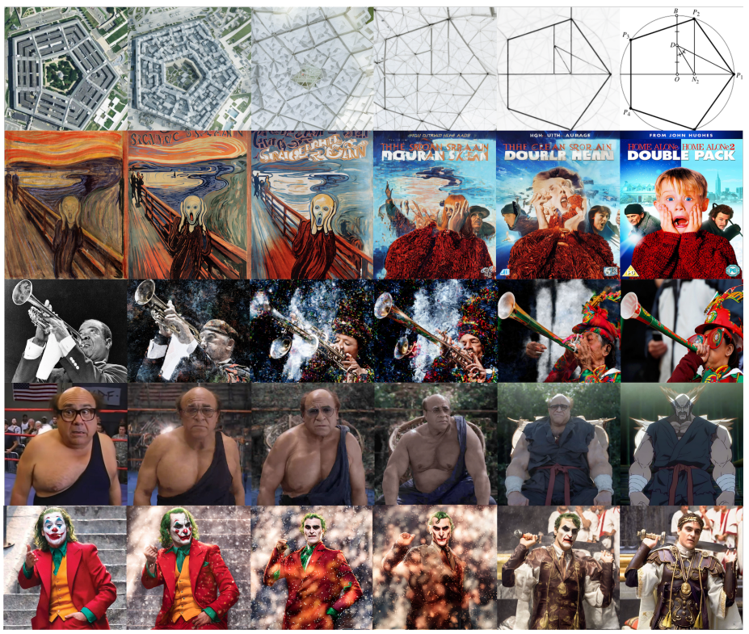
  * 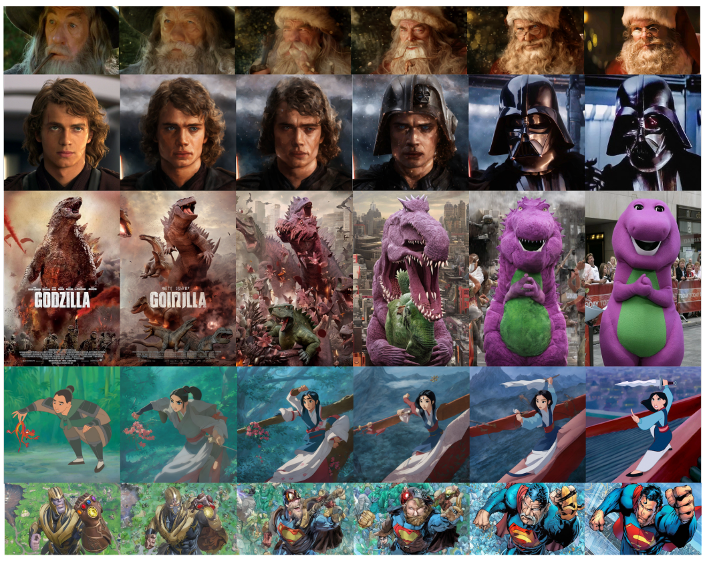  
