Inversion-based Style Transfer with Diffusion Models  
===
CVPR 2022 / arxiv 22.11  
#
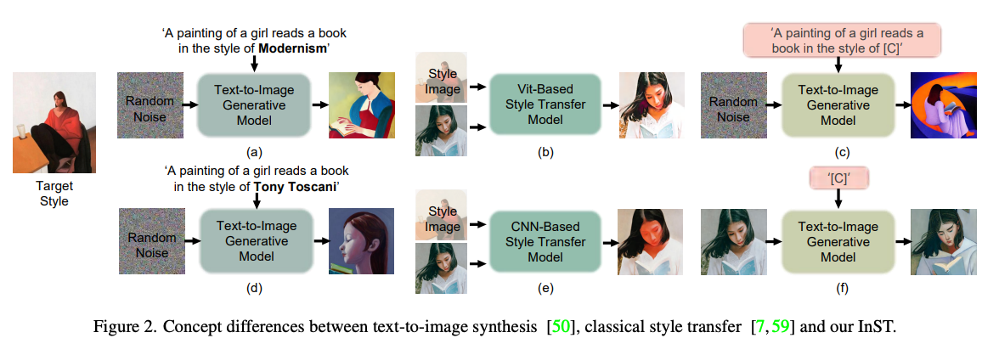  
* "예술적 스타일"은 그림 재료, 색상, 브러시 스트로크같은 너무나 다양한 고차원적인 요소들로 표현된다.  
  * 기존 방법들은 text로 이것을 포착하려고 하지만 text만으로 묘사하는 것은 어렵다. (a,b)  
  * 예시 이미지 기반에서 추출하는 방법들도 있는데 효과적이지는 않다. (b,e)  
  * 또한 스타일만 바뀌지는 것이 아니라 shape가 변경되는 경우가 있다.   
* Inversion기반의 이미지에서 예술적 스타일을 포착하는 방법을 제안한다.  
  * (c)처럼 원하는 text에 스타일을 입힐 수도 있고, (f)처럼 translation도 가능하다. 
#
***
## Methods  
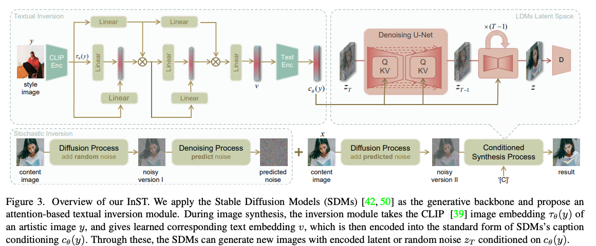  
x: content image, y: style image   
학습에서는 둘다 같은 이미지이다.  
#
여기서 기본 개념으로 삼는 것은 noise는 세부적 표현, text condition은 전체적 표현을 제어한다는 것이다.  
이것에 대해서 PtP를 참조하고 있다.  
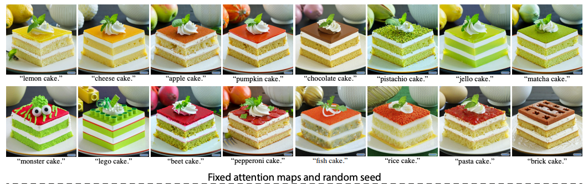  
> detail representation이라고만 표현했는데, content나 shape을 의미하는 것 같다.  
> holistic representation은 스타일을 의미하는 것 같다.

> 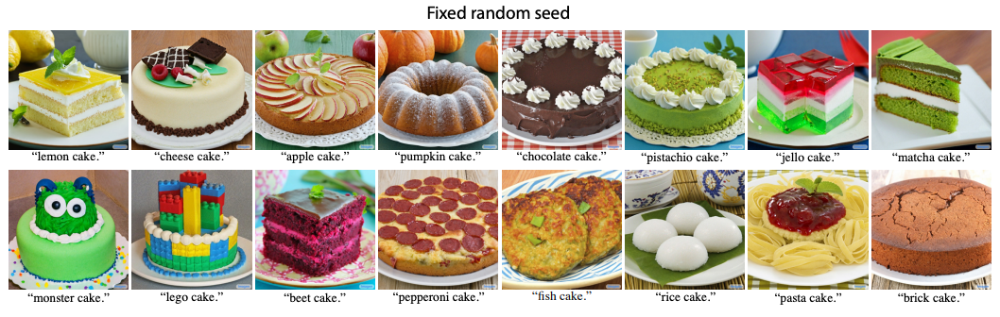  
> 하지만 정확히는 noise와 attention map이 detail을 제어하는 것이 맞는 표현이다.  
> 물론 이 연구에서는 editing이 아니라 text가 변하지 않으니 생략한 것 같다.  
#
### Textual Inversioin  
text로 스타일의 모든 요소를 함축할 수 없기 때문에 learnable vector를 두어서 Textual Inversion을 한다. (prompt learning으로 볼수도 있을 것 같다.)  
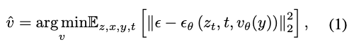  
처음에는 reconstruction loss를 사용해서 optimize했지만, 한 장의 이미지에서 overfitting없이 정확한 임베딩을 얻기 어렵다.  
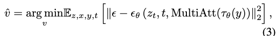  
그래서 multi-layer cross attention을 거친 벡터를 사용한다.  
> 앞에는 self인 것 같은데 여튼 논문에서는 cross라고 부른다.  

overfitting을 예방하기 위해 0.05 드롭아웃 한다.  
#
### Stochastic Inversion  
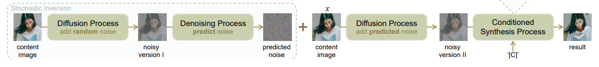  
DDIM Inversion이랑 다르다.  
논문에서 너무 대충 설명해서 코드를 확인했다.  
1. t=1000*strength로 설정하고 랜덤노이즈를 더해서 (q_sample process) z_t를 만든다.
2. z_t를 모델에 넣어서 z_t-1을 만든다.  
    이때 condition은 위에서 학습한 것이 사용된다.  
3. 2번의 아웃풋, 즉 t => t-1로 가는 noise로 linear approximation한다.  
    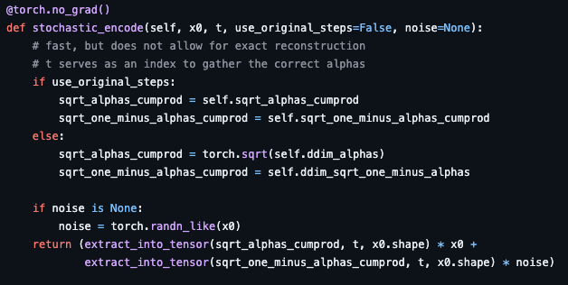  
> 주석으로 달려있는 것처럼 속도는 빠르겠지만 reconstruction 성능은 DDIM Inversion보다 당연히 안 좋다.
> 하지만 이 논문에서는 content를 완벽하게 유지하는게 목적이 아니니 이런 선택을 한 것 같다.  
#
***
## Experiments  
* multi-attention덕분에 기존 textual inversion보다 수렴속도가 빠르다.  
  *   
#
* style 추출을 더 잘한다.  
  * 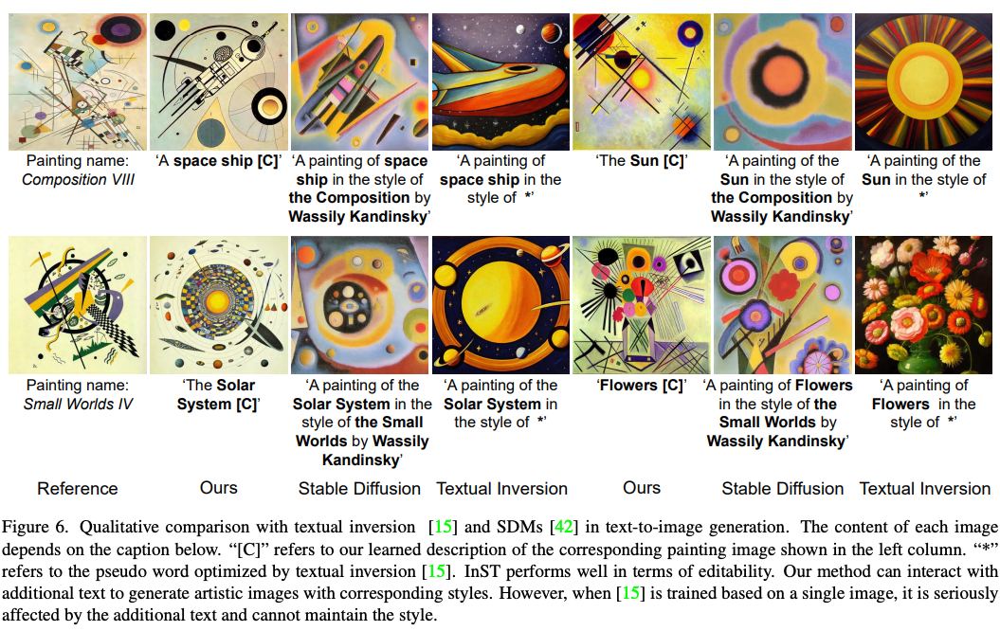  
#
* text로만은 표현할 수 없다.  
  * 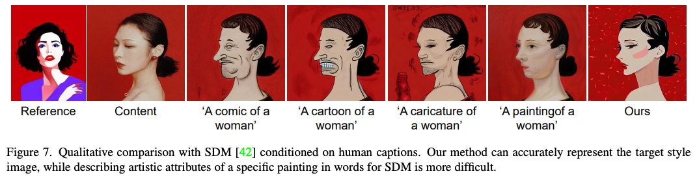
#
* 정량적으로 더 좋다.  
  * 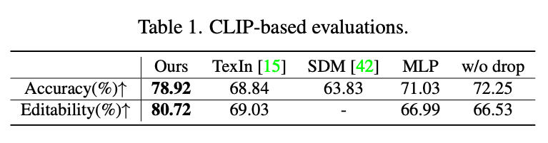  
#
* Baseline (w/o)이 뭔지 설명이 없다.  
  * 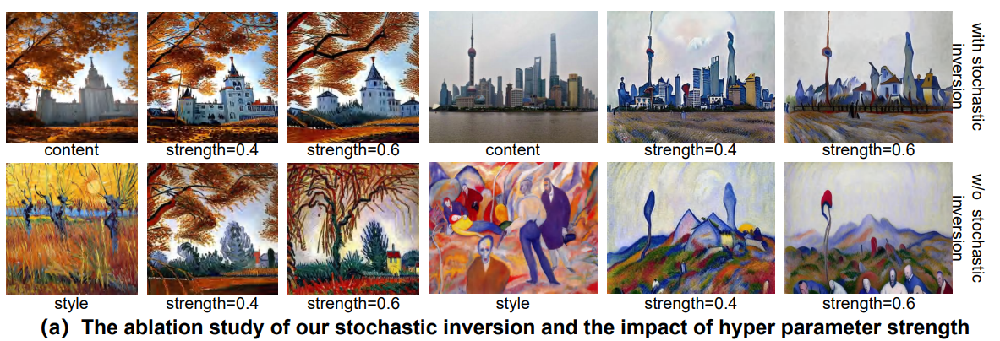  
#
* multi attention은 style 추출, drop-out은 overfitting 방지를 해준다.
  * 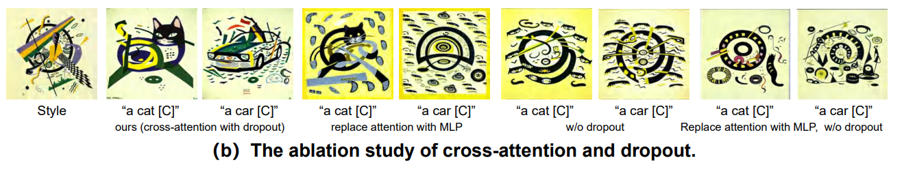

