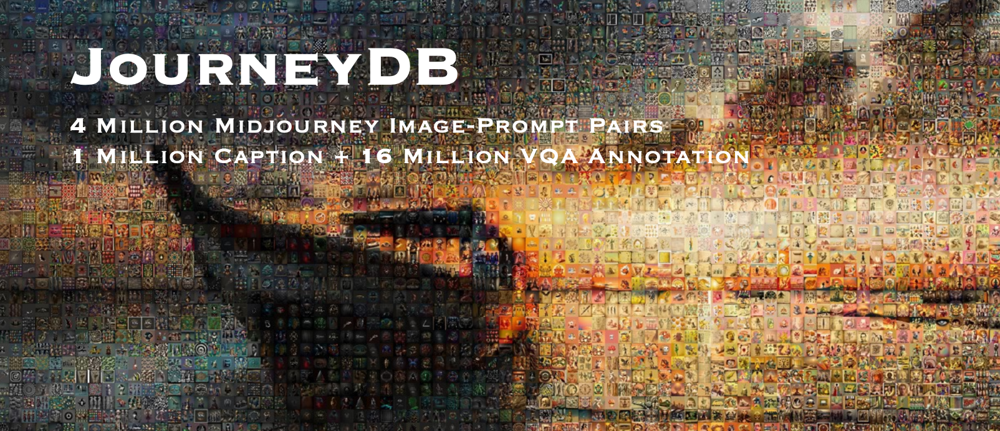
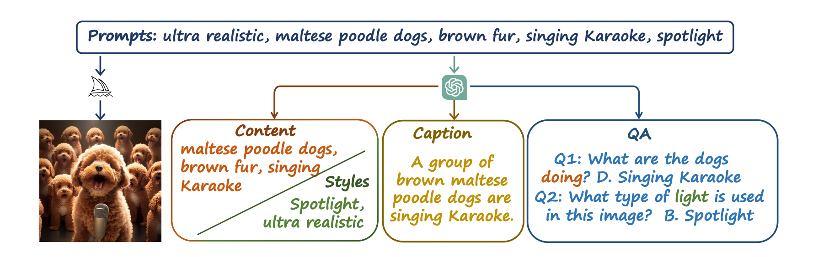
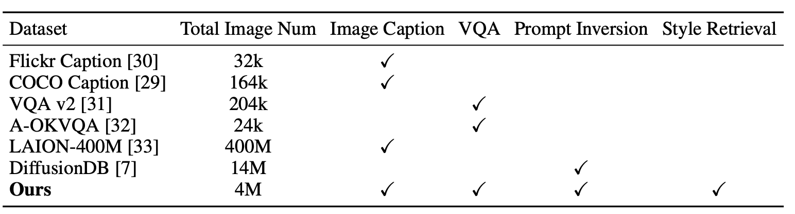
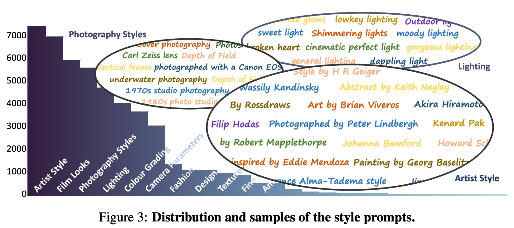
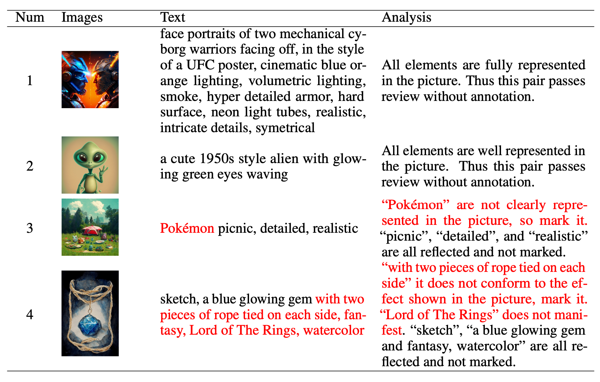
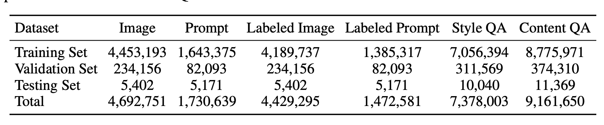
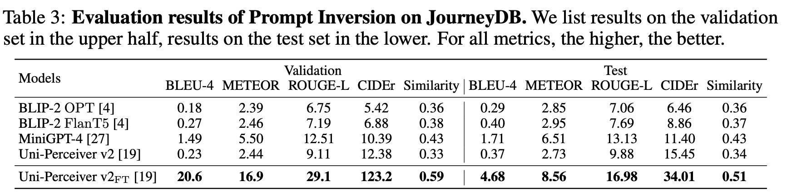
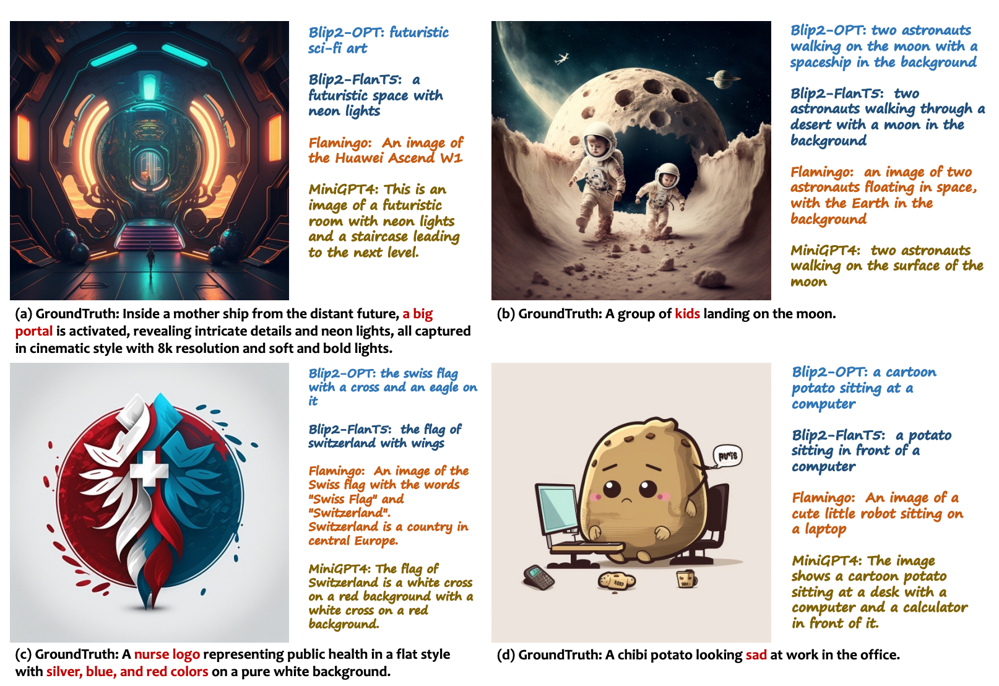
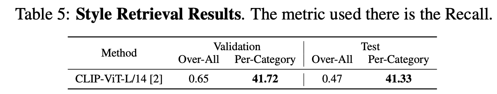
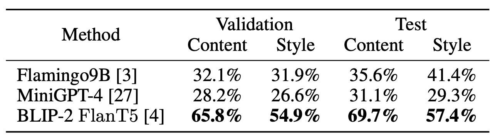

  
미드저니에서 만든 데이터셋, Synthetic 이미지로 구축한 데이터셋이라고 한다.
정성적으로 거르지는 않았을 것이고, 샘플링한 기준이 무엇일지 궁금해서 읽은 논문

### Data Collection

디스코드에 미드저니 채널에서 생성되는 이미지를 프롬프트와 함께 모았다.
이 때 컨디션 없이 순수하게 prompts에서 생성된 데이터만 사용했다.

### Data Annotation

우리는 다른 DB와는 다르게 여러가지 테스크에 대해서 전부 지원한다.

Visual Understanding AnnotationGPT-3.5를 사용해서 이미지에 대한 캡션을 생성하였다.”style”, “content”, “atmosphere”, “others”로 구분하여 단어를 얻고, 이 단어들로 캡션을 생성한다.그리고 style에 관한 질문, content에 관한 질문을 생성하고 4가지 보기와 답을 만들었다.

Style Clustering스타일에 관련된 단어들은 너무 많고 표현도 다양하다.그래서 GPT-3.5를 사용해서 클러스터링을 한다.

  

Image-Prompt consistency filtering생성이 제대로 되지 않았을 수 있다. 그래서 40명이 직접 확인했다. (허허…..)text prompt에서 해당 단어가 이미지에 묘사되어 있지 않으면 해당 단어는 빼버리는 작업을 진행하였다.
 

### Data Statistics

1024 x 1024 이상의 해상도 이미지 4,692,751장

Independent prompts 1,730,639장

GPT-3.5 annotation 1,472,581장명시되어있지는 않지만 위의 과정으로 제거하고 남은 데이터가 “Labeled”에 속하는 데이터를 말하는 것 같다.

fileterd by Image-Prompt consistency 5,402장정성적 평가에서 가장 그럴듯한 것들로 테스트셋을 만들었다.

70,521개 스타일을 334개의 카테고리로 정리함

train : val = 20 : 1 로 랜덤 샘플링

## Benchmarks

### Prompt Inversion
 

생성된 이미지의 원래 텍스트 프롬프트를 예측하는 task
Captioning은 이미지의 주요 내용만 예측하는 것에 비해, 이것은 시점, 조명, 스타일과 같은 요소들까지도 텍스트로 뽑아내야 한다.

이 데이터셋을 사용하여 Uni-Perceiver라는 모델을 학습시켰다.
이 때 데이터 증강이나 추가적인 트릭없이 온전히 논문에서 설명하는 트레이닝 방법만 사용했다.

### Image Caption
   

이미지의 시각적인 요소를 설명하는 캡션을 예측하는 task
기존에는 COCO Caption이라는 벤치마크를 사용했는데 우리가 이미지에 대한 상세하고 high-level의 묘사가 더 잘 되어있다.

기존에 실제 이미지로 학습한 모델들은 JourneyDB로 평가했을 때 당연히 성능이 좋지 않다.

GPT-3.5는 캡션을 너무 자세하고 길게 만든다. 반면 실제 이미지로 이루어진 데이터셋은 캡션이 비교적 짧다.이로 인해 예측하는 캡션의 길이가 차이가 있고, 지금의 metric으로는 성능이 낮게 평가가 된다.

생성된 이미지와 실제 이미지에는 서로 다른 개념에 집중하여 설명하게 된다. (감정, 사람/사물의 속성 등…)

(그러니까 제대로 된 metric을 만들고, 이런 부분 고려해서 연구하라는 말인 듯…)

특정한 속성을 묘사하지 않거나 다른 것으로 착각한다.

### Style Retrieval
   

스타일은 카메라 parameter (조리개, 화각, iso 같은 카메라 설정값을 말하는듯), 조명, 아티스트 스타일, 색상등의 344개의 카테고리로 분류한다.
(위에서는 7만개의 스타일 정보라고 했는데, 여기서는 15만개의 스타일 단어를 분류했다고 한다.)

(명시되어 있지는 않지만) clip-score로 유사도가 높은 스타일 텍스트에 대한 것을 골라내서 gt랑 비교하는 방식인 것 같다.
Over-All은 15만개를 하나씩 일일히 다 비교한 것이고, Per-Category는 카테고리 별로 1개씩 골라서 비교하는 것 같다.

카테고리 단위로 평가하는 것이 타당한 평가방법이라고 주장하고싶은 것 같다.

### Visual Question Answering (VQA)

Style에 대한 질문, Content에 대한 질문을 따로 구성하였다.

기존 모델들은 실제 이미지로만 학습했기 때문에 현실세계에서 보기 어려운 Content에 대해서는 잘 대답하지 못하는 것을 확인할 수 있다.

또한 실제 이미지는 Style이 한정되어있기 때문에 다양한 Style에 잘 대응하지 못하는 것을 확인할 수 있다.

## Conclusion and Discussion

생성 콘텐츠가 우리 주변에 넘쳐나고 있다. 이를 잘 이해하는 것이 필요하다.

다만 이 데이터셋은 NSFW score로 부적절한 콘텐츠를 걸러내긴 했지만 완벽하지는 않다.
디스코드 채널을 통해서 수집했기에 기본적으로 디스코드 커뮤니티 가이드라인에는 걸리지 않을 것이다.
부적절한 데이터를 발견하면 트위터로 연락해 줘라.

생성된 이미지가 입력 프롬프트와 일치한다는 가정을 기반으로 데이터를 만들었다.
실제로는 이미지와 텍스트가 일치하지않아서 annotation에 노이즈가 있을 수 잇다.. (이걸 지금 말하냐…)
이거는 CLIP 사용해서 필터링하거나 manual cleaning으로 알아서 제거하고 사용하면 된다. (다 끝나서 말하네…;;;)

## QnA

appendix에 질의형태로 추가적인 내용이 있는데, 흥미로운 내용 몇가지를 가져왔다.

40명의 professional annotators를 고용하고 있고, 일당은 50달러다.

2023-02-01 ~ 2023-05-30 기간에 수집된 데이터이다.

공식적인 ethical review를 거치지는 않았다.

Github 레포에 이 데이터셋 사용하는 논문을 정리할 예정이다.

공개적으로 마음껏 사용해도 된다. (비상업적 라이센스는 있다.)

데이터는 적어도 매달 한번씩은 업데이트할 것이다. 릴리스 후에 깃헙에 공유할 것이다.
