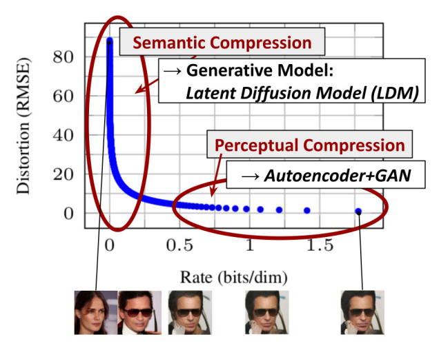
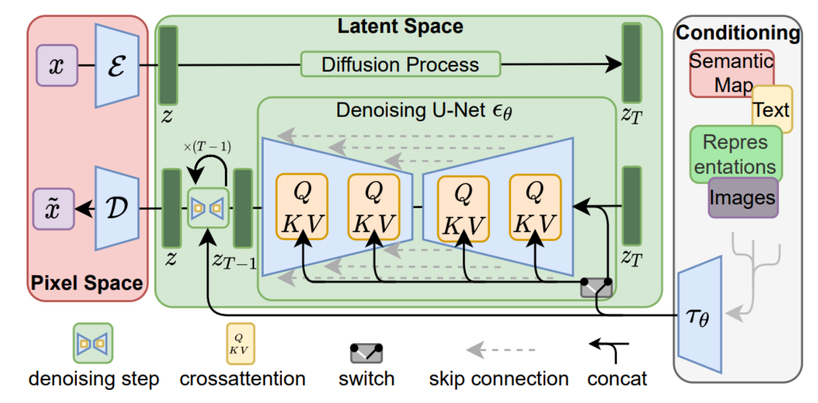
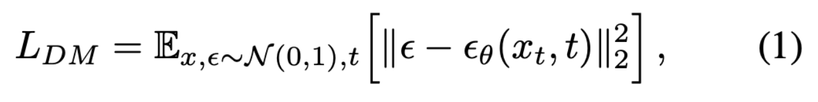
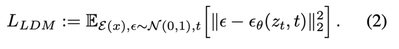
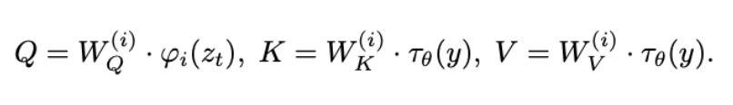
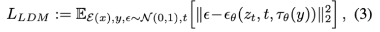
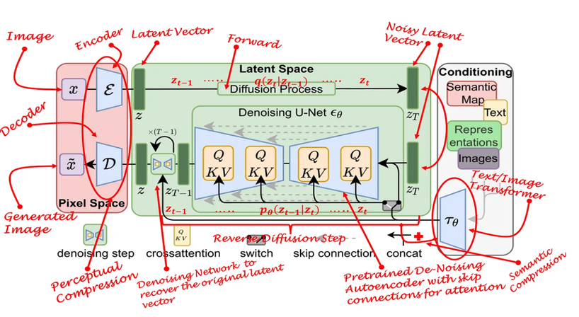
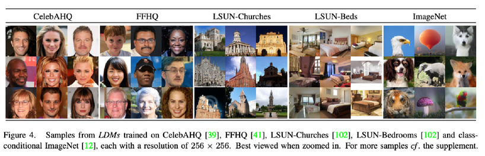
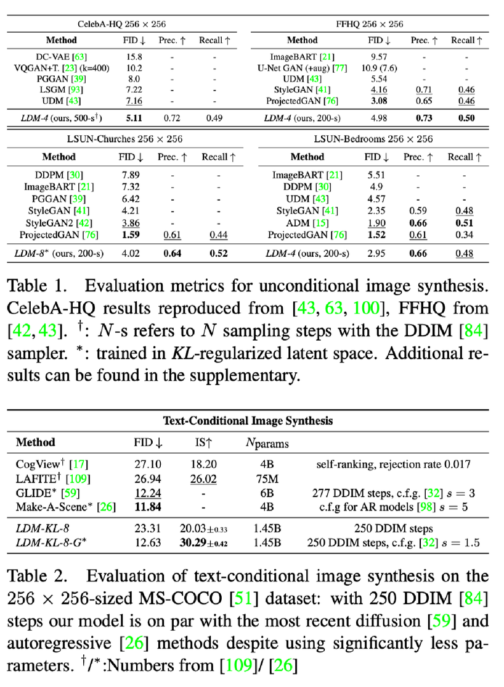

There are two methods for high resolution image synthesis.
1. Scaling up the Auto-Regression transformer models. but this have too many parameters (billions)
2. Adversarial training like GAN. but this is so complex and it can’t scale to multi-modal distribution.
   But Diffusion Model solves these problems.

However DM needed to train and evaluate on the high-dimensional RGB channel, which required large computing resources.

LDM have 3 contribution.
1. LDM need lower computing resource.
2. Find near-optimal point between complexity reduction and detail preservation.
3. LDM can use another domain condition (such as text) using cross-attention.

Diffusion Loss

Latent represnetations Loss

τ_θ(y) : domain specific encoder
ϕ_i(z_t) : (flattened) intermediate representation of UNet  
 

