MAG-Edit: Localized Image Editing in Complex Scenarios via Mask-Based Attention-Adjusted Guidance
---
arXive 23.11 /

## Introduction  
이 논문은 복잡한 시나리오의 이미지에서 Inpainting하는 것을 목표로한다.

이 논문에서 말하는 ”복잡한” 시나리오는 아래처럼 마스크영역을 제외하면 “배경”만 존재하는 것이 아니라  
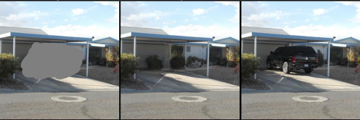  
실제 환경처럼 배경뿐만 아니라 여러가지 객체가 같이 존재하는 데이터를 의미하는 것 같다.      
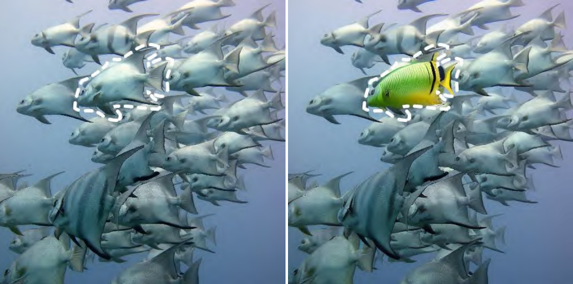  
기존 Inpainting은 두가지 방법이 있다.

1. mask 입력을 받는 방법 
   * 이 경우 마스크 영역내에 기본 구조를 유지하는 능력이 부족하다.

2. attention 기반의 mask를 자동으로 설정하는 방법
   * editing leakage: 의도한 객체 외에 다른 영역에도 영향을 준다.(내 생각엔 위 예시에 경우 원하는 객체를 고르는 것도 불가능하다.)
   * misalignment: 조건으로 준 text와 다른 편집을 수행한다.
                                
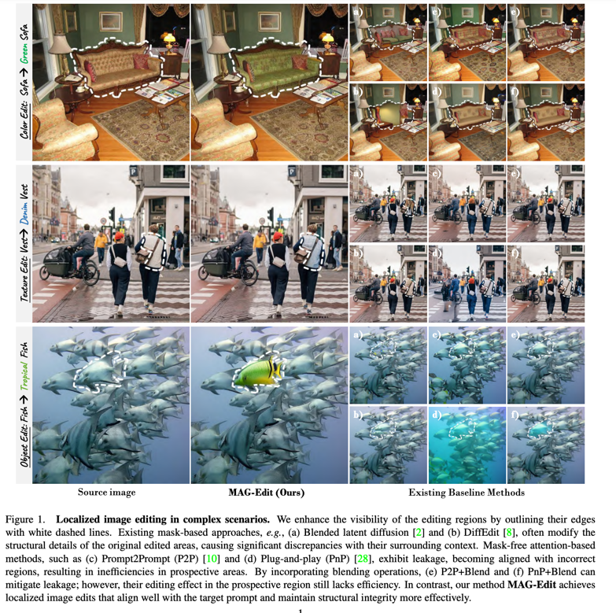

이를 해결하기 위해서 본 논문은 Cross-Attention가 text prompt와 입력의 embeddin의 align을 담당한다는 점을 이용한다.  
결과적으로 non-trainable한 방법을 제안한다.

## Method
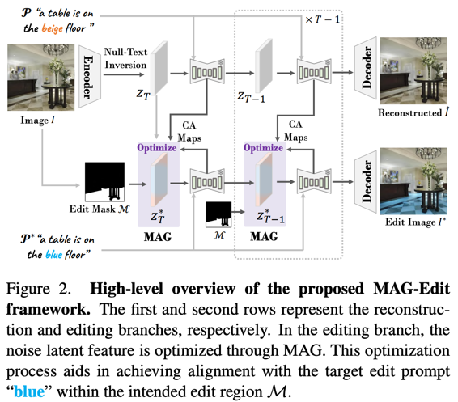    
  

1. 매 t스텝에서 reconstruction branch의 CA(Cross-attention)맵을 editing branch로 주입한다.   
    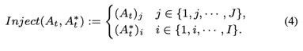
    fig 3(a)처럼 추가되는 단어의 토큰에대한 CA맵을 중간에 끼워넣는 방식으로 주입을 한다.
    > 이 방법은 P2P에서 제안하는 것과 동일한 방법이다.

    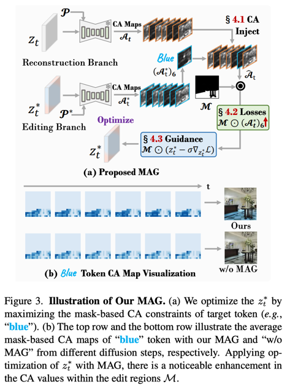
2. Token Ratio Constraint    
    CA 값이 높다는 것은 해당 토큰과 영역의 alignment가 좋다는 것을 의미한다.  
    하지만 1번처럼 CA맵을 주입한 경우 타겟 토큰에 대한 CA값은 공통적인 CA값에 비해 비교적 작다.  
    하지만 이 논문에서 원하는 방향은 타겟 토큰의 내용이 반영되도록 하는 것이므로 해당 CA값을 키워주도록 노이즈 z를 최적화해준다.   
    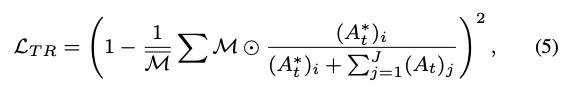  
    i: target token, j: common token

3. Spatial Ratio Constraint  
    하지만 이 방법만으로는 충분히 해당 토큰을 최대화하지 못한다.  
    그래서 다음과 같은 loss로 마스크 외부를 최소화해준다.      
    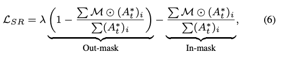  
    > 의도는 알겠는데 굳이 이렇게 두개로 나눠야하나...?  
    > 자세한 설명은 없다.  
    > λ = 3이다.

4. Negative Prompt Constraint  
    흰색 -> 검은색과 같이 극단적인 변화에서는 잘 적용이 되지 않는다.  
    때문에 Negative prompt에 해당하는 CA 값을 사용해서 반대방향으로 최적화해준다.    
    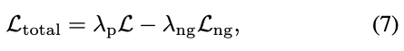  
    > 흠 설명이 없다... 하지만 맥락상 1~3번에 내용을 Negative prompt를 사용해서 한번 더 구해준 것이 L_ng인 것 같다.

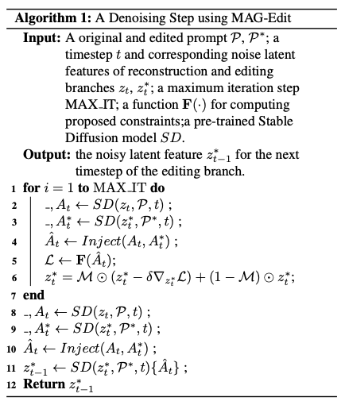         
  
## Result
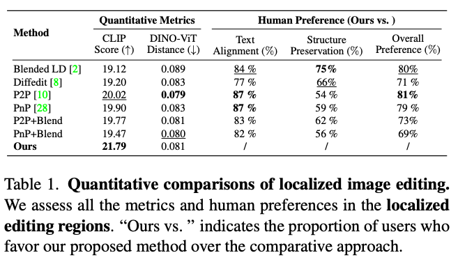  
Quantitative Metircs는 생성된 이미지와 target text prompt간의 alignment를 측정한 것  
Human Preference는 해당 baseline 모델보다 제안하는 모델이 더 좋다고 선택한 비중을 말한다.  
                                                              

