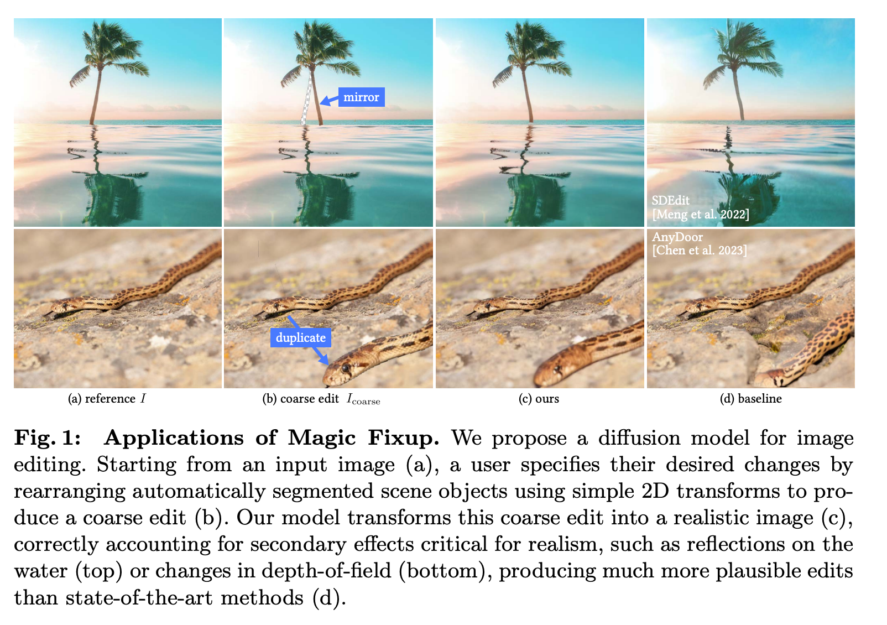
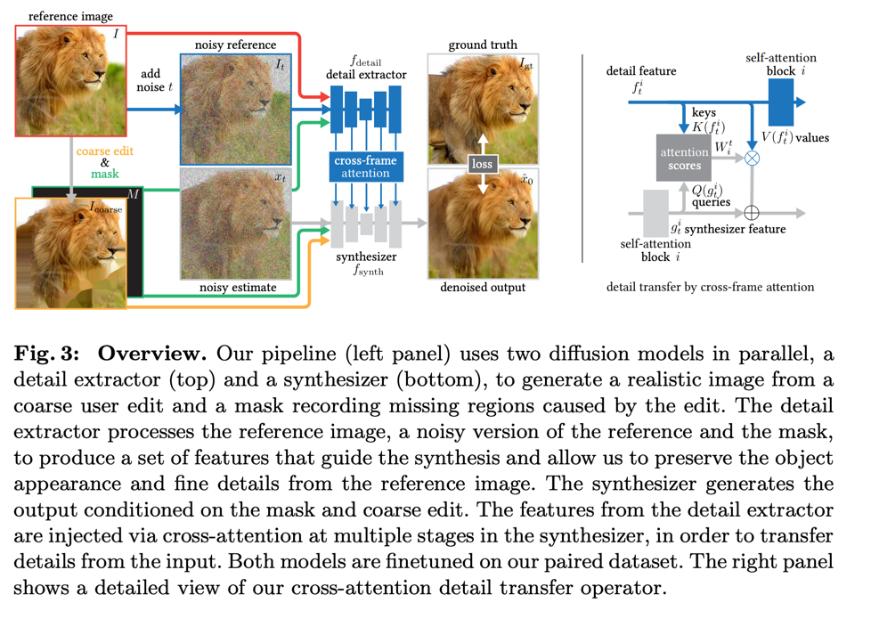
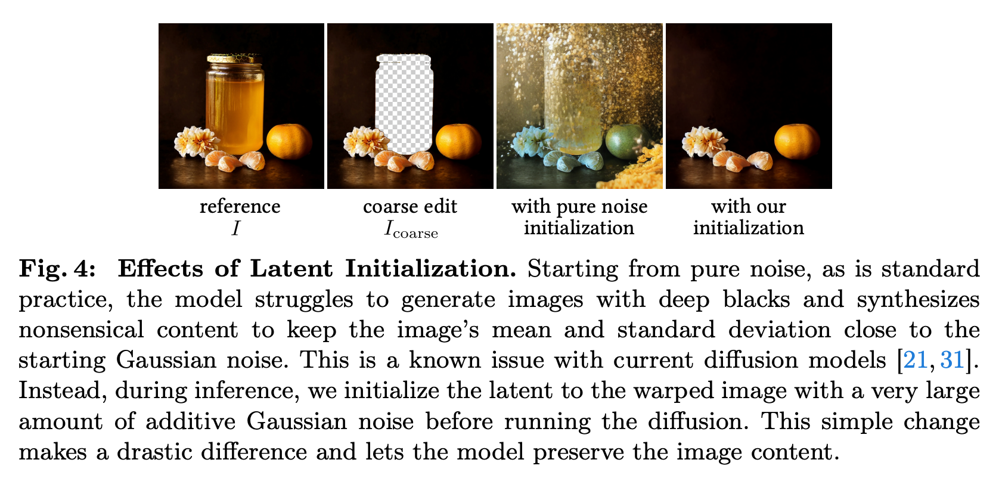
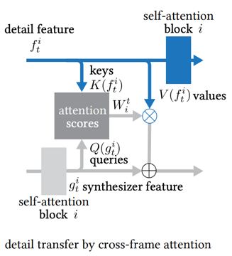
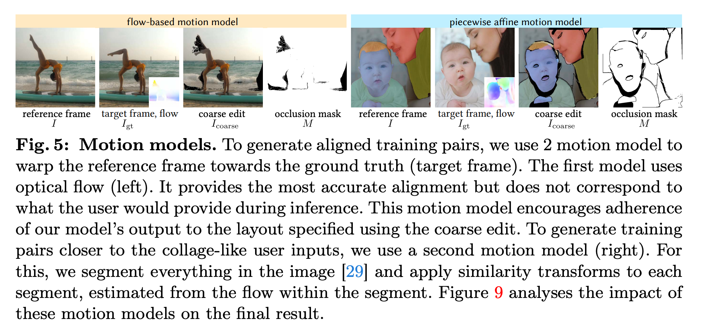
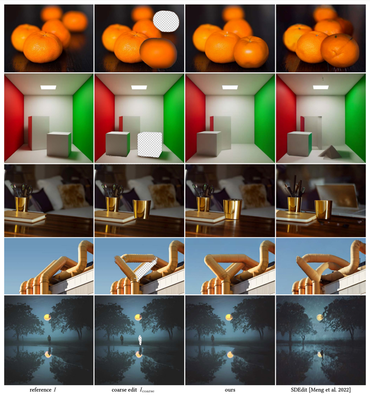
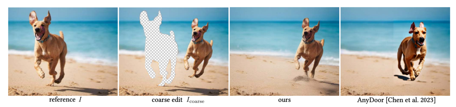
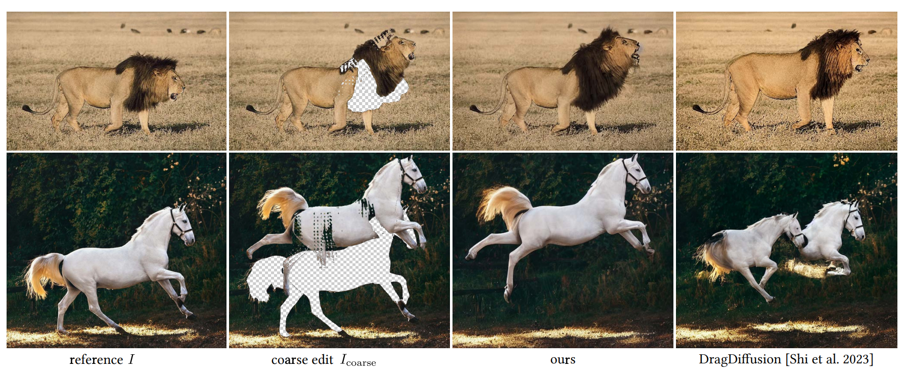
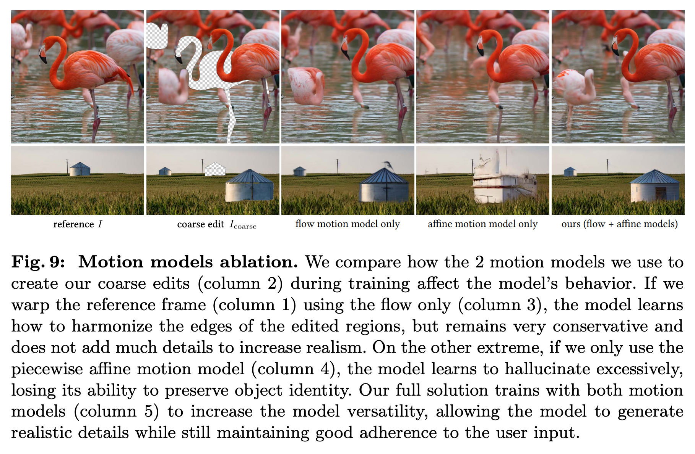
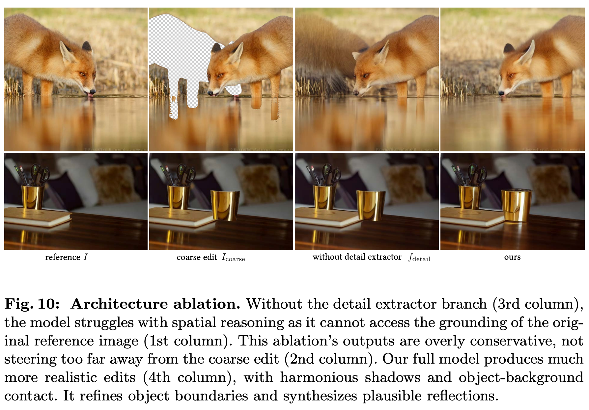

Magic Fixup: Streamlining Photo Editing by Watching Dynamic Videos
--

arxiv 24.03 / adobe
                   
### Introduction

자연스러운 이미지 편집은 많은 노동력이 필요하다.  
간단한 편집이라고 하더라도 조명 변화, 객체 간 물리적 상호작용이 일관성이 없으면 자연스럽지 못하다.  
이를 수작업으로 해결하기 위해서는 많은 노동력을 들여 심할 경우 픽셀 수준까지 수정하기도 한다.  

이것을 생성모델로 해결하려고 하는데, 원본 이미지의 정보가 최대한 유지되어야 한다는 것이다.  
이를 위해서 이 논문에서는 비디오 데이터를 사용한다.  
비디오 데이터에서 두 프레임을 소스와 타겟으로 선택 후 객체의 포즈 차이를 기준으로 소스에 변형을 한다.  
이를 diffusion에 입력하여 타겟처럼 생성되도록 학습한다.  

### Method

#### 1. Specifying coarse structure wwith simple transforms
* I : 원본 이미지 (512*512)
* I_coarse : 편집된 이미지 (photoshop으로 간단하게 편집한 이미지 생각하면 될 것 같다)
* M : 편집된 영역을 추적하는 이진 마스크
###
#### 2. From coarse edits to realistic images using diffusion
  

1. 사용자가 편집한 구조를 따르면서
2. 편집되지 않은 이미지의 내용을 유지  

이 두가지 요구조건을 만족하면서 빈 영역을 채우는 생성을 해야 한다.  
이를 위해서 2개의 diffusion 모델을 병렬적으로 사용한다.  
둘다 초기값은 SD v1.4이다.
reference image를 사용하는 방식이기 때문에 CLIP을 사용하는 cross-attention은 제거한다.
###
#### 3. Extracting details from the reference image
노이즈를 더한 원본 이미지를 한스텝 denoising하는 과정에서 self-attention 입력 전의 값을 사용한다.  
> 기존 Inpainting model 사용할 때처럼, 7채널로 입력된다. (reference + noisy + mask)  
> 추가된 채널에 대한 가중치도 동일하게 0으로 초기화한다.
###
#### 4. Image synthesis by detail transfer to the coarse edit
  

synth모델에서는 pure gaussian noise에서 시작하는 것이 아니라 noisy coarse image 부터 denoising을 한다.  
이는 reference image의 분포에서 벗어나지 않도록 하기 위함이다.  
논문에서는 40%를 사용했다. (0.4 * T스텝)  

  

detail extractor 모델에서 추출한 QKV를 self-attention 이후 cross-attention에 사용한다.
> 여기 구조에 대한 자세한 설명은 없지만, 기존에 text condition 을 대신해서 원본이미지의 정보를 condition으로 대체된 것 같다.  
###
#### 5. Training with paired supervision from video data
위와 같은 모델을 만들기 위해 영상 데이터를 사용해서 두 diffusion 모델을 학습한다.
> detail extractor 모델도 tuning 하는 것이 맞나 의심된다.  
> reconstruction을 학습했다면 모르겠는데, 논문에 명시되어있지는 않다.

소스와 타겟은 1~10초의 무작위 간격이고, 두 프레임 간에 flow가 너무 큰 경우 사용하지 않는다.  
그리고 mask 데이터가 필요하기 때문에 2가지 방법을 사용해서 mask를 생성한다.

  

합성/애니메이션을 제외한 스톡 비디오 클립으로 데이터를 구성하였다.  
2.5million clip에 두가지 motion model을 사용해 총 5million 학습 데이터셋을 구성하였다.
   
### Result
* 32배치로 120,000 step 학습
* A100 8대로 48시간
* 학습할때는 T=1000, 생성할때 T=50 (DDIM)
  * α1 = 0.9999, αT=0.98
* 비교 모델은 SDEdit, AnyDoor, DragDiffusion
  * 텍스트 입력이 필요한 모델은 BLIP 사용

#### ablation studies

